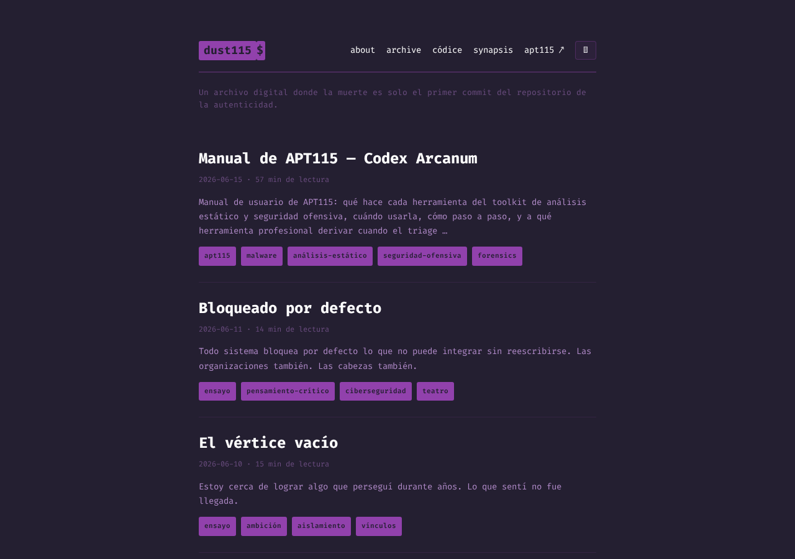
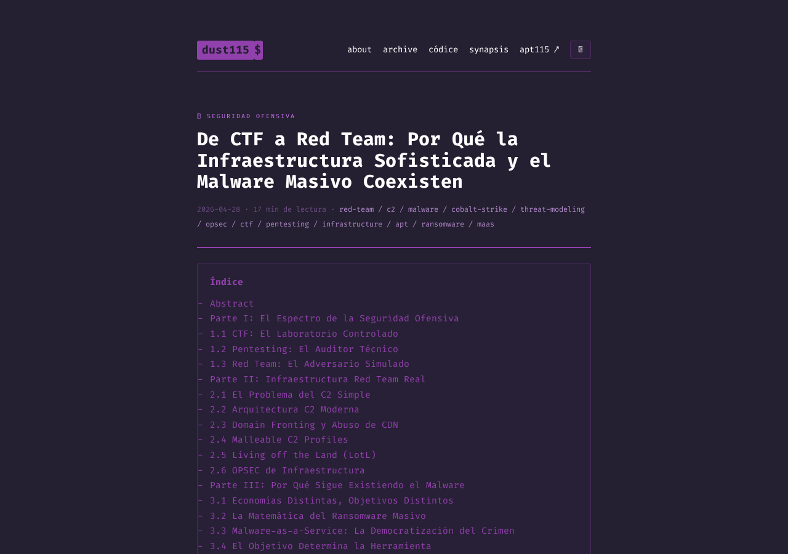
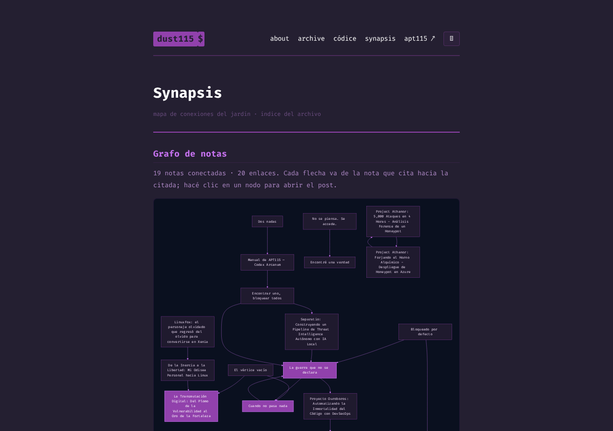
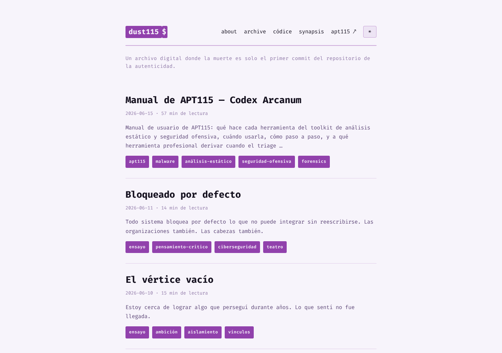
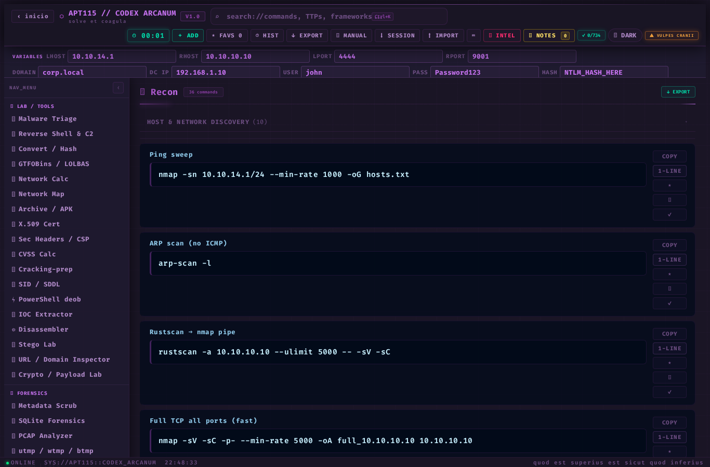

# dust115

> Un archivo digital donde la muerte es solo el primer commit del repositorio de la autenticidad.

**En vivo:** [fennek.org](https://fennek.org)



`dust115` es un sitio estático. Tres cosas viven acá: un blog de ensayos, una narrativa larga llamada *Códice del Polvo*, y **APT115**, una herramienta de análisis que corre entera en el navegador. Nada de esto necesita un servidor que piense. Se compila una vez y se sirve como archivos planos — que es la forma más honesta de durar: sin estado que mantener, sin proceso que matar, sin nada que se caiga a las tres de la mañana.

Lo que sigue describe cómo está armado. No por qué.

---

## Qué es

Tres cuerpos, una sola voz de fondo.

- **Blog** — ensayos largos y densos sobre lo que aparezca: tecnología, finitud, cómo se piensa. No consuelan ni venden; procesan.
- **Códice del Polvo** — una narrativa larga en curso, dividida en tres Eras, con su propia sección en `/codice/`. No es el blog y no se mezcla con él: tiene su propio orden, su propia navegación y su propio índice.
- **[APT115](https://fennek.org/apt115/)** — un toolkit de seguridad ofensiva y análisis estático de malware que corre 100% del lado del cliente. Cero backend. Lo que entra a esa herramienta no sale del navegador.

---

## Cómo funciona

Hugo compila el contenido (Markdown + front matter) a HTML estático. Cada push a `main` dispara GitHub Actions (`.github/workflows/hugo.yml`), que buildea con Hugo extended **0.152.2** y publica en GitHub Pages. El dominio `fennek.org` se sirve vía un `static/CNAME`. No hay paso de deploy manual: se escribe, se pushea, existe.



Algunas decisiones que vale la pena nombrar porque no son obvias:

- **Posts con imágenes = page bundles.** Cada post con imágenes es una carpeta (`content/posts/<slug>/index.md` con las imágenes al lado, referenciadas por nombre). Las rutas son relativas, así que el sitio no depende del dominio ni del subpath. Mover el dominio no rompe una sola imagen.
- **Digital garden.** Los ensayos se enlazan entre sí con wikilinks `[[ ]]`, y cada página muestra sus **backlinks** ("Mencionado en") — resueltos post-procesando el HTML ya renderizado, no el Markdown crudo, para no romper shortcodes ni el índice.
- **Códice ordenado por `weight`.** El orden de lectura del Códice es explícito y está desacoplado de la fecha de publicación. La navegación prev/next del Códice se mueve por ese `weight` y vive aislada: nunca enlaza al blog, y el blog nunca enlaza al Códice.

### Synapsis

`/synapsis` es el mapa del jardín. Un grafo dirigido jerárquico (mermaid/dagre, en la estética de un BloodHound) que Hugo genera desde los wikilinks reales — los nodos y aristas no se mantienen a mano, salen del contenido. Debajo, un índice cronológico del blog por año.



### Shortcodes

El sitio define los suyos para lo que Markdown no cubre: `listening`, `ascii`, `commit`, `codice-list`, `callout`, `command`, `figure`, `badge`, `tlp`. La referencia completa está en `themes/vulpine-marrow/docs/shortcodes.md`.

---

## El tema: Vulpine Marrow

El sitio usa su propio tema Hugo, **Vulpine Marrow**, derivado del tema [Terminal](https://github.com/panr/hugo-theme-terminal) de panr (MIT) — vendorizado, ya no es una dependencia. Negro profundo con violeta, Fira Code self-hosted, un HUD terminal-clean, y una regla simple: el glow se reserva para lo que pide atención, no se reparte.



El CSS está en capas que se concatenan en un solo bundle fingerprinted, en orden estricto: **tokens → base (Terminal) → skin**. La paleta sale de tokens `--vm-*`; la clase `.vm-light` sobre `<html>` los intercambia por el modo claro. Se editan las capas de *skin*, nunca la base.

El tema vive en `themes/vulpine-marrow/` (la copia que GitHub Pages necesita) y se publica aparte como proyecto standalone en **[github.com/Fennek115/vulpine-marrow](https://github.com/Fennek115/vulpine-marrow)**. La copia del sitio es la fuente de verdad; el repo público es un espejo de distribución, sincronizado con `scripts/sync-theme.sh push`.

---

## APT115

[APT115 // CODEX ARCANUM](https://fennek.org/apt115/) es un toolkit de seguridad ofensiva y análisis estático de malware. Corre **100% en el navegador**: nada se sube a ningún lado, y funciona offline abriendo su `index.html` como archivo local.



Lo que trae:

- **Cheatsheet ofensivo** — comandos de recon/web/AD/privesc/tunneling con variables de engagement (`{LHOST}`, `{RHOST}`, …) sustituidas en vivo, favoritos, notas, checklist, y export/import de la sesión completa a JSON.
- **Malware Triage** — suelta un archivo y corre la cadena de analyzers que apliquen: parsers propios PE/ELF/Mach-O (headers, imports, mitigaciones, firma), hashes (md5/sha/imphash/TLSH/telfhash), entropía, Rich Header, Authenticode, strings, capacidades con tags ATT&CK, macros VBA, LNK, PDF, **YARA real** (libyara-wasm con packs de Mandiant/GCTI/ReversingLabs/signature-base), PEiD, desensamblado del entry point (Capstone) y esteganálisis.
- **Más herramientas** — Reverse Shell & C2, Mini-CyberChef, GTFOBins/LOLBAS offline, Network Calc, IOC Extractor, Disassembler (x86/ARM/MIPS), URL/Domain Inspector (homógrafos IDN, typosquats, DGA), Crypto/Payload Lab, Stego Lab, y un grupo **Forensics** (Metadata Scrub, SQLite Forensics, PCAP, utmp/wtmp/btmp).

Sin backend, sin telemetría. Los lookups externos (VirusTotal, MalwareBazaar, urlscan) son opt-in: solo abren una pestaña cuando se los hace clic. Es triage estático — orienta una primera mirada, no reemplaza un sandbox ni a un analista. Manual de usuario completo en [`/posts/apt115-manual/`](https://fennek.org/posts/apt115-manual/).

---

## Estructura del repo

```
.
├── content/
│   ├── posts/          # ensayos del blog (page bundles cuando llevan imágenes)
│   ├── codice/         # Códice del Polvo (sección propia, ordenada por weight)
│   ├── about.md
│   └── synapsis.md     # el mapa del jardín
├── themes/
│   └── vulpine-marrow/ # el tema: layouts, partials, shortcodes, CSS, fuentes
├── static/
│   ├── apt115/         # la herramienta (app client-side + bundle)
│   └── CNAME           # dominio custom (fennek.org)
├── archetypes/         # plantillas para 'hugo new'
├── scripts/
│   └── sync-theme.sh   # publica el tema al repo standalone
├── .github/workflows/  # build + deploy a GitHub Pages
└── hugo.toml
```

---

## Desarrollo local

```bash
# Servidor de desarrollo con live reload (incluye drafts)
hugo server -D

# Build de producción (igual que CI)
hugo --gc --minify

# Post nuevo, solo texto
hugo new posts/mi-titulo.md

# Post nuevo CON imágenes — siempre page bundle
hugo new --kind bundle posts/mi-titulo
#   luego las imágenes van DENTRO de content/posts/mi-titulo/
#   y se referencian relativas: . Nunca rutas /img/ absolutas.

# Capítulo nuevo del Códice
hugo new codice/codice-XX-titulo.md
```

---

## Créditos y licencia

- Generado con [Hugo](https://gohugo.io/).
- Tema **Vulpine Marrow**, derivado del tema [Terminal](https://github.com/panr/hugo-theme-terminal) de panr (MIT, vendorizado). Tipografía [Fira Code](https://github.com/tonsky/FiraCode) (OFL), self-hosted.
- APT115 vendoriza, con sus licencias en `static/apt115/vendor/`: libyara (BSD-3), Capstone (BSD), spark-md5 (MIT), TLSH (Apache-2.0), packs YARA de Mandiant/GCTI/ReversingLabs y signature-base de Florian Roth (DRL 1.1), GTFOBins/LOLBAS, firmas PEiD y magic de Apache Tika.

El contenido (ensayos y Códice) es obra propia; el código del sitio y de la herramienta, salvo lo vendorizado arriba, también.

---

El termostato siempre en el mismo número es lo que mata. Esto es lo contrario: un lugar donde las cosas se nombran antes de normalizarse. No promete nada. Está acá, y eso ya es más de lo que se admite.

```
commit 0xc0d3x · mortui vivos docent
note: la muerte es solo el primer commit. esto es el repositorio.
```
