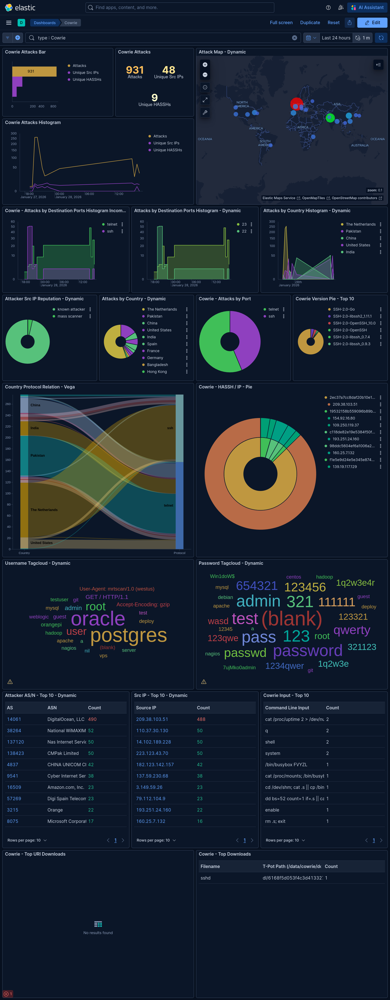
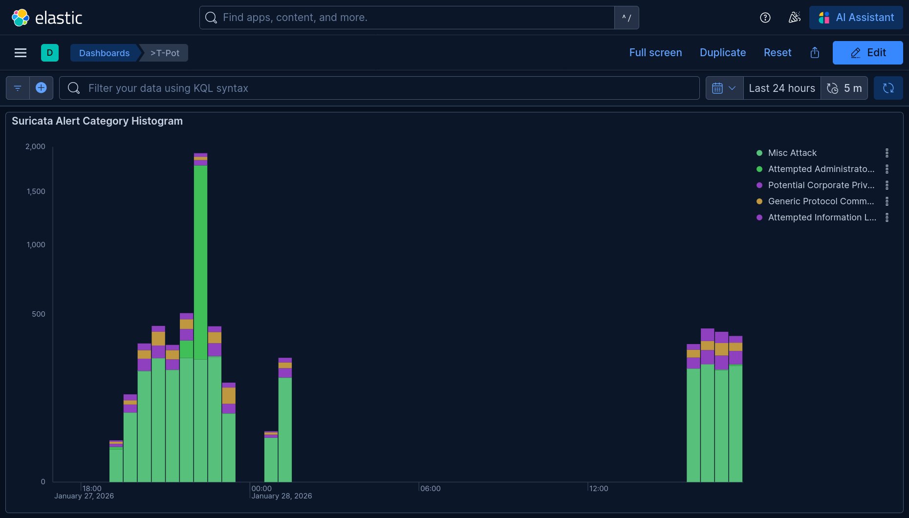
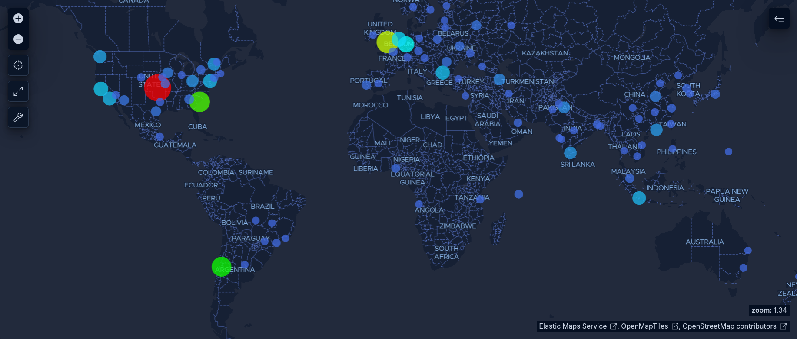
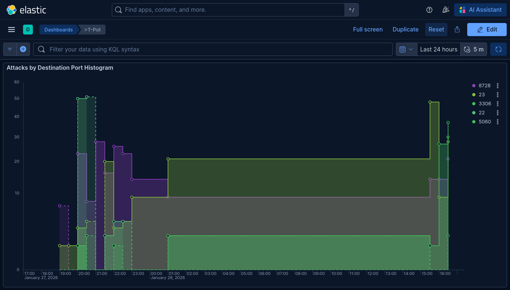

## La Alquimia de Datos: Transformando Ruido en Inteligencia

En la antigua práctica de la alquimia, el Athanor era el horno de destilación donde los maestros separaban las impurezas del metal base para obtener oro. En la ciberseguridad moderna, este mismo principio se aplica cuando desplegamos honeypots: exponemos deliberadamente sistemas señuelo para capturar tráfico hostil y, mediante un proceso riguroso de análisis forense, destilamos inteligencia procesable desde el ruido constante de internet.

Project Athanor nace como un [[athanor-setup|experimento controlado para medir]] la hostilidad de la nube pública. La pregunta era simple pero reveladora: ¿cuánto tiempo tarda una dirección IP recién expuesta en recibir su primer ataque? La respuesta resultó ser dramática y aleccionadora.

)

## La Infraestructura: Especificaciones y el Colapso Inevitable

Para este experimento se desplegó una máquina virtual en Microsoft Azure con las siguientes especificaciones técnicas:

**Recursos de Cómputo:**
- Tipo de instancia: Standard_D2s_v3 (2 vCPUs Intel Xeon, 8 GB RAM)
- Sistema operativo: Ubuntu 24.04 LTS
- Plataforma de honeypot: T-Pot 24.04 (Community Edition)
- Stack de análisis: Elasticsearch, Logstash, Kibana (ELK)
- Contenedores desplegados: 22 honeypots simultáneos (Cowrie, Dionaea, Suricata, Honeytrap, entre otros)

**Configuración de Red:**
- Dirección IP pública expuesta sin restricciones de firewall
- Puertos expuestos: SSH (22/2222), HTTP (80), HTTPS (443), FTP (21), MySQL (3306), MSSQL (1433), RDP (3389), MongoDB (27017), y más de 30 puertos adicionales simulando servicios vulnerables

T-Pot es una plataforma "All-in-One" que integra múltiples honeypots especializados dentro de contenedores Docker, centralizando logs en Elasticsearch para visualización mediante Kibana. La arquitectura permite capturar ataques desde múltiples vectores simultáneamente: fuerza bruta SSH, exploits web, escaneos de bases de datos, y malware de IoT.

### El Colapso: Anatomía de una Falla Catastrófica

**Timeline del Incidente:**
- T+00:00 - Instancia desplegada, IP pública asignada
- T+00:10 - Primera alerta de conectividad perdida
- T+00:12 - Conexión SSH totalmente no responsiva
- T+00:15 - Portal de Azure confirma estado "Running" pero sin respuesta de red

Lo que inicialmente se diagnosticó como un simple problema de recursos reveló un escenario técnico más complejo. El servidor no simplemente "se quedó sin memoria"; experimentó una condición crítica de competencia por recursos entre múltiples procesos de alta demanda.

**Análisis Técnico del Colapso:**

El stack de Elasticsearch consume agresivamente memoria JVM (Java Virtual Machine), típicamente configurado para utilizar entre 2-4 GB de heap memory. Simultáneamente, los 22 contenedores de honeypots procesaban conexiones entrantes masivas, cada uno escribiendo logs a disco y enviándolos al pipeline de Logstash para indexación en tiempo real. Esta combinación creó un escenario de presión extrema sobre los 8 GB disponibles.

Cuando la memoria física se agotó, el kernel de Linux invocó al OOM Killer (Out of Memory Killer), un mecanismo de último recurso que selecciona procesos para terminar basándose en heurísticas de consumo de memoria y prioridad. En este caso, el OOM Killer comenzó a sacrificar contenedores Docker aleatorios, pero el proceso de Elasticsearch (siendo el mayor consumidor) eventualmente también fue terminado, colapsando todo el stack de visualización.

Este comportamiento es característico de sistemas sin límites de recursos adecuadamente configurados mediante cgroups. Sin las restricciones `--memory` y `--memory-swap` en Docker, los contenedores pueden competir sin control hasta agotar los recursos del host, generando lo que se conoce como "noisy neighbor problem" pero a escala de un solo sistema.

**Resolución y Recuperación:**

Se ejecutó un hard reboot desde el portal de Azure. Tras reiniciar, se implementaron límites de memoria temporales y se monitoreó activamente el consumo de recursos. El sistema se mantuvo estable por aproximadamente cuatro horas antes de un apagado controlado, período durante el cual se capturaron 5,324 eventos de ataque distribuidos en múltiples vectores.

## Análisis Forense Shell: Descifrando Intenciones Maliciosas

El honeypot Cowrie simula un shell SSH interactivo completo, registrando cada comando ejecutado por atacantes que logran "autenticarse" mediante credenciales comunes. Este enfoque permite observar el comportamiento post-explotación sin exponer sistemas reales.

### El Comando más Revelador

Del dataset capturado, el comando más sofisticado técnicamente fue:

```bash
cd /dev/shm; cat .s || cp /bin/echo .s; /bin/busybox FVYZL
```

Este comando aparentemente simple revela múltiples técnicas de evasión y reconocimiento:

**Análisis Línea por Línea:**

**1. `cd /dev/shm`** - El directorio `/dev/shm` (Shared Memory) es una partición tmpfs montada en RAM. A diferencia del disco tradicional, los archivos escritos aquí:
- No dejan rastros persistentes (se borran al reiniciar)
- Evitan triggers de antivirus basados en monitoreo de archivos
- Permiten ejecución más rápida (I/O de memoria vs disco)
- No generan logs en sistemas de auditoría de acceso a disco

Esta es una técnica fundamental de **fileless malware**, donde el payload malicioso opera exclusivamente en memoria volátil para minimizar detección forense.

**2. `cat .s`** - Intenta leer un archivo oculto (prefijo `.` lo hace invisible en listados básicos). Este archivo probablemente contiene:
- Un script de segunda etapa
- Una lista de comandos codificados
- Un payload binario codificado en base64

**3. `|| cp /bin/echo .s`** - El operador `||` (OR lógico) ejecuta este comando solo si `cat .s` falla (archivo no existe). Esta es una técnica de **fingerprinting del sistema**:
- Si `cp` tiene éxito, confirma que `/bin/echo` existe (sistema tipo Unix/Linux)
- Si falla, el atacante sabe que el sistema usa rutas no estándar
- Permite al atacante mapear la estructura de binarios disponibles

**4. `/bin/busybox FVYZL`** - BusyBox es un ejecutable que combina múltiples utilidades Unix en un solo binario, común en sistemas embebidos e IoT. El parámetro `FVYZL` es particularmente revelador:
- BusyBox responde listando todos sus módulos disponibles cuando recibe un argumento inválido
- Esto expone qué herramientas tiene disponibles el sistema (wget, ftpget, tftp, nc, etc.)
- El atacante usa esta técnica para determinar vectores de descarga de malware adicional

### Contexto de la Cadena de Ataque

Este comando forma parte de una secuencia más amplia observada en el dataset:

```bash
cat /proc/mounts; /bin/busybox FVYZL
cd /dev/shm; cat .s || cp /bin/echo .s; /bin/busybox FVYZL
dd bs=52 count=1 if=.s || cat .s || while read i; do echo $i; done < .s
rm .s; exit
```

La progresión muestra una operación estructurada:
1. Reconocimiento inicial del sistema de archivos (`/proc/mounts`)
2. Identificación de capacidades del sistema (BusyBox fingerprinting)
3. Cambio a memoria compartida y búsqueda de payload
4. Lectura de instrucciones (con múltiples métodos de fallback)
5. Limpieza de evidencia (`rm .s`)

Esta secuencia es consistente con botnets de IoT automatizados, particularmente variantes de Mirai o Gafgyt, que buscan infectar dispositivos con recursos limitados para integrarlos en redes de DDoS.



## Inteligencia de Red: El Arsenal de los Atacantes

Suricata es un motor de detección de intrusiones (IDS) de código abierto que analiza tráfico de red en tiempo real contra firmas conocidas de ataques. Durante las cuatro horas operativas, Suricata generó 3,920 alertas únicas clasificadas en múltiples categorías de amenaza.

### Alertas Prioritarias: DoublePulsar y Exploits Legacy

**Alerta #1: DoublePulsar Backdoor (1,596 detecciones)**

```
ET EXPLOIT [PTsecurity] DoublePulsar Backdoor installation communication
```

DoublePulsar es un implante de backdoor desarrollado por la NSA y filtrado por el grupo Shadow Brokers en 2017. Funciona como un módulo kernel-mode para Windows que permite:
- Inyección de código arbitrario sin tocar el disco
- Bypass de controles de seguridad a nivel kernel
- Persistencia invisible a herramientas de análisis en user-mode

Aunque el exploit original (EternalBlue/MS17-010) fue parcheado en 2017, la persistencia de estas detecciones cinco años después es alarmante. Esto sugiere dos escenarios:
- **Escaneos automatizados** de botnets buscando sistemas sin parchear
- **Infraestructura comprometida legacy** que continúa propagando el exploit automáticamente

La prevalencia masiva de DoublePulsar en tráfico de internet es un indicador de la "deuda técnica de seguridad" global: millones de sistemas Windows sin parchear siguen expuestos a exploits públicos de hace años.

**Alerta #2: Dshield Block Listed Sources (719 detecciones)**

```
ET DROP Dshield Block Listed Source group 1
```

Esta alerta indica tráfico originado desde direcciones IP catalogadas por el proyecto DShield (SANS Internet Storm Center) como fuentes de actividad maliciosa confirmada. Estas IPs típicamente pertenecen a:
- Servidores comprometidos usados como proxies de ataque
- Infraestructura de botnets activas
- Nodos de exit de redes Tor usadas para actividad maliciosa

### Vulnerabilidades Críticas: CVEs Activamente Explotados

El análisis de CVEs detectados revela patrones de explotación dirigida:

**CVE-2024-14007 (16 detecciones)** - Vulnerabilidad crítica en dispositivos IoT, específicamente en implementaciones de servicios web embebidos. Esta CVE permite:
- Remote Code Execution (RCE) sin autenticación
- Compromiso completo del dispositivo
- Integración del dispositivo en botnets (Mirai, Mozi)

La presencia activa de exploits para esta CVE tan reciente indica que los atacantes actualizan rápidamente sus arsenales, incorporando nuevos exploits apenas se publican detalles técnicos.

**CVE-2023-46604 (2 detecciones)** - Vulnerabilidad crítica en Apache ActiveMQ que permite deserialización remota de objetos Java, conduciendo a RCE. Esta CVE ha sido ampliamente explotada por operadores de ransomware, incluyendo:
- HelloKitty ransomware
- TellYouThePass ransomware
- Grupos de ransomware-as-a-service

La detección de intentos de explotación de ActiveMQ en un honeypot genérico sugiere escaneos indiscriminados en busca de esta vulnerabilidad, sin selectividad de objetivos.

**CVE-2002-0012/0013 (5 detecciones)** - Vulnerabilidad en Microsoft SQL Server 2000. La persistencia de intentos de explotación de una CVE de 22 años de antigüedad es notable y refleja:
- Scripts de ataque heredados que nunca fueron actualizados
- Infraestructura comprometida ejecutando payloads obsoletos automáticamente



### Ataques de Fuerza Bruta: Credenciales Más Intentadas

El análisis de logs de autenticación reveló patrones predecibles pero reveladores:

**Top Credenciales por Servicio:**
- SSH: `root:root`, `admin:admin`, `user:user`, `oracle:oracle`
- PostgreSQL: `postgres:postgres`, `admin:admin123`
- MySQL: `root:root`, `root:123456`, `admin:admin`
- MSSQL: `sa:sa`, `administrator:P@ssw0rd`

Estas credenciales reflejan configuraciones por defecto de instalaciones de software, demostrando que los atacantes priorizan "low-hanging fruit" antes de invertir recursos en ataques más sofisticados. Un sistema con credenciales por defecto será comprometido en minutos.

## Geopolítica del Ciberespacio: Origen y Objetivos

Es fundamental aclarar que la atribución geográfica en ciberseguridad es problemática y potencialmente engañosa. Las direcciones IP de origen no representan la ubicación real de los atacantes; típicamente son:
- Infraestructura VPS comprometida (cloud computing)
- Nodos de exit de VPNs comerciales
- Sistemas residenciales con botnets instalados
- Proxies de servicios "bulletproof hosting"

### Infraestructura de Ataque: Análisis por ASN

El análisis de Autonomous System Numbers (ASN) revela qué proveedores de red hospedan la infraestructura utilizada:

**Top 5 ASN por Volumen:**
1. **AS396982 (Google LLC)** - 2,020 eventos (38% del total)
2. **AS14061 (DigitalOcean)** - 913 eventos (17%)
3. **AS8075 (Microsoft Corporation)** - 382 eventos (7%)
4. **AS215925 (Vpsvault.host)** - 256 eventos (5%)
5. **AS398324 (Censys Inc.)** - 159 eventos (3%)

La dominancia de proveedores de cloud legítimos (Google, Microsoft, DigitalOcean) no indica que estas empresas realicen ataques, sino que sus plataformas son ampliamente abusadas:
- VPS económicas para desplegar scanners automatizados
- Infraestructura comprometida mediante credenciales robadas
- Servicios gratuitos con verificación laxa de identidad

La presencia de Censys Inc. es particularmente interesante: Censys es una plataforma legítima de investigación de seguridad que escanea internet indexando servicios expuestos. Su tráfico es técnicamente indistinguible de reconocimiento malicioso, ilustrando la dificultad de diferenciar investigación legítima de amenazas reales basándose únicamente en comportamiento de red.



### Análisis por Puerto: Objetivos Preferenciales

Los datos revelan qué servicios son más activamente buscados:

**Top Puertos Atacados (Estados Unidos):**
- Puerto 8728: 191 conexiones (MikroTik RouterOS API)
- Puerto 4369/4040/4567/5560: 39-42 conexiones c/u (SCADA/ICS protocols)

**Top Puertos Atacados (India):**
- Puerto 3306: 123 conexiones (MySQL)
- Puerto 23: 25 conexiones (Telnet - IoT devices)

**Top Puertos Atacados (Países Bajos):**
- Puerto 22: 96 conexiones (SSH)
- Puerto 8000/8088: 21-26 conexiones (HTTP alternativo/APIs)

El targeting de puerto 8728 (RouterOS) es especialmente significativo: MikroTik routers han sido vectores de múltiples campañas de malware debido a configuraciones inseguras por defecto. La concentración de ataques en puertos SCADA (4369, 4040, 4567) sugiere búsqueda de infraestructura crítica industrial expuesta accidentalmente a internet.



## Anexo: Preservación de Evidencia Forense

En análisis forense digital, la cadena de custodia es fundamental para mantener la integridad y admisibilidad de la evidencia. Aunque este proyecto es académico, se aplicaron principios forenses profesionales:

**Procedimiento de Recolección:**
1. Extracción de logs sin modificación
2. Hash SHA-256 de todos los archivos extraídos para verificación de integridad
3. Anonimización de datos sensibles (IPs propias, credenciales internas)
5. Compresión y almacenamiento

**Estructura de Artefactos Preservados:**

```
📂 project-athanor-artifacts/
├── 📁 screenshots/
│   ├── elastic_dashboard.png
│   ├── mapa_amenazas.png
│   └── cowrie_dashboard.png
├── 📁 logs_processed/
│   ├── Cowrie_Input_Top_10.csv
│   ├── Suricata_Alert_Signature.csv
│   └── Attacks_by_Country.csv
└── 📦 athanor_logs_full_dump.zip (Evidencia Cruda - 85MB)
```

El dataset completo incluye logs JSON sin procesar de todos los honeypots, permitiendo análisis retrospectivo con diferentes herramientas. La estructura preserva metadatos originales (timestamps, IDs de sesión) necesarios para reconstruir cronologías de ataque.

El dataset anonimizado está disponible para investigación [Descargar aquí](https://github.com/Fennek115/fennek115.github.io/releases/download/athanor/project-athanor-artifacts.zip).

## Lecciones Defensivas: Fortificación y Mitigación

El experimento revela vulnerabilidades sistémicas que trascienden el honeypot específico:

### 1. Gestión de Recursos en Contenedores

**Problema Identificado:** Sin límites de memoria, los contenedores compitieron hasta agotar recursos del host.

**Mitigación Técnica:**
```bash
docker run --memory="512m" --memory-swap="512m" --cpus="0.5" \
  --oom-kill-disable honeypot_container
```

Los parámetros `--memory` y `--memory-swap` establecen límites estrictos, mientras que `--cpus` evita monopolización de CPU. El flag `--oom-kill-disable` previene que el kernel termine el contenedor; en su lugar, las operaciones dentro del contenedor fallarán explícitamente, permitiendo manejo de errores controlado.

### 2. Hardening de SSH

**Configuración Recomendada (`/etc/ssh/sshd_config`):**
```
PasswordAuthentication no
PubkeyAuthentication yes
PermitRootLogin no
MaxAuthTries 3
LoginGraceTime 30
ClientAliveInterval 300
ClientAliveCountMax 2
```

Esta configuración deshabilita completamente autenticación por contraseña, forzando uso exclusivo de claves criptográficas. El parámetro `MaxAuthTries 3` limita intentos de autenticación, mientras que `LoginGraceTime 30` cierra conexiones que no completan autenticación rápidamente, mitigando ataques de agotamiento de conexiones.

### 3. Network Security Groups (Azure)

**Principio de Denegación por Defecto:**
```
Rule 100: Allow SSH from Corporate_IP/32 → Port 22
Rule 200: Allow HTTPS from Any → Port 443
Rule 300: Deny All from Any → Any
```

En entornos de producción, jamás se debe exponer un servidor sin restricciones de firewall. Los Network Security Groups (NSG) de Azure permiten whitelisting por IP, asegurando que solo fuentes autorizadas puedan alcanzar servicios críticos.

### 4. Monitoreo Proactivo y Alertas

**Stack de Observabilidad:**
- Métricas de sistema: Prometheus + Node Exporter
- Logs centralizados: ELK Stack o Grafana Loki
- Alertas: Alertmanager configurado con umbrales de memoria/CPU
- SIEM: Integración con Wazuh o Splunk para correlación de eventos

La visibilidad proactiva habría permitido detectar el consumo anómalo de memoria antes del colapso, habilitando intervención manual o auto-scaling automatizado.

## Conclusión: La Hostilidad de la Nube como Constante

Project Athanor confirma empíricamente lo que la industria de ciberseguridad ha documentado durante años: internet es un entorno fundamentalmente hostil. Una dirección IP expuesta será escaneada, probada y atacada en minutos, sin consideración de su propósito legítimo.

Los hallazgos clave son:

**1. Tiempo hasta primer ataque: <10 minutos** - La velocidad de descubrimiento y targeting indica escaneos globales automatizados constantes. No existe período de gracia; la exposición es inmediata.

**2. Diversidad de vectores:** Los atacantes no se especializan; ejecutan campañas multi-vector simultáneamente, buscando cualquier superficie de ataque disponible.

**3. Persistencia de exploits antiguos:** La detección de CVEs de 2002 demuestra que la infraestructura comprometida ejecuta payloads heredados indefinidamente. La obsolescencia técnica es una constante.

**4. Abuso de infraestructura legítima:** La mayoría de ataques se originan desde proveedores cloud legítimos, complicando estrategias de bloqueo basadas en reputación de ASN.

Para organizaciones desplegando infraestructura en la nube, las implicaciones son claras: **la seguridad no puede ser una consideración posterior**. La configuración segura por defecto, el principio de mínimo privilegio, y la visibilidad continua son requisitos fundamentales, no opcionales.

El Athanor cumplió su propósito: transformó el plomo del ruido de internet en oro de inteligencia procesable. La próxima iteración del proyecto incluirá recursos escalables, límites de memoria adecuados, y períodos de observación extendidos para capturar patrones longitudinales de amenazas.

Como dijo el alquimista: el proceso de destilación requiere paciencia, contención adecuada, y atención constante al fuego. En ciberseguridad, estos principios permanecen atemporalmente válidos.

---

*Hash del Dataset: `SHA256:171704c359eeea77ff28ce9581fec9bdd1b5166bcc9636b8b631393003a8a6f0`*
