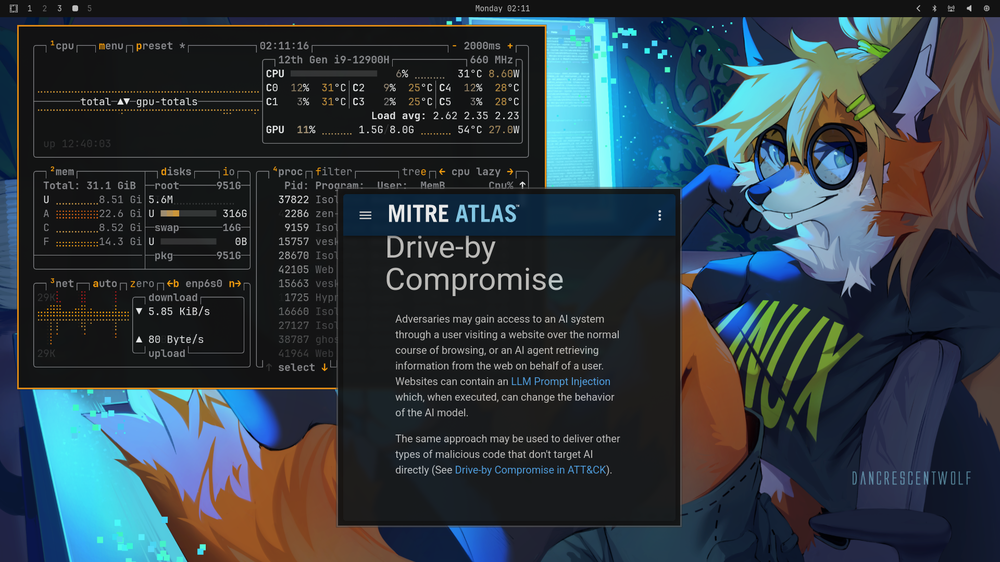
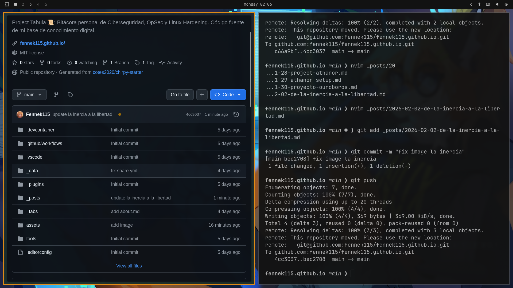

> "[[transmutacion-digital|Solve et coagula]]" — Axioma alquímico: disolver lo viejo para cristalizar lo nuevo.

**Fecha:** 02 de Febrero de 2026

El debate entre Windows y Linux suele ser circular, pasional y, a menudo, poco productivo. Ambos bandos esgrimen argumentos técnicos mientras ignoran el elefante en la habitación: que la mayoría de nuestras preferencias tecnológicas no son racionales, sino viscerales. Son el producto de años de condicionamiento, de caminos de menor resistencia, de inercias heredadas.

No escribo esto para convencer a nadie de abandonar su sistema operativo, ni para avivar guerras santas tecnológicas. Escribo esto como una **bitácora de iniciado** de mi propia transformación: de un adolescente que optimizaba registros en Windows 7 para exprimir 5 FPS más, a un profesional de la ciberseguridad que encontró en Linux no solo un sistema operativo, sino una filosofía de trabajo, una herramienta que respeta mi agencia.

Hoy, en pleno 2026, mi veredicto es claro: para mi perfil técnico, creativo y profesional, Linux ha dejado de ser una alternativa exótica para convertirse en el estándar que define mi flujo de trabajo. Esta es mi historia, con sus fracasos, revelaciones y el doloroso proceso de desaprender para volver a aprender.

---

## 🪟 El Espejismo de la Comodidad: La Era Windows (1998-2016)

### Los Primeros Pasos: Windows como Puerta de Entrada

Mi viaje comenzó como el de muchos de mi generación: **Windows 98** y el salto cuántico a **Windows 7**. Inconscientemente me salté las "ovejas negras" del ecosistema Microsoft (XP con sus vulnerabilidades legendarias, Vista con su torpeza proverbial), y mis recuerdos de esa época están teñidos de una nostalgia agridulce.

Pasar de emular una Sega Genesis en mi vieja máquina a correr emuladores de PS1 y PS2, jugar *Counter-Strike*, los primeros *Call of Duty*... se sentía como **magia pura**. Para un adolescente con recursos limitados, Windows 7 era el universo entero contenido en una notebook compaq con 2GB de RAM.

### La Falsa Sensación de Control

Sin embargo, esa magia tenía un **costo oculto** que solo entendería años después.

Con un hardware que ya nacía obsoleto (2 núcleos, 2GB de RAM, 200GB de almacenamiento mecánico), me vi forzado a convertirme en un "mecánico de emergencia" de mi propio entorno. Pasaba tardes enteras haciendo lo que en ese entonces creía que era "optimización":

- Editando el registro de Windows con guías de dudosa procedencia de foros en español
- Creando scripts `.bat` para liberar memoria RAM (que probablemente no hacían nada)
- Ajustando planes de energía que en teoría daban más rendimiento
- Probando "optimizadores" propietarios que prometían el oro y el moro

Recuerdo especialmente uno de **Razer** (Cortex, creo) que literalmente mataba el explorador de Windows, dejándote con un fondo negro estático y solo la aplicación activa en pantalla. Era brutal, primitivo, y efectivo... para ganar 3-5 FPS en juegos que ya corrían a 20.

En retrospectiva, **estaba luchando contra el sistema, no trabajando con él**. Era como intentar hacer que un caballo cojo ganara una carrera cambiándole las herraduras cada hora.

### El Primer Encuentro con Linux: Rechazo y Frustración

Durante esa época, en los rincones oscuros de internet, empecé a escuchar rumores, casi **mitos urbanos**, sobre algo llamado **Linux**:

- Era gratis (en un mundo donde pirateaba todo, esto no me impresionaba)
- Velaba por la "libertad" (concepto abstracto para mi yo de 15 años)
- Era "más rápido y eficiente" (esto sí llamaba mi atención)

Motivado por la curiosidad y la desesperación de mi hardware limitado, decidí probar. Bajé ISOs de **Ubuntu, Puppy Linux, Lubuntu** y algunas otras distribuciones que ya no recuerdo.

El resultado fue **desastroso**.

Rompí el arranque (GRUB) más veces de las que puedo contar. Aprendí a la fuerza sobre la BIOS, sobre particiones, sobre el MBR vs GPT, sobre cómo formatear una PC desde cero (algo que luego me haría gracia cuando veía "técnicos" cobrar 20-30 dólares por hacer exactamente eso).

Pero cada intento terminaba en frustración:

- Linux se sentía **más lento** que Windows 7 en mi hardware (probablemente por drivers mal configurados o falta de aceleración gráfica)
- La interfaz era confusa, abstracta, fea
- No podía jugar a nada (o no sabía cómo hacerlo)
- No tenía ni idea de qué hacer con la terminal negra que me miraba amenazante

La conclusión de mi yo de 15 años fue tajante: 

> "Linux es una basura. Es para nerds que tienen tiempo de sobra. Yo solo quiero que las cosas funcionen."

Volví a Windows porque era lo que **conocía**. Era predecible. Era cómodo. Me sentía seguro en mi jaula dorada, sin darme cuenta de que las rejas estaban hechas de mi propia ignorancia.

### La Zona de Confort: Windows 10 y el Estancamiento

Años después, finalmente pude armarme una PC de escritorio. Era hardware algo obsoleto para su época (2015-2016), pero comparado con mi máquina anterior, era un **Ferrari**. Podía jugar, programar, hacer lo que quisiera sin las limitaciones que había vivido.

Instalé **Windows 10**. Todo "simplemente funcionaba". 

Y ahí comenzó el verdadero problema: **el estancamiento**.

Cuando todo funciona sin esfuerzo, cuando no hay fricción, cuando el sistema hace todo por ti... dejas de aprender. Mi curiosidad informática, que antes me obligaba a investigar cada error, a entender cada proceso, se había **atrofiado**. Me había vuelto un usuario pasivo, un consumidor de tecnología en lugar de un creador con ella.

Había cambiado mi hambre de conocimiento por la comodidad de la ignorancia funcional.

---

## 🔥 El Punto de Inflexión: La Nigredo y el Llamado Profesional

En alquimia, la **nigredo** es la fase de putrefacción, de muerte del viejo ser. Es el momento donde todo lo que creías saber se desmorona. Para mí, llegó cuando decidí profesionalizarme en tecnología.

### El Despertar: Ciberseguridad y la Realidad Incómoda

Empecé a estudiar informática en mis tiempos libres, con la meta de eventualmente entrar a la universidad o a un instituto técnico. Mi interés se inclinó naturalmente hacia la **ciberseguridad** — un campo que me parecía fascinante por su naturaleza de resolver puzzles, de pensar como un atacante para defender mejor.

Y ahí me golpeó la realidad como un balde de agua fría:

**Casi todas las herramientas profesionales de seguridad son nativas de Linux.**

Kali Linux, Parrot OS, las herramientas de pentesting, los frameworks de exploit, los laboratorios de análisis forense, la gestión de redes... todo, absolutamente todo, estaba diseñado primero para entornos Unix-like. Windows era, en el mejor de los casos, un ciudadano de segunda clase.

Intentar ser un profesional de ciberseguridad usando solo Windows es como intentar ser chef profesional usando solo un microondas. Técnicamente se puede, pero estás **fundamentalmente limitado** por tu herramienta.

Además, empecé a notar que:

- Todos los tutoriales buenos estaban centrados en Linux
- La documentación oficial de herramientas asumía un entorno Unix
- Los profesionales del campo usaban Linux como estándar
- Windows Subsystem for Linux (WSL) era un parche sobre un problema fundamental

Tenía dos opciones: seguir nadando contra la corriente o **adaptarme**.

### El Tercer Intento: Hardware Mejor, Mentalidad Diferente

Para ese entonces había cambiado de PC nuevamente — un portátil "gamer" bastante potente pero que representaba un downgrade desde mi perspectiva (movilidad a cambio de expansibilidad, una decisión que aún cuestiono).

Con conocimientos ya más sólidos de programación, sistemas y redes, decidí darle a Linux una **tercera oportunidad**. Esta vez no por curiosidad adolescente, sino por necesidad profesional.

Y me llevé la sorpresa de mi vida.

---

## 🐧 La Albedo: El Renacimiento en Linux (2020-2026)

En alquimia, la **albedo** es la fase de purificación, donde emerge algo nuevo y refinado de las cenizas de lo viejo. Mi encuentro con el Linux moderno fue exactamente eso.


_Mi escritorio actual: Arch Linux con Hyprland, múltiples terminales y un flujo de trabajo optimizado_

### El Cambio de Paradigma: Linux Había Madurado (o Yo Había Madurado)

No sé en qué momento exacto ocurrió el cambio — si fue Linux el que maduró o si fui yo quien finalmente alcanzó el nivel de comprensión necesario — pero el sistema que encontré ya no era ese monstruo hostil de mi adolescencia.

**Las distribuciones modernas eran diferentes:**

- La instalación era **más fácil que instalar Windows** (sin buscar drivers por todos lados)
- Las interfaces gráficas (GNOME, KDE Plasma) eran hermosas y funcionales
- Los gestores de paquetes tenían sentido lógico una vez que entendías el concepto
- **Proton** (la capa de compatibilidad de Valve) había revolucionado el gaming en Linux

Empecé con distribuciones "amigables" como **Linux Mint** y **Pop!_OS**, y gradualmente fui explorando el ecosistema.

### 1. La Revelación de los Repositorios: Gestión Centralizada de Software

Uno de los primeros "click" mentales fue entender **la lógica de los repositorios**.

En Windows, el flujo típico para instalar software es:

1. Buscar en Google "[nombre del programa] download"
2. Navegar a una página web (rezando que sea la oficial y no malware)
3. Descargar un `.exe` 
4. Ejecutarlo y hacer clic en "Next" 47 veces
5. Desmarcar toolbars y bloatware ocultos en la instalación
6. Repetir esto para cada programa
7. Actualizar cada programa manualmente cuando se abra

Es un sistema **arcaico, inseguro y fragmentado**, heredado de los años 90.

En Linux (y en macOS con Homebrew, para ser justos), existe un concepto diferente:

```bash
# Instalar software
sudo pacman -S firefox vlc gimp

# Actualizar TODO el sistema Y todo el software instalado
sudo pacman -Syu
```

Un solo comando. Un solo repositorio confiable. Todo centralizado, verificado criptográficamente, actualizado atómicamente.

**Es la diferencia entre ir a 15 tiendas diferentes para hacer las compras de la semana, versus ir a un supermercado donde todo está organizado y verificado.**

Las tiendas gráficas (como GNOME Software o Discover con Flatpak) hacen esto aún más simple: un clic para instalar, todo se actualiza junto, sin reiniciar el sistema.

Cuando finalmente entendí esto, fue como un **velo cayendo de mis ojos**. Pensé: "¿Cómo pude vivir de otra manera?"

### 2. La Ilusión de Propiedad: Privacidad y Control Real

Con el tiempo, algo en Windows empezó a molestarme profundamente: **la sensación de no ser dueño de mi propia máquina**.

**Síntomas de la enfermedad:**

- Actualizaciones forzadas que reiniciaban el PC en medio de mi trabajo
- Telemetría que no podía desactivar completamente sin hackeos del registro
- Bloatware que reaparecía mágicamente después de actualizaciones (Candy Crush, Xbox Game Bar, etc.)
- Cortana y el buscador web integrado que consumían recursos incluso cuando no los usaba
- Windows Defender escaneando mis archivos sin permiso explícito
- Configuraciones que cambiaban solas con las actualizaciones

Me empecé a sentir como un **invitado en mi propia casa**. O peor, como un inquilino que renta una máquina cuyo verdadero dueño es Microsoft.

Incluso llegué a instalar **Chocolatey** (un gestor de paquetes para Windows vía CMD) solo para intentar traer algo de cordura al caos de la gestión de software.

En Linux, por contraste:

- Yo decido cuándo se actualiza el sistema (una vez a la semana, dos veces al mes, cuando me dé la gana)
- No hay telemetría oculta (y si existe, puedo auditar el código fuente)
- No hay bloatware preinstalado
- El sistema **obedece mis órdenes**, no al revés

Es la diferencia entre conducir tu propio auto versus estar en un Uber donde el conductor decide la ruta.

### 3. Rendimiento: La Paradoja de los FPS

Seré honesto: el rendimiento en **gaming** sigue siendo el talón de Aquiles de Linux.

Dependiendo del juego, la pérdida puede variar entre **5% y 40%** comparado con Windows nativo. Esto es especialmente cierto con juegos que usan DRM invasivo (Easy Anti-Cheat, Denuvo) o que tienen ports mal optimizados.

**Pero aquí está el truco que no entendía antes:**

En Windows, podía tener 10-15% más FPS en un juego específico... pero:

- El sistema operativo consumía 3-4GB de RAM en idle
- Los procesos en segundo plano (telemetría, Windows Update, antivirus) causaban stuttering
- Los drivers de GPU se actualizaban solos y a veces rompían cosas
- El rendimiento variaba salvajemente entre sesiones

En Linux:

- El sistema consume 800MB-1.5GB de RAM en idle
- No hay procesos ocultos saboteando el rendimiento
- Los drivers son estables (especialmente en AMD, que tiene drivers open-source excelentes)
- El rendimiento es **predecible y consistente**

Prefiero tener 5% menos FPS pero saber exactamente qué está haciendo mi sistema, que tener 5% más pero con micro-stuttering impredecible.

Además, **Proton ha madurado espectacularmente**. En 2026, el 80-90% de mi biblioteca de Steam funciona perfectamente. Juegos que pensé que nunca correría en Linux (Elden Ring, Cyberpunk 2077, algunos indies) funcionan sin tocar nada.

### 4. La Navaja Suiza: Linux para el Profesional de TI

Aquí es donde Linux realmente brilla. Para uso profesional en tecnología, no hay competencia.

#### Ciberseguridad y Pentesting

Todo funciona **nativamente**:

- Herramientas de reconocimiento (Nmap, Masscan, theHarvester)
- Frameworks de explotación (Metasploit, Empire, Cobalt Strike)
- Análisis forense (Autopsy, Volatility, Wireshark)
- Cracking de contraseñas (John the Ripper, Hashcat)
- Proxies y man-in-the-middle (Burp Suite, mitmproxy)

No hay que pelear con WSL o con máquinas virtuales lentas. Todo corre directamente en el metal.

#### Virtualización y Laboratorios

**QEMU/KVM** ofrece virtualización de tipo 1 (hipervisor directo) con rendimiento casi nativo. Puedo tener 5-6 VMs corriendo simultáneamente para laboratorios de red, análisis de malware, entornos de desarrollo, sin que el sistema se arrodille.

En Windows, VirtualBox o VMware Workstation son soluciones de tipo 2 (sobre el sistema operativo), muchísimo más lentas y limitadas.

#### SSH, Terminal y Automatización

La terminal de Linux no es un ciudadano de segunda clase como CMD o PowerShell en Windows. Es el **corazón del sistema**.

Puedo:

- Conectarme a servidores remotos vía SSH con autenticación por claves
- Crear túneles SSH para bypasear restricciones de red
- Automatizar tareas con scripts Bash, Python o cron jobs
- Gestionar servicios en la nube (AWS, Azure, GCP) desde la CLI nativa
- Usar herramientas como `tmux` para sesiones persistentes

Todo esto existe en Windows, pero siempre se siente como un **añadido artificial**, no como parte orgánica del sistema.

#### Desarrollo y DevOps

- Contenedores con **Docker** y **Podman** funcionan nativamente (en Windows necesitas WSL2 o Hyper-V)
- Orquestación con **Kubernetes** es infinitamente más simple
- Los stacks modernos (Node.js, Python, Go, Rust) tienen mejor soporte y menos fricción
- Las herramientas de CI/CD (Jenkins, GitLab CI, GitHub Actions) se sienten naturales

### 5. El Bono Inesperado: Creatividad y Música

Nunca pensé que Linux sería viable para mis hobbies creativos, pero me sorprendió gratamente.

**Grabación de guitarra eléctrica:**

Conecto mi guitarra → interfaz de audio USB → **Guitarix** (amplificador y pedalera virtual open-source) → **Ardour** o **Reaper** para grabar.

La latencia es **bajísima** (2-5ms), mucho mejor que en Windows donde ASIO drivers a veces secuestraban todo el audio del sistema o generaban clicks y pops.

El sistema **JACK** (Jack Audio Connection Kit) permite rutear audio entre aplicaciones con una flexibilidad que en Windows solo existe con software de terceros costoso.

¿Es más complicado de configurar inicialmente? Sí. ¿Funciona mejor una vez configurado? Absolutamente.

### 6. Hyprland: La Geometría del Pensamiento Digital

Y aquí llegamos a algo que nunca imaginé que cambiaría tanto mi forma de trabajar: los **tiling window managers**.


_Múltiples terminales, navegador, y herramientas de desarrollo organizadas automáticamente_

#### El Problema con las Ventanas Flotantes

Durante años, tanto en Windows como en los primeros meses en Linux con GNOME o KDE, manejaba ventanas de la manera "tradicional":

- Ventanas que se superponen unas sobre otras
- Maximizar/minimizar constantemente
- Usar Alt+Tab para encontrar la ventana que necesitas entre 15 abiertas
- Ajustar manualmente el tamaño de cada ventana
- Perder tiempo organizando tu espacio de trabajo

Es **ineficiente**, pero es todo lo que conocía.

#### El Descubrimiento de los Tiling Window Managers

Un día, curioseando en Reddit y foros de Linux, empecé a ver screenshots de setups minimalistas donde todas las ventanas estaban perfectamente **organizadas en mosaico**, sin superposiciones, aprovechando cada píxel de la pantalla.

Eran **tiling window managers** (gestores de ventanas en mosaico): i3, bspwm, dwm, Sway... y el más moderno: **Hyprland**.

La premisa es simple pero revolucionaria:

> Las ventanas nunca se superponen. El gestor las organiza automáticamente en layouts (horizontal, vertical, stacking) que aprovechan toda la pantalla.

#### Mi Experiencia con Hyprland

Después de probar i3 y Sway, me establecí en **Hyprland** por varias razones:

1. **Animaciones suaves y modernas** - A diferencia de i3 que es ultra-minimalista, Hyprland tiene transiciones fluidas que hacen que el workflow se sienta natural, no robótico
2. **Basado en Wayland** - Mejor manejo de múltiples monitores, escalado fraccional, y seguridad
3. **Configuración en un solo archivo** - Todo en `~/.config/hypr/hyprland.conf`, simple y auditable
4. **Comunidad activa** - En constante desarrollo, bugs se arreglan rápido

**Cómo funciona en la práctica:**

Cuando abro una terminal, ocupa toda la pantalla. Abro otra, y Hyprland **automáticamente** divide la pantalla en dos mitades verticales. Abro una tercera, y reorganiza todo en un layout óptimo.

No tengo que hacer nada. El sistema **piensa por mí**.

Tengo configurados **10 espacios de trabajo virtuales**:

- **Workspace 1**: Navegador principal (Firefox)
- **Workspace 2**: Terminales para desarrollo
- **Workspace 3**: IDE (Neovim en tmux)
- **Workspace 4**: Herramientas de pentesting (Burp Suite, mitmproxy)
- **Workspace 5**: Discord/comunicación
- **Workspace 6**: Spotify/música
- **Workspace 7**: Documentación (PDFs, wikis)
- **Workspace 8**: Máquinas virtuales (si las tengo abiertas)
- **Workspace 9**: Monitoreo del sistema (htop, btop)
- **Workspace 10**: Flotante para ventanas misceláneas

Cambio entre ellos con `Super + [número]` instantáneamente. Es como tener **10 monitores virtuales** en uno solo.

**Atajos que uso todo el tiempo:**

```
Super + Enter         → Abrir terminal
Super + Q             → Cerrar ventana
Super + [1-10]        → Cambiar a workspace N
Super + Shift + [1-10] → Mover ventana a workspace N
Super + H/J/K/L       → Navegar entre ventanas (estilo Vim)
Super + F             → Fullscreen de la ventana actual
Super + V             → Cambiar a layout vertical
Super + B             → Cambiar a layout horizontal
```

Todo controlado desde el teclado. El mouse prácticamente no lo uso, excepto para el navegador.

#### Por Qué Esto Cambia el Juego

**Eficiencia cognitiva:**

No pierdo tiempo decidiendo dónde poner cada ventana. El sistema las organiza óptimamente. Mi cerebro puede enfocarse en el *contenido*, no en la *logística* de las ventanas.

**Aprovechamiento de pantalla:**

Cada píxel se usa. No hay espacio desperdiciado. Puedo ver código en un lado, documentación en otro, y terminal en el centro, todo visible simultáneamente.

**Fluidez del workflow:**

Cuando estoy programando, tengo:
- Código en workspace 2
- Navegador con documentación en workspace 1
- Terminal corriendo tests en workspace 3

Salto entre ellos con un solo keypress. No hay Alt+Tab interminable buscando la ventana correcta.

**Control total:**

Puedo configurar reglas para aplicaciones específicas:

```conf
# Spotify siempre en workspace 6
windowrule = workspace 6, ^(Spotify)$

# Discord siempre en workspace 5
windowrule = workspace 5, ^(discord)$

# Ventanas flotantes para diálogos
windowrule = float, ^(pavucontrol)$
```

El sistema **aprende** cómo trabajo y se adapta.

#### La Curva de Aprendizaje

No voy a mentir: los primeros 2-3 días con Hyprland fueron **frustrantes**.

Estaba acostumbrado a 20+ años de ventanas flotantes. Mi cerebro quería alcanzar el mouse para arrastrar ventanas. Mis dedos buscaban Alt+Tab por reflejo.

Pero después de esa joroba inicial, algo **hizo click**.

Dejé de *luchar* con las ventanas y empecé a *fluir* con ellas.

Ahora, cuando uso una máquina con Windows o macOS, me siento **claustrofóbico**. Las ventanas se superponen. Tengo que moverlas manualmente. Alt+Tab me muestra una pila desorganizada de aplicaciones.

Se siente como **retroceder en el tiempo**.

#### ¿Es Para Todos?

**Absolutamente no.**

Los tiling window managers son para:

- Personas que pasan 8+ horas al día en la computadora
- Usuarios avanzados que no le temen a archivos de configuración
- Quienes priorizan eficiencia sobre familiaridad
- Desarrolladores, administradores de sistemas, analistas de datos, cualquiera que trabaje con múltiples ventanas simultáneas

Si usas la PC solo para navegar, ver videos y redes sociales, un tiling WM es **overkill**.

Pero si eres alguien que constantemente está haciendo malabares con terminales, editores, navegadores, herramientas de desarrollo... es un **game changer**.

---

## ⌨️ La Rubedo: Reflexión sobre la Transformación y la Tiranía del QWERTY

En alquimia, la **rubedo** es la fase final: la piedra filosofal, la perfección alcanzada, pero también la comprensión de que toda verdad es relativa.

### El Síndrome del QWERTY: Por Qué No Cambiamos

Aquí está la pregunta incómoda: si Linux es técnicamente superior para tantos casos de uso, ¿por qué la mayoría de la gente sigue usando Windows?

La respuesta no es técnica, es **psicológica y sociológica**.

Pensemos en el teclado **QWERTY**.

La distribución QWERTY fue diseñada en los **1870s** para máquinas de escribir mecánicas. El objetivo era separar las letras comúnmente usadas juntas para evitar que las barras metálicas se atascaran físicamente.

Es una **solución a un problema mecánico que ya no existe**.

Existen alternativas más eficientes:

- **Dvorak**: diseñado para minimizar movimiento de dedos
- **Colemak**: balance entre eficiencia y facilidad de transición
- Layouts específicos para programación

Sin embargo, el mundo entero sigue usando QWERTY. No porque sea mejor, sino porque:

1. **Path dependence**: es lo que existe y cambiar tiene costos
2. **Network effects**: todos los teclados vienen así por defecto
3. **Costo de aprendizaje**: reentrenar la memoria muscular toma meses
4. **Tradición inconsciente**: "así se han hecho siempre las cosas"

Incluso heredamos características físicas de las máquinas de escribir (el escalonado de las teclas) en nuestros teclados digitales modernos, donde **no existe razón física** para ello. Es una limitación analógica del siglo XIX incrustada profundamente en nuestras herramientas digitales del siglo XXI.

Una dicotomía fascinante.

### Windows es Nuestro QWERTY Colectivo

Con Windows pasa exactamente lo mismo:

**Creemos que es "intuitivo" simplemente porque es lo único que hemos usado desde niños.**

La interfaz de Windows, su lógica de archivos (C:\, D:\), su gestión de software fragmentada, sus reinicios obligatorios... nada de esto es inherentemente lógico o superior. Es solo **familiar**.

Cambiar a Linux requiere:

- Desaprender patrones de 15-20 años
- Recablear conexiones neuronales sobre "cómo funciona un ordenador"
- Enfrentar la **fricción cognitiva** de sentirse incompetente temporalmente
- Cuestionar suposiciones que parecían verdades universales

Es incómodo. Es frustrante. Es como volver a aprender a caminar.

**Pero una vez que superas esa joroba inicial, la libertad es embriagadora.**

### El Problema No Es Técnico, Es Ontológico

El verdadero obstáculo para la adopción de Linux no es la compatibilidad de drivers o la interfaz gráfica (que ya están resueltas en 2026). Es que requiere un **cambio de mentalidad**.

De:
- "La computadora hace lo que ella quiere, yo me adapto"

A:
- "Yo configuro la computadora para que haga lo que yo necesito"

Es el cambio de ser consumidor pasivo a ser agente activo de tu propia tecnología.

Y eso da miedo, porque implica **responsabilidad**.

---

## 🏁 La Síntesis: Todas las Verdades Son Medias Verdades

Como dice el **Kybalion** en su principio de polaridad:

> "Todo es dual; todo tiene polos; todo tiene su par de opuestos; los opuestos son idénticos en naturaleza, pero diferentes en grado; los extremos se tocan; todas las verdades no son sino medias verdades; todas las paradojas pueden reconciliarse."

### Windows No Es el Demonio

Windows tiene su lugar. Para usuarios que:

- Solo quieren consumir contenido (Netflix, YouTube, navegación)
- No tienen interés en entender cómo funciona su sistema
- Usan software específico que solo existe en Windows (Adobe, ciertas herramientas CAD, algunos juegos con anti-cheat invasivo)
- Valoran la comodidad sobre el control

Windows es **suficiente**. Funciona. No es necesario cambiarlo.

### Linux No Es la Panacea

Linux también tiene problemas:

- La fragmentación de distribuciones puede ser abrumadora
- Algunos drivers (especialmente WiFi y GPUs Nvidia) pueden ser problemáticos
- El gaming, aunque mejoró, sigue siendo subóptimo en muchos casos
- La curva de aprendizaje existe, y no todo el mundo tiene tiempo o interés

No es para todos, y **está bien**.

### Para Quién Sí Es Linux (Mi Conclusión Personal)

Linux es ideal para:

**El usuario curioso** que quiere entender cómo funcionan las cosas por debajo del capó.

**El profesional técnico** que trabaja en desarrollo, DevOps, ciberseguridad, administración de sistemas, redes, análisis de datos.

**El creador de contenido techie** que valora la personalización extrema y el control total sobre su flujo de trabajo.

**El obsesivo de la privacidad** que no quiere telemetría ni bloatware en su máquina.

Para estos perfiles, Linux no es solo una alternativa. Es la **herramienta que se adapta a ti**, no tú a la herramienta.

### Mi Veredicto en 2026

Después de años intentando usar Linux como sistema principal, y finalmente lo logre, estos son mis hallazgos:

**Ventajas que no puedo abandonar:**
- Privacidad y control total sobre mi sistema
- Rendimiento consistente y predecible
- Gestión centralizada de software
- Herramientas profesionales nativas
- Personalización sin límites (Hyprland cambió mi vida)
- Estabilidad (meses sin reiniciar)
- Workflow optimizado al extremo

**Concesiones que he aceptado:**
- 5-10% menos FPS en algunos juegos (pero juego menos que antes, así que no es crítico)
- Ocasionalmente pelear con drivers (raro, pero pasa)
- Algunos programas no están disponibles (pero hay alternativas)
- Curva de aprendizaje para cosas como tiling WMs

**El balance es claro**: para mi perfil, las ventajas superan ampliamente las desventajas.

¿Significa que todos deberían usar Linux? **No**.

Significa que si eres alguien que:
- Se siente limitado por su sistema actual
- Quiere aprender en profundidad sobre tecnología
- Trabaja en campos técnicos donde Linux es el estándar
- Valora la eficiencia y el control sobre la comodidad

Entonces vale la pena **atravesar la fricción** del cambio.

---

## 🌅 Epílogo: El Camino del Iniciado

Hay un patrón reconocible en quienes eventualmente adoptan Linux:

1. **Prueba inicial** → Frustración → Abandono
2. **Segunda prueba** → Pequeños logros → Vuelve a Windows por comodidad
3. **Tercera prueba (por necesidad profesional)** → El "click" mental → Adopción gradual
4. **Dominio** → Incapacidad de volver atrás
5. **Maestría** → Exploración avanzada (tiling WMs, Arch, etc.)

Es un **rito de paso**, una transformación alquímica.

Disuelves tus viejas suposiciones (solve), enfrentas el caos de lo desconocido (nigredo), purificas tu entendimiento (albedo), y cristalizas una nueva forma de trabajar (coagula).

Al final, no se trata de Windows vs Linux.

Se trata de **inercia vs agencia**.

De aceptar la herramienta que te dan, versus forjar la herramienta que necesitas.

Y como toda verdad filosófica, esto también es solo una media verdad. Tu kilometraje puede variar.

Pero si llegaste hasta aquí, tal vez seas alguien que está listo para su propia transformación.

El camino está ahí. Solo requiere el primer paso.

---

*¿Tienes experiencias similares con Linux, o perspectivas diferentes? Me encantaría leer tus reflexiones, envíame un correo o contáctame por alguna de mis redes.*

---

## Referencias y Recursos

**Para comenzar con Linux:**
- [Linux Journey](https://linuxjourney.com/) - Tutorial interactivo excelente
- [DistroWatch](https://distrowatch.com/) - Comparación de distribuciones
- [r/linux4noobs](https://reddit.com/r/linux4noobs) - Comunidad amigable para principiantes
- [r/unixporn](https://reddit.com/r/unixporn) - Inspiración para customizar tu setup

**Distribuciones recomendadas para empezar:**
- **Linux Mint** - La más amigable para usuarios de Windows
- **Pop!_OS** - Excelente para gaming y creadores de contenido
- **Fedora** - Balance entre estabilidad y software moderno
- **Manjaro** - Para los más aventureros (basado en Arch pero más accesible)

**Para los curiosos sobre Tiling Window Managers:**
- [Hyprland](https://hyprland.org/) - Mi elección personal, moderno y con animaciones
- [i3wm](https://i3wm.org/) - El clásico, simple y confiable
- [Sway](https://swaywm.org/) - i3 pero para Wayland
- [r/unixporn](https://reddit.com/r/unixporn) - Galería de setups increíbles

**Lecturas filosóficas:**
- *El Kybalion* - Los siete principios herméticos
- *The Cathedral and the Bazaar* - Eric S. Raymond (sobre desarrollo open-source)
- *Free Software, Free Society* - Richard Stallman
- *In the Beginning... Was the Command Line* - Neal Stephenson
