## Abstract

Este artículo documenta el diseño, construcción y evolución de **Separatio**, un pipeline de Cyber Threat Intelligence automatizado que construí en 6 días. El sistema lee feeds RSS de ciberseguridad a través de Miniflux, analiza cada artículo con modelos de lenguaje (local con Ollama o cloud con OpenAI/Claude/Gemini), correlaciona CVEs contra [[la-guerra-que-no-se-declara|el catálogo CISA KEV y scores EPSS]] de FIRST.org, y genera un informe diario en PDF, Markdown y HTML con exportación de IOCs lista para ingestión en un SIEM.

El resultado: de 4000+ artículos acumulados sin leer a un briefing ejecutivo estructurado, con fuentes citadas, CVEs corroborados y APT profiles, entregado antes de las 8am. Localmente tarda ~3.75 horas; con OpenAI, **9 minutos** para 260 artículos.

> El nombre viene del concepto alquímico de *separatio*: separar lo sutil de lo grosero. Aplicado a seguridad: separar la señal del ruido en el mar de publicaciones diarias.

---

## El Problema: 4000 Artículos Sin Leer

Todo empezó con Miniflux. Quería una página centralizada de noticias de ciberseguridad para mantenerme al día sin navegar por diez sitios diferentes. Lo monté en un LXC en Proxmox, busqué los mejores feeds del sector, y lo llené.

El resultado inmediato fue un problema inesperado: en pocos días tenía **más de 4000 artículos sin leer**. Feeds como el MSRC de Microsoft acumulaban 2975 entradas. Black Hills Information Security, 909. No hay humano que lea eso en una semana.

Lo dejé. Pasaron semanas. El contador seguía subiendo.

La solución llegó de un sitio inesperado: estaba leyendo documentación sobre SIEMs, concretamente sobre cómo funcionan los parsers de eventos y las reglas de correlación. Es fascinante como estos sistemas ingieren miles de eventos por segundo, extraen campos estructurados de texto no estructurado, correlacionan eventos de múltiples fuentes, y producen alertas priorizadas con contexto.

El paralelismo era obvio: mis artículos RSS eran eventos. Cada uno tenía estructura implícita: tipo de amenaza, severidad, actores, CVEs, IOCs. Lo que necesitaba era un parser inteligente seguido de un correlador y un generador de reportes.

Con el auge de los modelos de lenguaje open source, y tras probar **phi4** y **qwen3.5** en Ollama y ver lo bien que leen y estructuran información sin inventarse nada, el camino estaba claro.

---

## La Arquitectura: Una Cadena de Producción

El concepto central es una cadena de producción de inteligencia inspirada en los pipelines ETL de los SIEMs modernos:

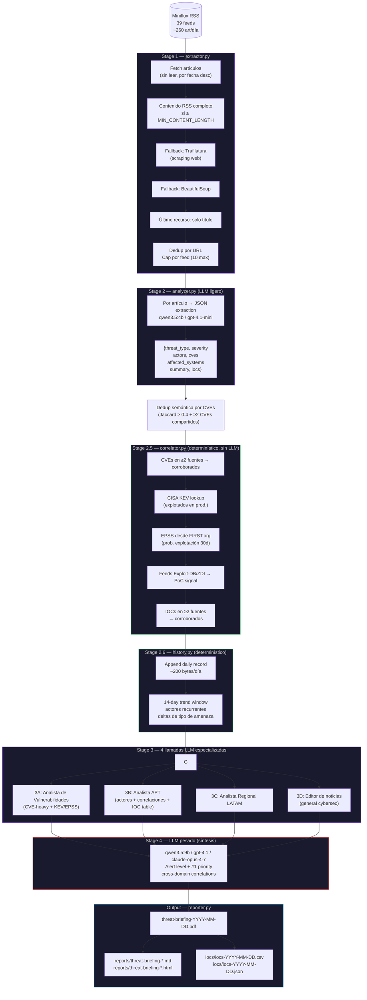
```mermaid
flowchart TD
    A[("Miniflux RSS\n39 feeds\n~260 art/día")] --> B

    subgraph S1["Stage 1 — extractor.py"]
        B["Fetch artículos\n(sin leer, por fecha desc)"]
        B --> B1["Contenido RSS completo\nsi ≥ MIN_CONTENT_LENGTH"]
        B1 --> B2["Fallback: Trafilatura\n(scraping web)"]
        B2 --> B3["Fallback: BeautifulSoup"]
        B3 --> B4["Último recurso: solo título"]
        B4 --> B5["Dedup por URL\nCap por feed (10 max)"]
    end

    B5 --> C

    subgraph S2["Stage 2 — analyzer.py (LLM ligero)"]
        C["Por artículo → JSON extraction\nqwen3.5:4b / gpt-4.1-mini"]
        C --> C1["{threat_type, severity\nactors, cves\naffected_systems\nsummary, iocs}"]
    end

    C1 --> D["Dedup semántica por CVEs\n(Jaccard ≥ 0.4 + ≥2 CVEs compartidos)"]
    D --> E

    subgraph S25["Stage 2.5 — correlator.py (determinístico, sin LLM)"]
        E["CVEs en ≥2 fuentes → corroborados"]
        E --> E1["CISA KEV lookup\n(explotados en prod.)"]
        E1 --> E2["EPSS desde FIRST.org\n(prob. explotación 30d)"]
        E2 --> E3["Feeds Exploit-DB/ZDI → PoC signal"]
        E3 --> E4["IOCs en ≥2 fuentes\n→ corroborados"]
    end

    E4 --> F

    subgraph S26["Stage 2.6 — history.py (determinístico)"]
        F["Append daily record\n~200 bytes/día"]
        F --> F1["14-day trend window\nactores recurrentes\ndeltas de tipo de amenaza"]
    end

    F1 --> G

    subgraph S3["Stage 3 — 4 llamadas LLM especializadas"]
        G --> G1["3A: Analista de Vulnerabilidades\n(CVE-heavy + KEV/EPSS)"]
        G --> G2["3B: Analista APT\n(actores + correlaciones + IOC table)"]
        G --> G3["3C: Analista Regional LATAM"]
        G --> G4["3D: Editor de noticias\n(general cybersec)"]
    end

    G1 & G2 & G3 & G4 --> H

    subgraph S4["Stage 4 — LLM pesado (síntesis)"]
        H["qwen3.5:9b / gpt-4.1 / claude-opus-4-7\nAlert level + #1 priority\ncross-domain correlations"]
    end

    H --> I

    subgraph OUT["Output — reporter.py"]
        I["threat-briefing-YYYY-MM-DD.pdf"]
        I --> I1["reports/threat-briefing-*.md\nreports/threat-briefing-*.html"]
        I --> I2["iocs/iocs-YYYY-MM-DD.csv\niocs/iocs-YYYY-MM-DD.json"]
    end

    style S1 fill:#1a1a2e,stroke:#7c3aed,color:#ccc
    style S2 fill:#1a1a2e,stroke:#7c3aed,color:#ccc
    style S25 fill:#1a1a2e,stroke:#16a34a,color:#ccc
    style S26 fill:#1a1a2e,stroke:#16a34a,color:#ccc
    style S3 fill:#1a1a2e,stroke:#7c3aed,color:#ccc
    style S4 fill:#1a1a2e,stroke:#dc2626,color:#ccc
    style OUT fill:#1a1a2e,stroke:#0ea5e9,color:#ccc
```

Lo verde es código determinístico. Lo violeta es LLM. Lo rojo es el modelo más potente. La separación es deliberada: **los hechos los establece el código, no el modelo**.

---

## Infraestructura Proxmox

Antes de entrar en el código, el contexto de hardware importa porque condiciona todas las decisiones de arquitectura:

```
Proxmox host: Intel i7-10510U (4C/8T), 15.3 GB RAM
├── LXC 111 — ollama:    4 cores, 10 GB RAM (CPU-only, sin GPU)
└── LXC 112 — miniflux: 2 cores,  2 GB RAM (Miniflux + pipeline)
```

Sin GPU. Todo en CPU. Esto importa mucho para los timeouts, la paralelización y la decisión final de integrar APIs cloud.

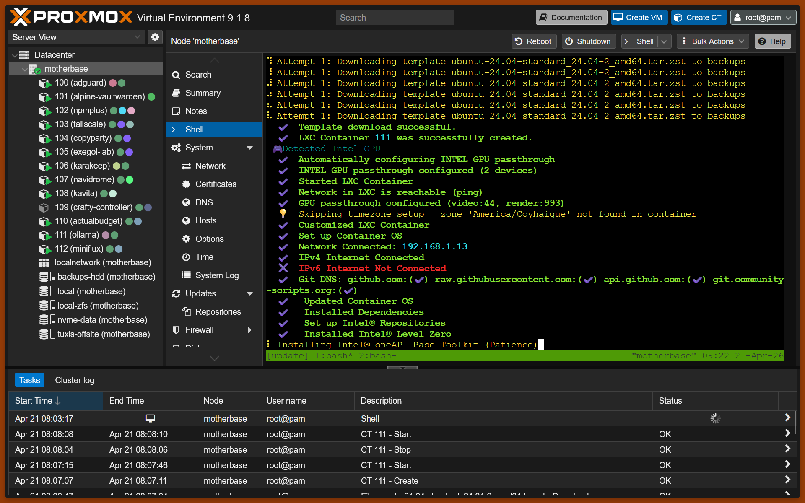
_LXC 111 recién creado — Ollama con passthrough GPU Intel configurado, aunque terminaría funcionando en CPU puro_

Configuración crítica de Ollama en LXC 111 vía systemd override:

```ini
[Service]
Environment="OLLAMA_HOST=0.0.0.0:11434"
Environment="OLLAMA_KEEP_ALIVE=10m"
Environment="OLLAMA_MAX_LOADED_MODELS=1"
```

`OLLAMA_MAX_LOADED_MODELS=1` es esencial con 10GB RAM: los modelos qwen3.5:4b (3.2GB) y qwen3.5:9b (7.2GB) no caben simultáneamente. El pipeline hace un **swap explícito** entre etapas llamando a `keep_alive=0` para forzar la descarga del modelo anterior antes de cargar el siguiente.

---

## Día 1 — 21 de Abril: El Pipeline Inicial

### Primer commit: funciona en un shot

El primer commit entregó un pipeline de 3 etapas funcional: **fetch → JSON extraction por artículo → informe consolidado**. 11 archivos, ~1500 líneas. La caché en JSON permitía re-ejecutar Stage 3 sin re-resumir.

El prompt de Stage 2 es directo y estructurado para extraer hechos, no para que el modelo opine:

```python
def build_summary_prompt(title: str, content: str,
                         feed: str, category: str) -> str:
    return f"""Analiza este artículo de ciberseguridad y extrae los campos pedidos.

FUENTE: {feed} [{category}]
TÍTULO: {title}
CONTENIDO:
{content}

Responde SOLO con este JSON (sin bloques markdown, sin texto adicional):
{{
  "threat_type": "Ransomware|APT|CVE|Phishing|DDoS|Supply Chain|Malware|...",
  "severity": "Crítica|Alta|Media|Baja|Informativa",
  "actors": ["máx 5 actores/grupos/países conocidos"],
  "cves": ["máx 10 CVE-XXXX-XXXXX mencionados"],
  "affected_systems": ["máx 5 sistemas/productos más relevantes"],
  "summary": "Análisis técnico en 4-5 oraciones: qué ocurrió, TTPs/MITRE,
              sistemas afectados, nivel de explotación, impacto potencial.",
  "iocs": ["máx 10 IPs, dominios, hashes, URLs explícitamente mencionados"]
}}"""
```

La restricción `máx N` en cada array es crítica. Sin ella, artículos como los Ubuntu Security Notices (que listan 50+ paquetes de kernel afectados) hacen que el modelo intente enumerar todo y supere el límite de tokens de salida, cortando el JSON a mitad. Lo descubrí en producción el Día 6.

### Los tres fallos inmediatos de Day 1

**1. Parámetros de Ollama silenciosamente ignorados**

Los parámetros `think` y `keep_alive` van como kwargs directos de `client.chat()`, NO dentro del dict `options`. Ollama los ignoraba silenciosamente:

```python
# INCORRECTO — think y keep_alive se ignoran dentro de options
response = client.chat(
    model=model,
    messages=messages,
    options={"temperature": 0, "think": False, "keep_alive": "10m"}
)

# CORRECTO — son kwargs top-level
response = client.chat(
    model=model,
    messages=messages,
    options={"temperature": 0, "num_ctx": 2048},
    think=False,
    keep_alive="10m"
)
```

Esto está documentado en el código fuente de Ollama pero no en la documentación principal. Horas perdidas.

**2. `PARALLEL_WORKERS=2` causaba timeouts silenciosos**

En CPU-only, Ollama serializa las peticiones al mismo modelo. Con 2 workers paralelos, la segunda request entra en cola y su timeout de httpx dispara antes de que Ollama empiece a procesarla. El error era silencioso: el artículo simplemente fallaba con timeout.

Solución permanente: `PARALLEL_WORKERS=1` para setups CPU-only.

**3. Stage 3 timeout en generaciones largas**

Un informe de 2000 tokens a 1 tok/seg necesita un timeout de 2000 segundos si la respuesta es síncrona. Impracticable. La solución fue `stream=True`:

```python
# Con streaming, el timeout aplica ENTRE chunks, no al total.
# El modelo puede generar durante horas siempre que no pare más de N segundos
# entre tokens consecutivos.
response = client.chat(
    model=model,
    messages=messages,
    stream=True,
    think=False,
    keep_alive="10m"
)

full_response = ""
for chunk in response:
    token = chunk.message.content
    full_response += token
```

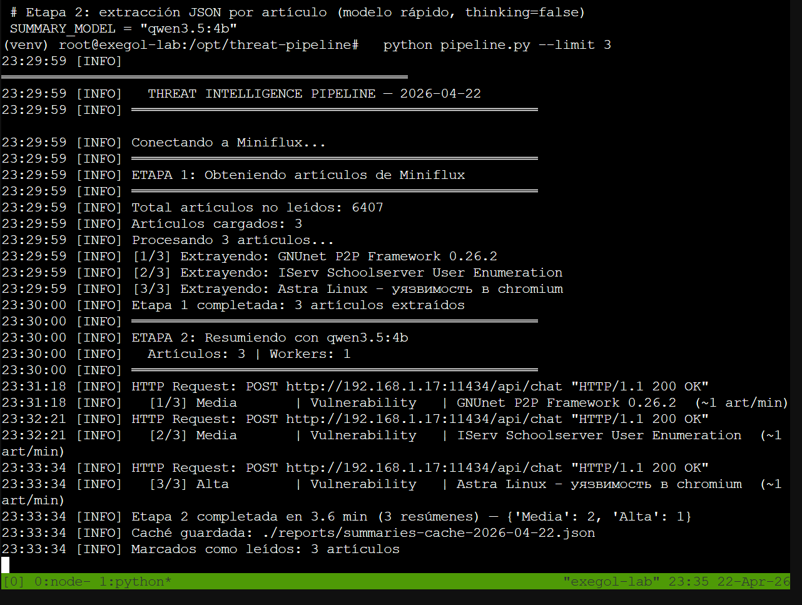
_Día 1: Stage 1 fetch de Miniflux + primeros artículos en Stage 2 — ~1 artículo/minuto con qwen3.5:4b_

---

## Día 2 — 22 de Abril: Inteligencia Real, No Solo Resúmenes

El primer informe era preciso pero plano: listaba lo que había pasado pero no conectaba hechos entre fuentes. Si CVE-2026-XXXXX aparecía en tres feeds distintos, el modelo lo reportaba tres veces por separado en lugar de decir "este CVE está siendo activamente discutido en múltiples fuentes".

La solución fue separar lo que hace el código de lo que hace el modelo.

### Stage 2.5: El Correlador Determinístico

```python
@dataclass
class CorrelationContext:
    """Correlaciones calculadas por código — hechos, no inferencias del LLM."""
    corroborated_cves: dict[str, list[str]]   # CVE → feeds donde apareció (≥2)
    kev_active_cves: list[str]                 # En catálogo CISA KEV
    poc_available_cves: list[str]              # Con PoC en Exploit-DB/ZDI/Sploitus
    trending_actors: dict[str, list[str]]      # Actor → feeds (≥2)
    all_cve_sources: dict[str, list[str]]      # Todos los CVEs del día
    epss_scores: dict[str, dict]               # CVE → {score, percentile} FIRST.org
    corroborated_iocs: dict[str, list[str]]    # IOC → feeds (≥2)
```

El correlador hace cuatro cosas sin ningún LLM:

1. **CVE corroboration:** CVEs vistos en ≥2 feeds independientes se marcan como "corroborados". Esto diferencia un CVE reportado por una sola fuente de uno que múltiples investigadores están cubriendo simultáneamente.

2. **CISA KEV lookup:** Descarga en vivo `known_exploited_vulnerabilities.json` de CISA. Si un CVE del día está en ese catálogo, significa que CISA ha confirmado explotación activa en producción. Esto es un hecho verificable, no una estimación.

3. **EPSS desde FIRST.org:** Para cada CVE único del día, consulta la API de FIRST.org y obtiene el Exploit Prediction Scoring System score: la probabilidad de que ese CVE sea explotado en los próximos 30 días, basada en datos de telemetría global.

4. **PoC signal detection:** Los feeds de Exploit-DB, Sploitus y ZDI no son noticias narrativas sino señales de que existe un exploit público. Si un CVE aparece en esos feeds, se marca como `poc_available`.

Todo esto se inyecta en el prompt de Stage 3 como bloque de contexto verificado:

```
CORRELACIONES VERIFICADAS
(calculadas por coincidencia exacta de IDs entre fuentes — no son inferencias):

CVEs CORROBORADOS (≥2 fuentes independientes):
CVE-2026-32172 — Power Apps: Vulnerability Report, Rapid7 Blog (2 fuentes)
CVE-2026-33819 — Bing: MSRC, The Hacker News (2 fuentes)

CVEs EN CISA KEV (explotados activamente en producción):
CVE-2026-32172, CVE-2026-40372

SCORES EPSS (probabilidad explotación 30 días):
CVE-2026-32172: EPSS 73% (percentil 94)
CVE-2026-40372: EPSS 41% (percentil 87)
```

El modelo recibe hechos verificados y los incorpora al análisis. Sin el correlador, tendría que inferirlos (y podría inventárselos).

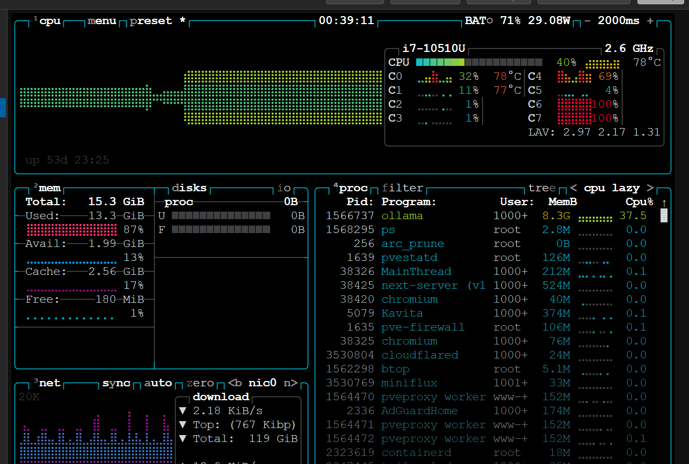
_htop durante Stage 2: qwen3.5:4b ocupa 5.1GB de RAM, CPU bajo porque las inferencias son rápidas (~1 min/artículo)_

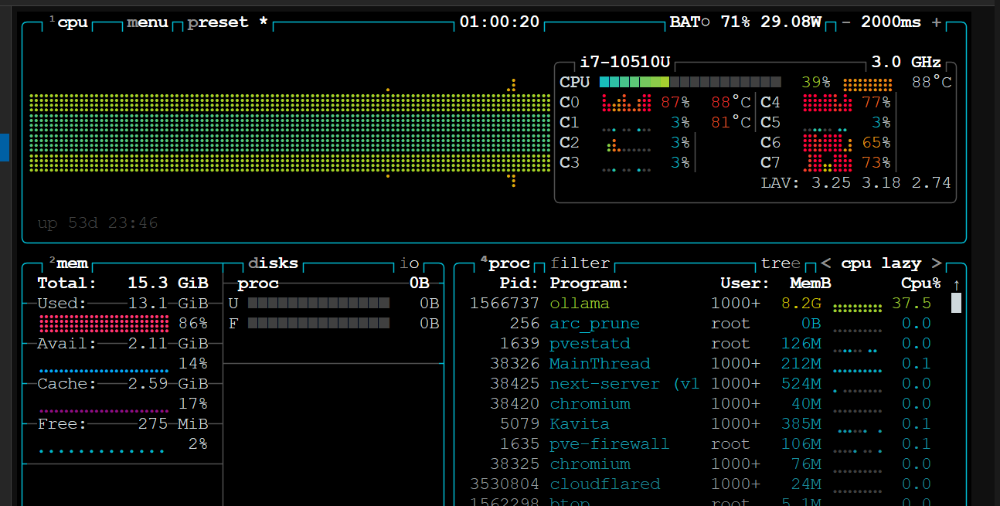
_Stage 3 con qwen3.5:9b: 8.2GB de RAM, core C0 al 87%, temperatura 88°C — el i7-10510U empuja hasta el límite_

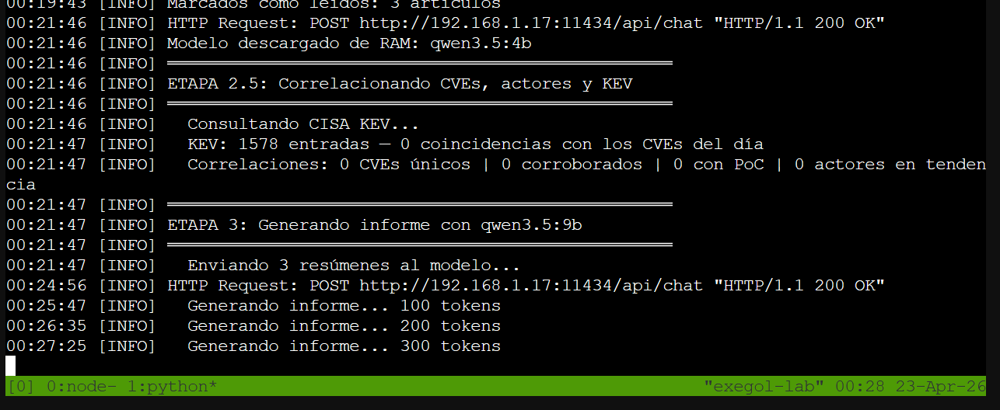
_Stage 2.5 completado (KEV: 0 hits ese día) y Stage 3 generando el informe — progreso visible cada 100 tokens_

El informe que salía era ya substantivamente mejor: secciones diferenciadas, contexto de campaña, actores identificados con sus TTPs.

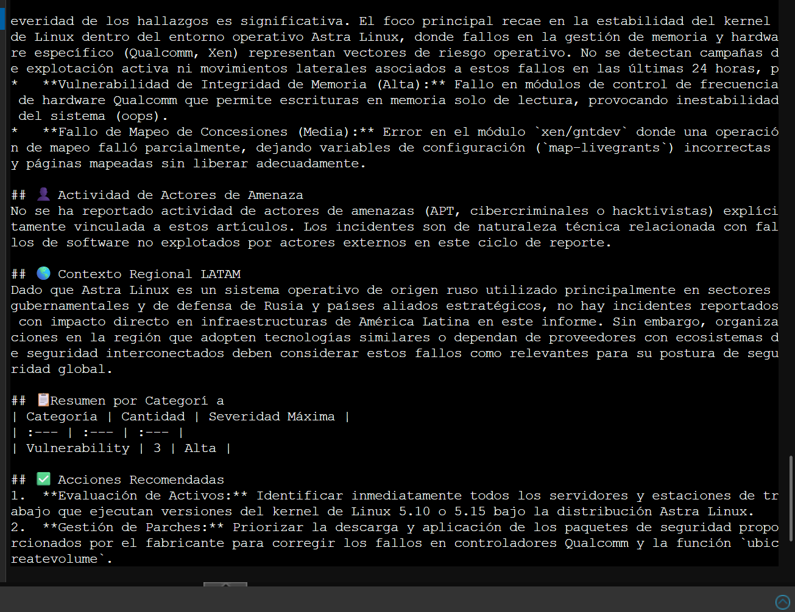
_Primer informe con estructura reconocible: análisis de vulnerabilidades kernel de Astra Linux, sección LATAM, acciones recomendadas_

---

## Día 3 — 23 de Abril: Liberando el Hardware

El cuello de botella era el hardware. Con CPU-only en LXC 111:

- Stage 2: **~1.75 minutos/artículo** → 120 artículos = **3.5 horas**
- Stage 3: carga de qwen3.5:9b = 20-30 minutos solo el primer token

Era funcional pero lento. Y había otro problema: no podía probar variaciones del pipeline rápidamente si cada iteración costaba 4 horas.

### Multi-provider en un commit

Añadí soporte para cuatro providers con un dispatcher unificado:

```python
PROVIDER = "ollama"   # "ollama" | "openai" | "claude" | "gemini"
```

```python
def _llm_chat(messages, model, provider, **kwargs):
    if provider == "ollama":
        return _ollama_chat(messages, model, **kwargs)
    elif provider == "openai":
        return _openai_chat(messages, model, **kwargs)
    elif provider == "claude":
        return _claude_chat(messages, model, **kwargs)
    elif provider == "gemini":
        return _gemini_chat(messages, model, **kwargs)
```

El mismo pipeline, el mismo código de stages, sin cambios. Solo se cambia `PROVIDER` en `config.py`.

### Curación de feeds: 54 → 39

Con el pipeline funcionando, analicé qué feeds aportaban señal real y cuáles eran ruido. Eliminé:
- Feeds con paywall mayoritario (artículos truncados = resúmenes basura)
- Fuentes de marketing disfrazado de research
- Feeds de alto volumen con bajo ratio señal/ruido

39 feeds distribuidos en 5 categorías: `Vulnerability`, `Threat Intel`, `Malware`, `LATAM`, `General`.

### El cap por feed: `PER_FEED_LIMIT`

MSRC tenía 2975 artículos no leídos. Sin cap, acaparaba el 95% del batch. Con `PER_FEED_LIMIT=10`:

```python
# Stage 1 — pipeline.py
if per_feed:
    counts: dict[str, int] = defaultdict(int)
    capped = []
    for a in articles:   # ordenados por published_at desc desde Miniflux
        if counts[a.feed_title] < per_feed:
            capped.append(a)
            counts[a.feed_title] += 1
    articles = capped[:limit]
```

Resultado: distribución equitativa entre fuentes. Los 10 artículos más recientes de cada feed, hasta el límite global.

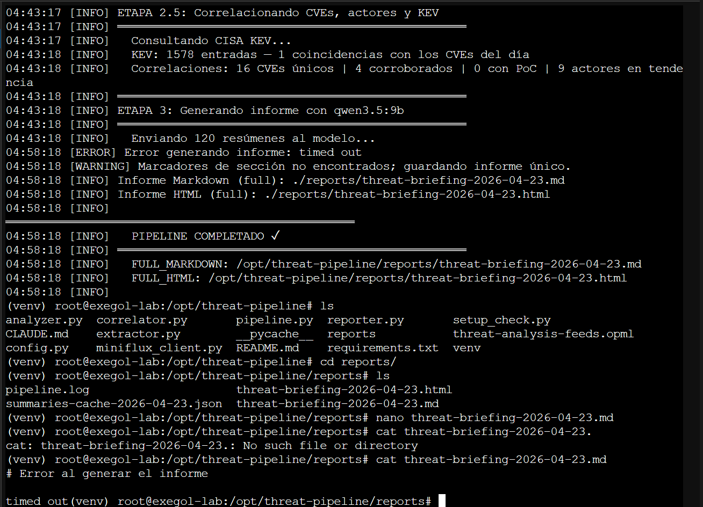
_Día 3: Pipeline completo con correlador — 16 CVEs únicos, 4 corroborados, 9 actores en tendencia_

---

## Día 4 — 24 de Abril: PDF, EPSS y Historia

### Export PDF con weasyprint

Un informe de ciberseguridad que no se puede compartir como PDF no es un informe, es un archivo de texto. Añadí `weasyprint` para la conversión Markdown → HTML → PDF.

El primer intento produjo páginas en blanco entre tablas. Causa: `page-break-inside: avoid` en tablas hace que weasyprint intente mover la tabla completa a la siguiente página, pero si la tabla no cabe ahí tampoco, genera una página vacía. Solución: eliminar esa regla y usar `thead/tbody` correctamente para que el encabezado se repita naturalmente en cada salto de página.

El PDF final tiene:
- Portada con quote de la Tabula Smaragdina, metadatos de ejecución, Report ID (`TIR-YYYYMMDD-XXXX`) y SHA-256 del contenido markdown
- ToC con números de página reales vía CSS `target-counter()`
- Tablas CVE con rayas zebra, columnas CVSS / EPSS / KEV
- Tablas anchas (>6 columnas) con fuente reducida a 7pt automáticamente
- Colofón alquímico al final

El SHA-256 en la portada permite verificar que el PDF no ha sido modificado desde su generación. Cualquiera con el markdown original puede recalcularlo.

### Stage 2.6: Trending histórico con ventana fija

El problema del historial es que el contexto del LLM crece linealmente con el tiempo. Si almacenas todo el historial y lo inyectas en el prompt, a los 6 meses el prompt es más largo que el informe.

Solución: ventana de 14 días con representación comprimida:

```python
# history.py — ~200 bytes por día en history.json
{
  "2026-04-22": {
    "date": "2026-04-22",
    "total_articles": 89,
    "severity_dist": {"Alta": 45, "Crítica": 12, "Media": 20, "Baja": 5, "Informativa": 7},
    "top_cves": ["CVE-2026-32172", "CVE-2026-33819"],
    "top_actors": ["APT29", "Lazarus Group", "GopherWhisper"],
    "threat_types": {"Vulnerability": 45, "Malware": 20, "APT": 12, "Supply Chain": 12}
  }
}
```

El bloque de trending que recibe el LLM tiene tamaño fijo independientemente de cuántos días haya en el historial: actores que regresan, actores nuevos, CVEs recurrentes, deltas de tipo de amenaza (solo si ≥20% de cambio).

### El problema de TPM en OpenAI Tier 1

gpt-4o en Tier 1 tiene 30K TPM. Con 120 artículos produciendo ~150 tokens de resumen cada uno, la entrada de Stage 3 ya supera ese límite antes de generar una sola palabra de salida.

Solución doble:
1. Cambiar a `gpt-4.1-mini` para Stage 2 (200K TPM)
2. Añadir `REPORT_ARTICLE_LIMIT` — solo los top 80 por severidad entran en Stage 3

```python
# Ordenar por severity_score y truncar
top_summaries = sorted(valid, key=lambda s: -s.severity_score)[:article_limit]
```

### El fix del timeout que cambió todo

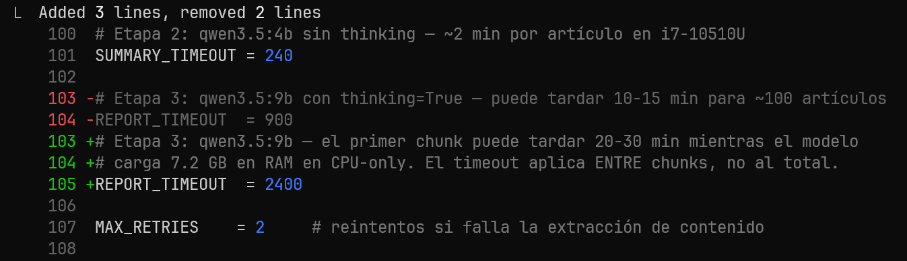
_Un cambio de 4 dígitos con horas de diagnóstico detrás — el primer chunk de qwen3.5:9b en CPU-only puede tardar 20-30 minutos mientras carga 7.2GB en RAM_

El timeout de `900` segundos (15 minutos) era suficiente para el tiempo entre chunks de streaming una vez el modelo estaba cargado. Pero **no** para el primer chunk, que tiene que esperar a que 7.2GB de pesos carguen en RAM desde disco. El fix fue subir a `2400` segundos (40 minutos) aplicados entre chunks, no al total.

---

## Día 4 con OpenAI: La Diferencia de Escala

Con OpenAI habilitado, el mismo pipeline que tardaba 3.5 horas en CPU procesó **120 artículos en 5.5 minutos** con `PARALLEL_WORKERS=8`:

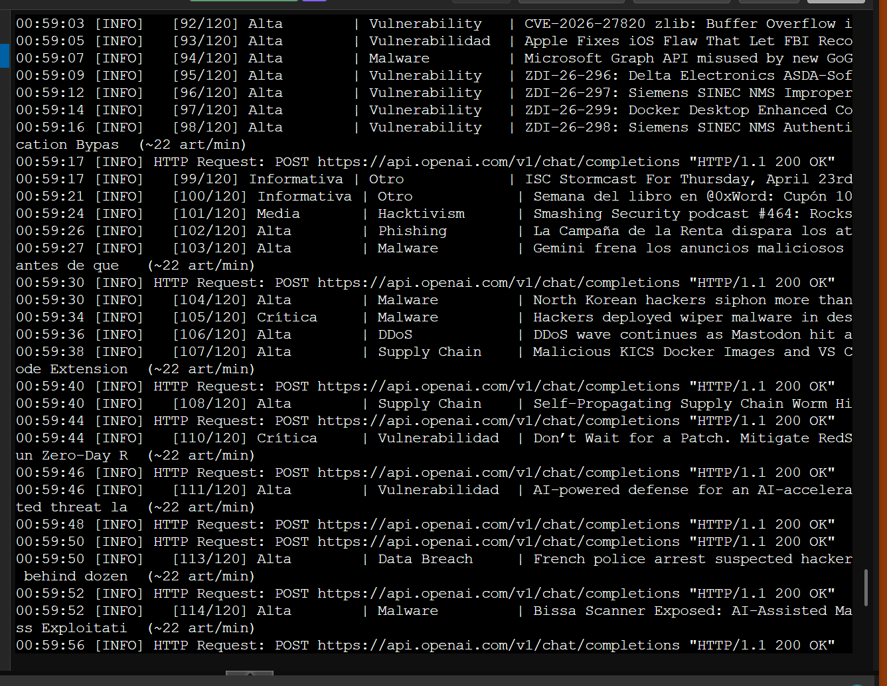
_Stage 2 con OpenAI gpt-4.1-mini: ~22 artículos por minuto con 8 workers paralelos — vs 1 artículo/minuto con Ollama CPU_

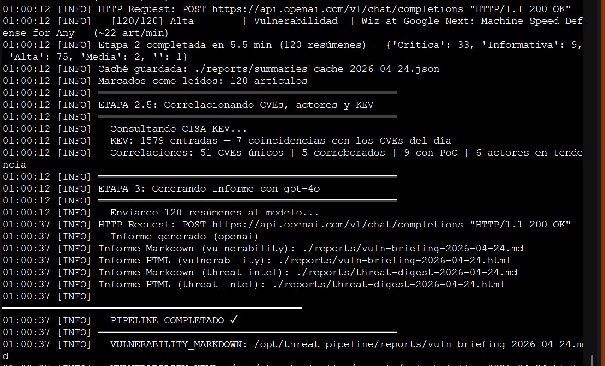
_Stage 2.5 ese día: 120 artículos procesados, 51 CVEs únicos, 5 corroborados, 9 con PoC, 7 en CISA KEV — 6 actores en tendencia_

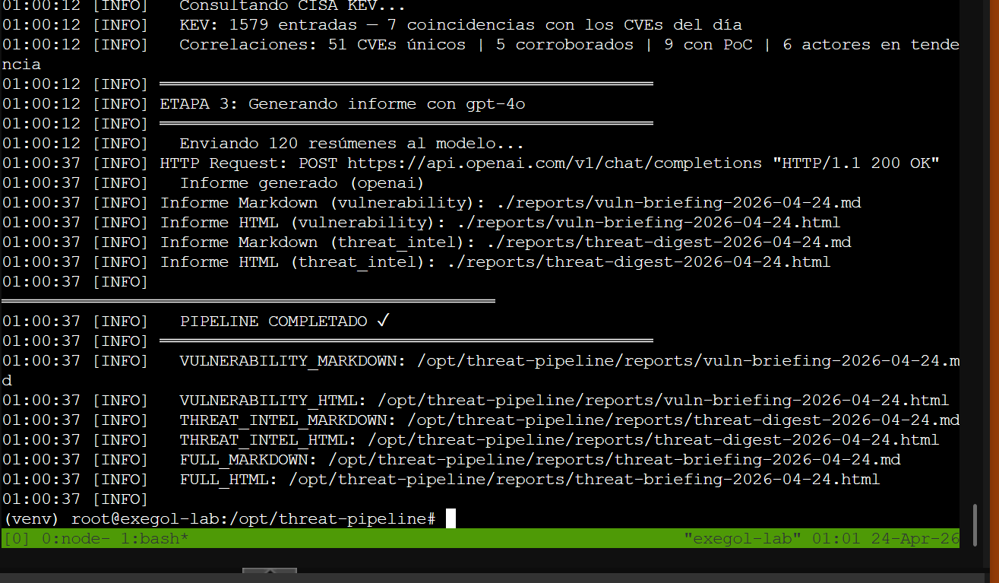
_Primer run completo con OpenAI: Stage 2 en 5.5 min + Stage 3 con gpt-4o en 25 segundos — informes MD y HTML generados_

Y el informe resultante era notablemente más rico:

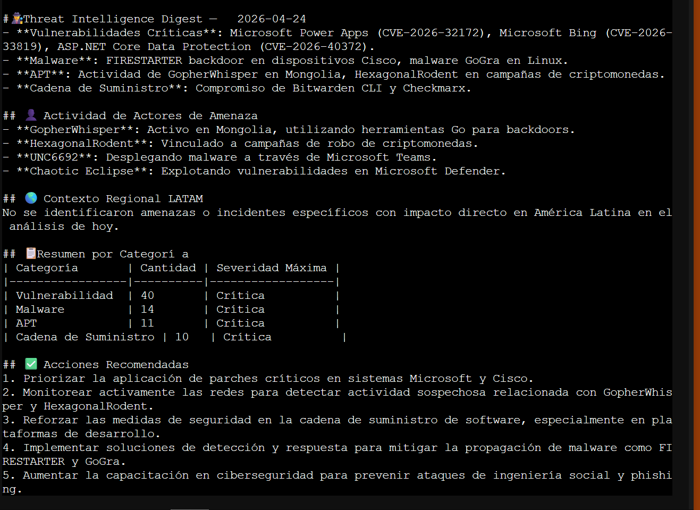
_Threat Intel Digest del 24 de abril: APT profiles de GopherWhisper, HexagonalRodent, UNC6692; resumen CVEs Microsoft, Cisco FIRESTARTER backdoor, supply chain compromise de Bitwarden CLI_

---

## Día 5 — 25 de Abril: Salidas Machine-Readable

Un pipeline de threat intelligence que solo genera un PDF está a medio terminar. Los SOCs necesitan IOCs en formatos que sus herramientas puedan ingerir directamente.

### Export CSV + JSON de IOCs

```python
def _detect_ioc_type(ioc: str) -> str:
    if re.match(r"^\d{1,3}(\.\d{1,3}){3}(:\d+)?$", ioc):     return "ip"
    if re.match(r"^[0-9a-fA-F]{64}$", ioc):                    return "sha256"
    if re.match(r"^[0-9a-fA-F]{40}$", ioc):                    return "sha1"
    if re.match(r"^[0-9a-fA-F]{32}$", ioc):                    return "md5"
    if ioc.startswith(("http://", "https://")):                 return "url"
    if re.match(r"^[a-zA-Z0-9][a-zA-Z0-9\-\.]+\.[a-zA-Z]{2,}$", ioc): return "domain"
    return "other"
```

El CSV tiene una fila por IOC único: `date, ioc, type, severity, title, feed, cves`. Listo para importar en Splunk, QRadar, Elastic SIEM o cualquier plataforma que acepte CSV.

El JSON agrupa por tipo: `ip / domain / sha256 / sha1 / md5 / url / other`. Ideal para integraciones API.

Una normalización importante: los IOCs "defanged" (`evil[.]com`, `hxxps://`) se normalizan antes de la correlación cruzada. Sin esto, el mismo IOC en dos feeds diferentes se registraría como dos identidades distintas y nunca se "corroboraría".

### Weekly digest (`--weekly`)

```python
python pipeline.py --weekly --weekly-days 7
```

Carga los últimos N `summaries-cache-*.json` y genera un briefing semanal: CVEs que persisten, actores más activos de la semana, TTPs dominantes, recomendaciones para los próximos 7 días. El mismo reporter genera el PDF.

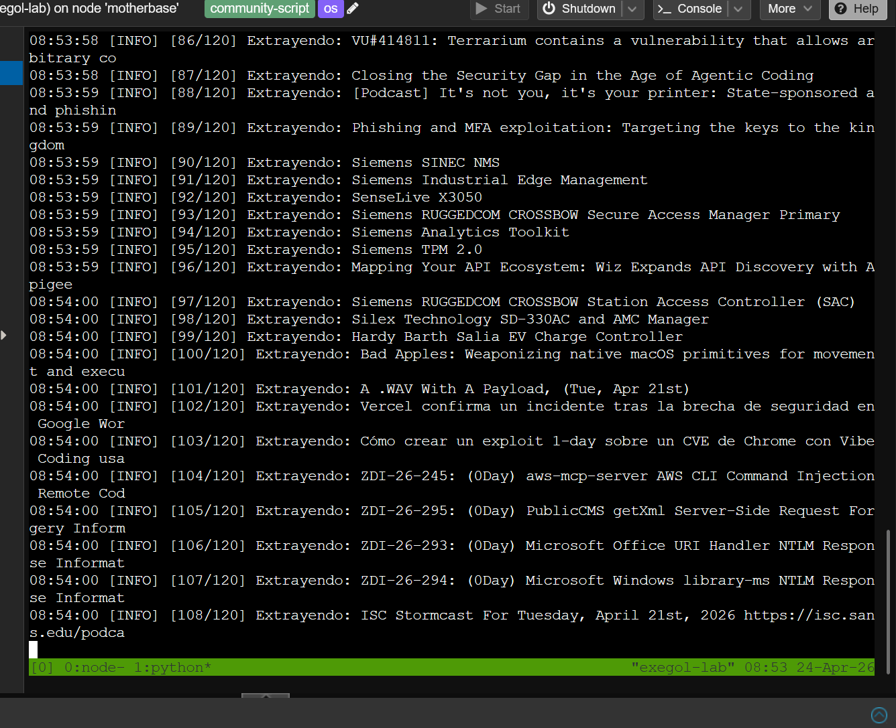
_Stage 1 extrayendo 120 artículos de 39 feeds — la cadena de fallbacks (RSS → trafilatura → BeautifulSoup → título) garantiza contenido útil incluso para feeds con extractores de RSS limitados_

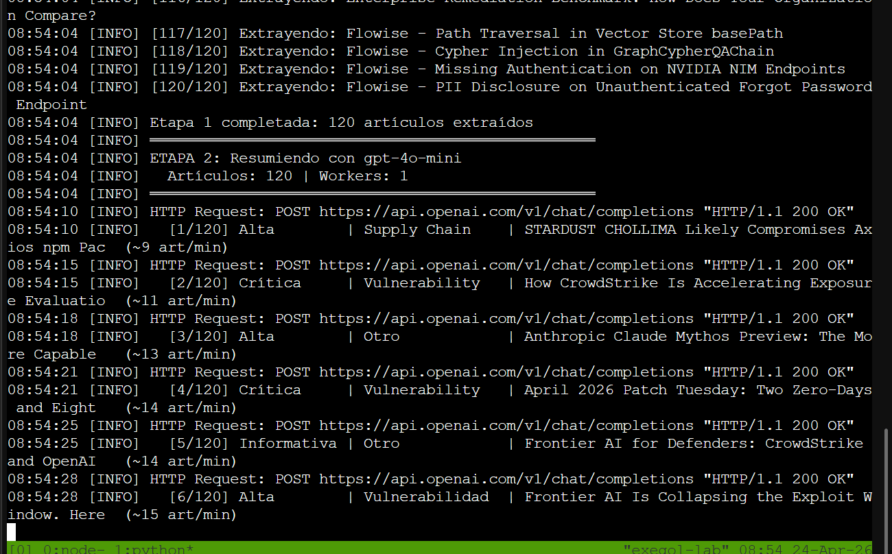
_Stage 2 con OpenAI — APTs, supply chain attacks, zero-days, ransomware: la diversidad de amenazas en un día normal de cybersec_

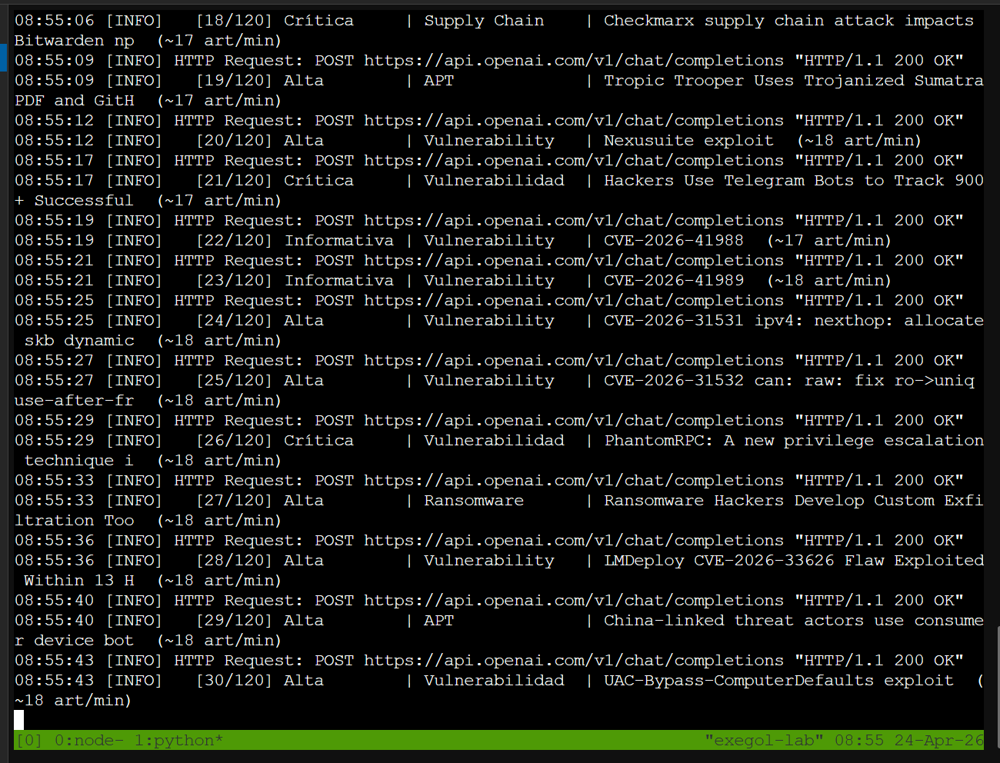
_Procesamiento continuo — Claude Desktop, Tropic Trooper, IOT botnets, AI-assisted phishing, ZDI advisories_

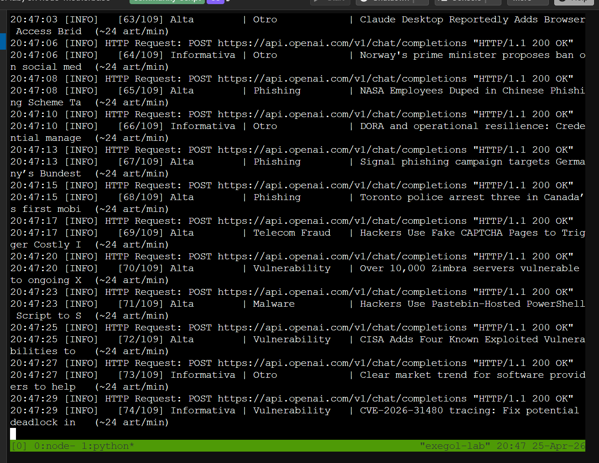
_Con más workers paralelos llegamos a 24 art/min — la API de OpenAI es el único cuello de botella real_

---

## Día 6 — 26 de Abril: El Pipeline Profesional

### Multi-phase Stage 3: 4 llamadas LLM especializadas

El problema con un solo prompt consolidado para Stage 3 es doble: el modelo tiene que ser experto en vulnerabilidades, APT analysis, contexto regional y noticias generales simultáneamente, y el prompt se vuelve enormemente largo.

La solución fue dividir en 4 llamadas LLM secuenciales, cada una con un system prompt de experto de dominio:

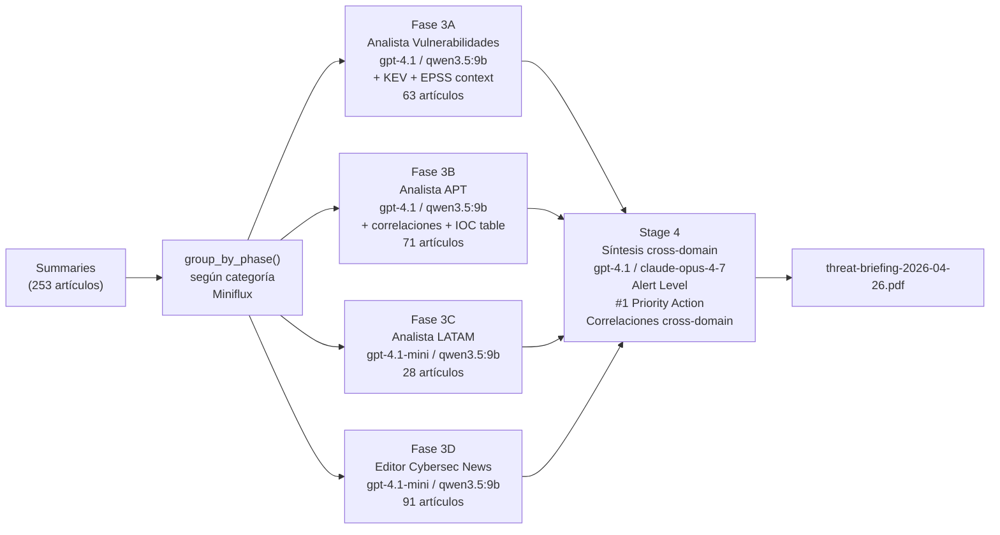
```mermaid
flowchart LR
    S["Summaries\n(253 artículos)"] --> ROUTER["group_by_phase()\nsegún categoría\nMiniflux"]

    ROUTER --> VA["Fase 3A\nAnalista Vulnerabilidades\ngpt-4.1 / qwen3.5:9b\n+ KEV + EPSS context\n63 artículos"]
    ROUTER --> TA["Fase 3B\nAnalista APT\ngpt-4.1 / qwen3.5:9b\n+ correlaciones + IOC table\n71 artículos"]
    ROUTER --> LA["Fase 3C\nAnalista LATAM\ngpt-4.1-mini / qwen3.5:9b\n28 artículos"]
    ROUTER --> GN["Fase 3D\nEditor Cybersec News\ngpt-4.1-mini / qwen3.5:9b\n91 artículos"]

    VA & TA & LA & GN --> SY["Stage 4\nSíntesis cross-domain\ngpt-4.1 / claude-opus-4-7\nAlert Level\n#1 Priority Action\nCorrelaciones cross-domain"]

    SY --> PDF["threat-briefing-2026-04-26.pdf"]
```

El routing es automático: las categorías de Miniflux se mapean a fases vía `PHASE_CATEGORY_MAP` en `config.py`. Añadir un nuevo feed en Miniflux en la categoría `Vulnerability` no requiere ningún cambio de código.

Los modelos por fase reflejan la criticidad del dominio:

| Stage | Ollama (CPU) | OpenAI | Claude | Gemini |
|-------|-------------|--------|--------|--------|
| Stage 2 (per-artículo) | qwen3.5:4b | gpt-4.1-mini | claude-haiku-4-5 | gemini-2.0-flash |
| Stage 3A/3B (crítico) | qwen3.5:9b | gpt-4.1 | claude-sonnet-4-6 | gemini-2.5-pro |
| Stage 3C/3D (general) | qwen3.5:9b | gpt-4.1-mini | claude-haiku-4-5 | gemini-2.0-flash |
| Stage 4 (síntesis) | qwen3.5:9b | gpt-4.1 | claude-opus-4-7 | gemini-2.5-pro |

### Bugs descubiertos en producción el Día 6

**USN array overflow:** Los Ubuntu Security Notices listan 50+ paquetes de kernel afectados. El modelo intentaba enumerarlos todos en `affected_systems`, saturando `SUMMARY_MAX_TOKENS` en cada intento. Fix: restricciones de tamaño en el prompt (`máx 5 sistemas`, `máx 10 CVEs`).

**wiz.io bloqueando scrapers:** Todos los artículos de wiz.io fallaban con 403. Fix: añadir al `NO_SCRAPE_DOMAINS` para usar solo el contenido RSS directamente.

**Fase vulnerability cortada a mitad de frase:** Con 63 artículos de vulnerabilidades y contexto KEV/EPSS, la entrada tenía 14.563 tokens de entrada. El `PHASE_MAX_TOKENS` de 3500 para output era insuficiente. Fix: subir a 4500.

### El run final del Día 6

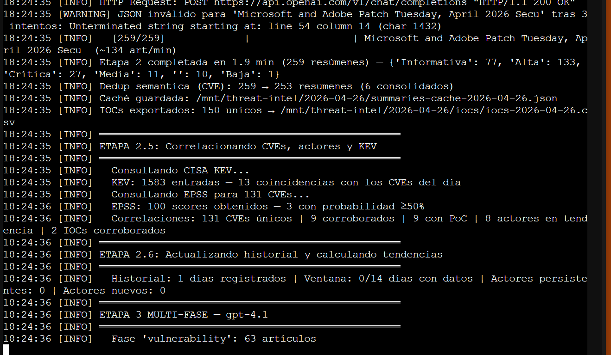
_26 de abril: 259 artículos analizados en 1.9 minutos (134 art/min con OpenAI), 6 consolidados por dedup CVE, 150 IOCs exportados, 131 CVEs únicos con 9 corroborados, 13 en CISA KEV, EPSS para 100 CVEs_

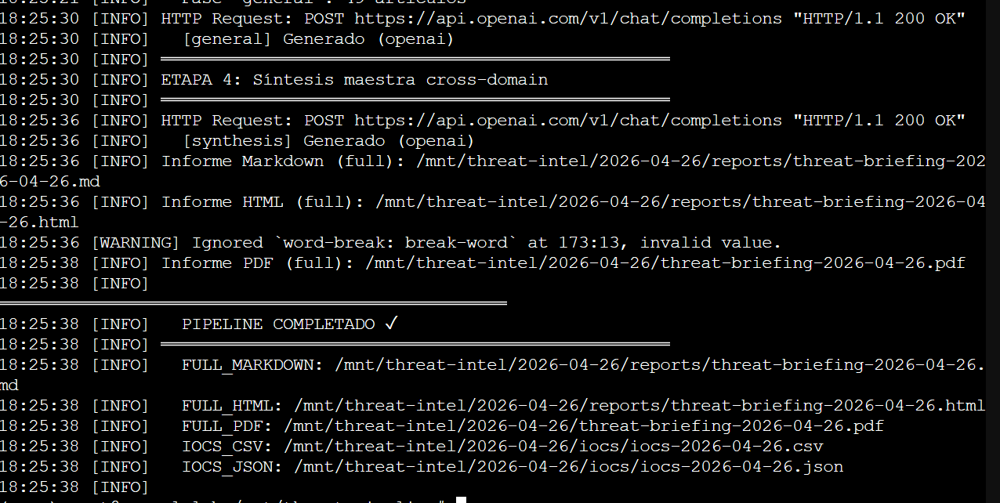
_Stage 4 síntesis terminada — PDF, HTML, Markdown y IOCs CSV/JSON generados. Pipeline total: ~9 minutos de punta a punta_

---

## Rendimiento: Ollama vs OpenAI

La diferencia es de órdenes de magnitud:

```
Con Ollama CPU-only (i7-10510U):
  Stage 2: ~1.75 min/artículo → 120 artículos ≈ 3.5 horas
  Stage 3: qwen3.5:9b primer chunk = 20-30 min (carga de modelo)
  Stage 3: generación total = 15-20 min adicionales
  Total: ~3.75-4 horas → cron a las 03:00, listo ~06:45

Con OpenAI (gpt-4.1-mini + gpt-4.1, PARALLEL_WORKERS=8):
  Stage 2: ~134 art/min → 259 artículos = 1.9 minutos
  Stage 3 multi-fase (4 fases + síntesis): ~7 minutos
  Total: ~9 minutos end-to-end
```

El coste de OpenAI durante el desarrollo completo del proyecto:

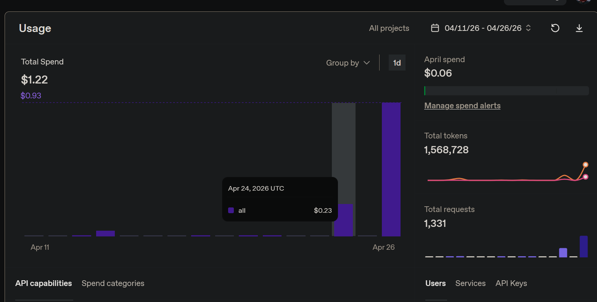
_15 días de desarrollo intensivo, múltiples runs diarios de prueba, correcciones y re-runs: $1.22 en total. 1,568,728 tokens consumidos en 1331 requests_

Para uso diario en producción, un run completo con OpenAI cuesta aproximadamente **$0.05-0.10** dependiendo del volumen de artículos.

La estrategia híbrida tiene sentido: Ollama para producción nocturna (gratis, sin red), OpenAI para desarrollo e iteración rápida.

---

## Módulos: Roles y Responsabilidades

| Archivo | Rol |
|---------|-----|
| `pipeline.py` | Orquestador principal — coordina todos los stages |
| `extractor.py` | Content extraction: RSS → scrape → BeautifulSoup → título |
| `analyzer.py` | Todas las llamadas LLM: Stage 2, Stage 3 (fases), Stage 4 |
| `correlator.py` | Stage 2.5: correlación determinística CVE/IOC/actor |
| `history.py` | Stage 2.6: log diario, trending de 14 días |
| `reporter.py` | Markdown → HTML → PDF; Report ID y SHA-256 |
| `miniflux_client.py` | Wrapper Miniflux API (token auth preferido) |
| `config.py` | Todos los parámetros configurables |
| `setup_check.py` | Diagnósticos de conectividad |

### `--report-only`: el modo que salvó el desarrollo

```bash
python pipeline.py --report-only
```

Carga el `summaries-cache-YYYY-MM-DD.json` del día y salta directamente a Stage 2.5 → 3 → 4. Esencial cuando se itera sobre el prompt o se corrige un fallo en Stage 3 sin querer re-ejecutar 4 horas de Stage 2.

---

## Decisiones Técnicas y Sus Razones

| Decisión | Por qué | Trade-off |
|----------|---------|-----------|
| Miniflux como backend RSS | Self-hosted, API-first, categorías y gestión de feeds built-in | Requiere instancia corriendo; no es zero-setup |
| Correlador determinístico antes del LLM | Corroboración por código = hechos verificables, sin riesgo de alucinación | Solo detecta coincidencias exactas de IDs; sin correlación semántica |
| Swap secuencial de modelos (Ollama) | 4b + 9b no caben simultáneamente en 10GB RAM | Añade tiempo de carga del modelo entre stages |
| `PARALLEL_WORKERS=1` en CPU | Previene timeout de cola en la segunda request | Stage 2 serializado: 120 art × 1.75 min = 3.5 horas |
| Streaming para Stage 3 | Timeout aplica entre chunks, no al total | Código ligeramente más complejo |
| Llamadas LLM por fase en Stage 3 | Cada modelo enfoca un dominio más estrecho; menor coste por llamada | 4 llamadas secuenciales en lugar de 1; latencia total algo mayor |
| SHA-256 del Markdown (no del PDF) | El rendering PDF es determinístico desde el markdown; el hash del markdown es estable | Quien recibe el PDF necesita el markdown para verificar |

---

## Lo que Sigue

El pipeline está en producción para uso diario. Las limitaciones actuales conocidas:

- **Sin UI web** — los informes son archivos en un directorio. Acceso por SSH o filesystem compartido.
- **Sin alertas en tiempo real** — si aparece un artículo Crítico a las 2pm, no hay push notification.
- **Output en un solo idioma** — español por defecto, configurable, pero sin mezcla por sección.
- **Histórico de trending** necesita ≥2 días de datos antes de producir algo significativo.

Lo más interesante que podría añadirse: un módulo de **correlación semántica** (no solo por ID exacto) para detectar que "LockBit" y "LockBit 3.0" son el mismo actor, o que dos CVEs distintos afectan al mismo componente de la misma forma. Eso requiere embeddings, que es otro nivel de arquitectura.

El repositorio está en: [github.com/Fennek115/separatio](https://github.com/Fennek115/separatio)

Para ver un ejemplo del output final, aquí hay un informe real generado el 26 de abril de 2026 con OpenAI (259 artículos, modo multi-fase):

[Descargar informe de ejemplo (PDF)](https://github.com/Fennek115/separatio/releases/download/demo/threat-briefing-2026-04-26.pdf)

---

## ¿Es Esto Realmente CTI?

Vale la pena ser honesto sobre esto. La industria usa el término "Cyber Threat Intelligence" con bastante libertad, y Separatio no es la excepción al llamarse pipeline de CTI.

El ciclo de inteligencia establece una jerarquía clara:

- **Threat Data** — hechos crudos sin procesar: IOCs en bruto, feeds RSS
- **Threat Information** — datos procesados con contexto: boletines NVD, resúmenes MSRC
- **Threat Intelligence** — analizado, correlado, accionable y **adaptado al entorno específico** de una organización

El elemento que distingue *intelligence* de *information* es precisamente ese último punto: el verdadero CTI sabe qué activos tiene tu organización, en qué sector operas, cuál es tu perfil de riesgo. Separatio no sabe nada de eso.

Otras limitaciones honestas:

- **Las fuentes son 100% públicas** — sin inteligencia cerrada, sin dark web, sin feeds de pago
- **El análisis es automatizado sobre información pública**, no investigación original de un analista con contexto propietario
- **No hay correlación con tu entorno** — un CVE en Windows Server puede ser crítico para ti o irrelevante dependiendo de tu stack, y Separatio no distingue

Lo que Separatio hace con más precisión es lo que herramientas como **MISP** u **OpenCTI** hacen en su capa de ingestión: agregar, normalizar, enriquecer y estructurar información de múltiples fuentes. A ese tipo de plataformas se les llama **Threat Intelligence Platforms (TIP)**, no generadores de CTI.

Una descripción más honesta sería:

> *Pipeline automatizado de agregación y briefing de threat intelligence* — o simplemente, un **automated threat briefing system**.

El valor real no es producir inteligencia original. Es eliminar el trabajo manual de leer 260 artículos al día, priorizar por severidad y corroboración cruzada, y entregar algo accionable antes de las 8am. Para un equipo pequeño o un analista individual sin acceso a plataformas comerciales de CTI, eso ya es suficiente.

---

## Reflexión Final

Lo más sorprendente de este proyecto no fue lo técnico. Fue confirmar que los modelos open source de 4B parámetros ya son suficientemente buenos para **extracción estructurada de información**, siempre que el prompt sea preciso y la tarea no requiera razonamiento creativo.

El modelo no "analiza" en el sentido humano. Lee el artículo, busca los patrones del prompt, y llena los campos. Eso es exactamente lo que necesito: consistencia, no creatividad.

La creatividad, el contexto y las correlaciones cross-dominio vienen del Stage 4 con el modelo más potente, que recibe el trabajo ya estructurado y pre-procesado de todo el pipeline. No tiene que leer 260 artículos; tiene que sintetizar 4 análisis especializados.

Es la misma arquitectura que hace 20 años usan los SIEMs: parsers baratos y rápidos para el volumen, analistas costosos y lentos para la síntesis. Solo que ahora los "analistas" son LLMs y los "parsers" también.
