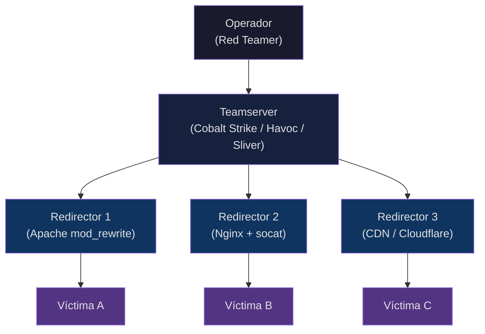
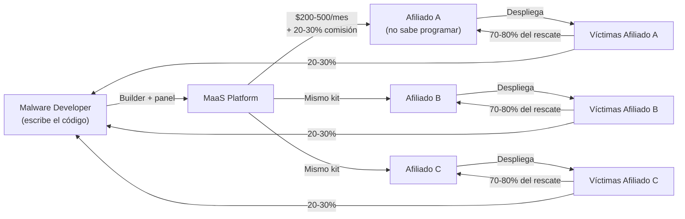
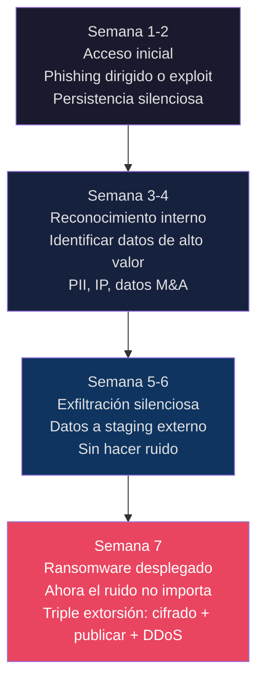
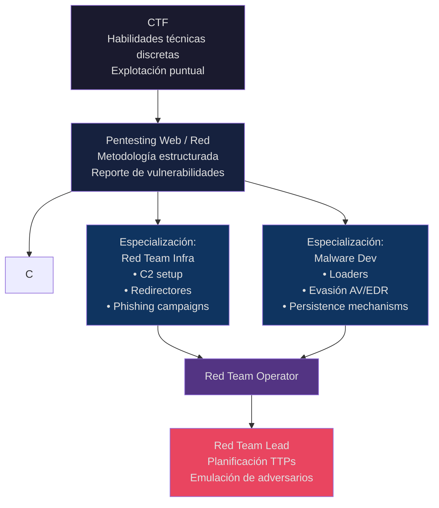

## Abstract

Hay una reflexión que surge naturalmente cuando empiezas a estudiar infraestructura Red Team real: si un atacante sofisticado puede operar con redirectores, domain fronting, C2 malleable y técnicas living-off-the-land que hacen casi indetectable su presencia, ¿por qué sigue existiendo el malware? ¿Por qué no todos los atacantes usan estas técnicas?

La respuesta revela algo fundamental sobre cómo funciona realmente el ecosistema de amenazas, y sobre la diferencia entre resolver un CTF, hacer pentesting, y operar como Red Team. No son versiones del mismo trabajo con distinto nivel de dificultad — son disciplinas con objetivos, modelos de amenaza y economías completamente distintos.

**Disclaimer:** Este contenido tiene fines educativos e investigativos. Está dirigido a profesionales de ciberseguridad, estudiantes de Red Team, y defensores que necesitan entender el panorama de amenazas real.

---

## Parte I: El Espectro de la Seguridad Ofensiva

### 1.1 CTF: El Laboratorio Controlado

Un CTF (Capture The Flag) es el equivalente de aprender a conducir en un circuito cerrado. Las reglas están definidas, hay una solución correcta, el tiempo está acotado, y sabes que al final de cada desafío existe una flag esperándote.

Lo que un CTF te enseña es invaluable: pensamiento lateral, lectura de código, explotación de vulnerabilidades específicas, reverse engineering, criptografía aplicada. Son habilidades técnicas concretas.

Lo que un CTF **no** te enseña es cómo opera un adversario real contra infraestructura real con defensores humanos activos, presupuesto ilimitado de tiempo, y consecuencias legales reales.

Las diferencias clave:

| Dimensión | CTF | Red Team |
|-----------|-----|----------|
| Objetivo | Capturar una flag | Demostrar impacto de negocio |
| Tiempo | Horas/días | Semanas/meses |
| Detección | No importa | OPSEC crítico |
| Rutas de ataque | Predefinidas | Abiertas |
| Adversario | Organizadores | SOC humano activo |
| Infraestructura | Simple | C2 complejo, múltiples pivots |
| Documentación | Flag como prueba | Evidencia forense de impacto |

### 1.2 Pentesting: El Auditor Técnico

El pentesting convencional se sitúa entre el CTF y el Red Team. Hay un scope definido, un time-box, y el objetivo es encontrar vulnerabilidades y reportarlas — no necesariamente explotarlas hasta sus últimas consecuencias.

Un pentester trabaja generalmente con permiso explícito, dentro de ventanas horarias acordadas, contra sistemas que el cliente ya conoce. La detección es secundaria porque el objetivo es encontrar agujeros, no demostrar qué haría un atacante real si nadie supiera que está ahí.

Esta es la brecha que muchos estudiantes no ven: el pentesting responde "¿puedo entrar?" El Red Team responde "¿qué podría hacer alguien que ya está adentro durante meses sin que nadie lo sepa?"

### 1.3 Red Team: El Adversario Simulado

El Red Team moderno emula Tactics, Techniques, and Procedures (TTPs) de adversarios reales — específicamente APTs (Advanced Persistent Threats) vinculados a estados-nación o grupos cibercriminales sofisticados.

El objetivo no es encontrar vulnerabilidades: es demostrar si el SOC puede detectar, contener y responder a un atacante que opera con paciencia, sofisticación y sigilo. El equipo de defensa (Blue Team) generalmente no sabe que el ejercicio está ocurriendo.

Esto cambia todo:

- El acceso inicial debe parecer legítimo (phishing dirigido, watering hole, supply chain)
- La persistencia debe sobrevivir reboots y análisis forense básico
- El movimiento lateral no puede disparar alertas de correlación
- Las exfiltraciones deben mezclarse con tráfico legítimo
- El C2 debe ser resistente a bloqueo de dominios y análisis de patrones

---

## Parte II: Infraestructura Red Team Real

Esta es la parte que cambia la perspectiva cuando ves cómo funciona realmente.

### 2.1 El Problema del C2 Simple

Imagina que comprometes una máquina con Metasploit y obtienes un reverse shell al puerto 4444 de tu IP. Funcionó. Pero:

- Tu IP queda en los logs del servidor comprometido
- El tráfico hacia un IP no corporativo en puerto 4444 dispara alertas en cualquier firewall básico
- Si tu IP es bloqueada, pierdes el acceso completamente
- Un analista de red puede correlacionar el tráfico y atribuirte en horas

Para un CTF, esto no importa. Para un Red Team contra una empresa con SOC, esto te quema en minutos.

### 2.2 Arquitectura C2 Moderna

La infraestructura C2 (Command & Control) profesional resuelve cada uno de esos problemas con capas de abstracción:



**El Teamserver** es donde opera el Red Teamer. Nunca está expuesto directamente a las víctimas.

**Los Redirectores** son VPS baratos en proveedores cloud que solo reenvían tráfico. Si uno es descubierto y bloqueado, los otros siguen operando. Están configurados para descartar cualquier conexión que no parezca un beacon legítimo — si un analista intenta conectarse directamente, obtiene una respuesta de servidor web genérico (Apache con página de WordPress, por ejemplo).

**Los beacons** en las víctimas se comunican sobre HTTPS hacia lo que parece tráfico web legítimo — no hacia IPs sospechosas en puertos no estándar.

### 2.3 Domain Fronting y Abuso de CDN

Una técnica más sofisticada es el domain fronting: el beacon de la víctima establece una conexión HTTPS hacia un dominio legítimo de alta reputación (históricamente Azure, AWS CloudFront, Cloudflare), pero el campo `Host` en la cabecera HTTP interna apunta a tu infraestructura real.

Para el firewall de la víctima, está viendo tráfico HTTPS hacia `ajax.cloudflare.com`. Para tu C2, está recibiendo el beacon correctamente.

La razón por la que esto importa: bloquear Cloudflare o Azure en una empresa rompería miles de servicios legítimos. Los defensores no pueden simplemente bloquear el tráfico.

### 2.4 Malleable C2 Profiles

Cobalt Strike (y sus sucesores open-source como Havoc, Sliver, Brute Ratel) permiten configurar exactamente cómo se ve el tráfico del beacon en la red.

Un perfil malleable puede hacer que el beacon imite el tráfico de Teams, de actualizaciones de Chrome, de telemetría de Windows. Las cabeceras HTTP, el timing de check-ins, el tamaño de los paquetes, la forma de encoding del payload — todo configurable para parecer tráfico legítimo.

```
# Ejemplo de perfil Cobalt Strike (simplificado)
http-get {
    set uri "/en_US/all.js";  # Parece una petición de Facebook
    client {
        header "Host" "www.facebook.com";
        header "Accept-Language" "en-US,en;q=0.5";
        metadata {
            base64;
            header "Cookie";
        }
    }
}
```

El analista que mira los logs ve requests a `/en_US/all.js` con cabeceras que parecen Facebook. Sin contexto adicional, parece legítimo.

### 2.5 Living off the Land (LotL)

La filosofía LotL es operar usando las propias herramientas del sistema operativo víctima en lugar de introducir malware externo. Esto elimina las detecciones basadas en firmas porque no hay nada que firmar.

En Windows:

- **PowerShell** para reconocimiento, movimiento lateral, y exfiltración
- **WMI** para persistencia y ejecución remota
- **certutil.exe** para descargar payloads (herramienta legítima de Windows)
- **mshta.exe**, **regsvr32.exe**, **rundll32.exe** para ejecutar código arbitrario
- **ntdsutil.exe** para volcar la base de datos de Active Directory

Un Red Teamer que opera puramente con LotL no introduce ningún binario externo al sistema. Usa únicamente herramientas que Microsoft instaló. Los antivirus basados en firmas son ciegos a esto.

### 2.6 OPSEC de Infraestructura

El OPSEC (Operations Security) de un Red Team profesional va más allá de las técnicas técnicas:

- **Registrar dominios con meses de anticipación** — los dominios recientes son inherentemente sospechosos para sistemas de reputación
- **Categorizar dominios en servicios de web filtering** — un dominio categorizado como "Technology" o "Business" tiene menos probabilidad de ser bloqueado
- **Aging de infraestructura** — usar la infraestructura para tráfico legítimo durante semanas antes del engagement, para que aparezca en baselines de tráfico normales
- **Compartimentación** — diferentes víctimas usan diferentes redirectores; comprometer uno no revela el resto de la infraestructura
- **Canary tokens** — para detectar si el Blue Team está investigando la infraestructura C2

Todo esto requiere planificación que comienza semanas o meses antes del primer click en un phishing.

---

## Parte III: Por Qué Sigue Existiendo el Malware

Aquí está la pregunta que motiva este post: si la infraestructura Red Team es tan sofisticada y difícil de detectar, ¿por qué sigue habiendo malware que "mete ruido"? ¿Por qué no todos los atacantes usan técnicas de este nivel?

La respuesta es que tienen **objetivos completamente distintos** y operan bajo **modelos económicos distintos**.

### 3.1 Economías Distintas, Objetivos Distintos

| Actor | Sofisticación | Volumen de víctimas | Objetivo |
|-------|--------------|-------------------|---------|
| APT Estado-nación | ████████████ Máxima | Muy pocas (objetivo específico) | Secretos, infraestructura crítica |
| Red Team comercial | ██████████ Alta | Pocas (cliente) | Evaluación de defensas |
| Ransomware operators | ███████ Media-alta | Cientos-miles | Extorsión corporativa |
| Infostealer masivo | ████ Media | Decenas de miles | Credenciales, crypto |
| Script kiddies | ██ Baja | Muchos (spray) | Oportunismo |
| Botnet spam | █ Mínima | Millones | Volumen puro |

Un APT vinculado a un estado-nación tiene recursos ilimitados pero necesita acceder a **objetivos de altísimo valor**: ministerios de defensa, laboratorios farmacéuticos, contratistas de defensa, infraestructura crítica. Para estos objetivos, la sofisticación es necesaria porque los defensores son igualmente sofisticados.

Un operador de ransomware masivo no necesita acceder a la NSA. Necesita cifrar los archivos de 10,000 pequeñas empresas que no tienen backups. Para ese objetivo, un malware simple distribuido vía phishing masivo **funciona perfectamente**.

### 3.2 La Matemática del Ransomware Masivo

La economía del ransomware masivo es devastadoramente efectiva sin requerir sofisticación técnica:

```
Campaña de phishing masivo:
├── 1,000,000 emails enviados (costo: ~$500 en servicio de spam)
├── 1% tasa de apertura = 10,000 víctimas click
├── 10% infección exitosa = 1,000 máquinas cifradas
├── 5% pagan rescate = 50 pagos
├── $2,000 promedio por rescate = $100,000
└── ROI: 200x sin un solo operador humano activo
```

El atacante no necesita estar presente. El malware hace el trabajo automáticamente: se instala, cifra, muestra la nota de rescate, gestiona el pago en crypto. Un humano solo necesita cobrar.

Contra un objetivo corporativo con EDR y SOC, este mismo malware sería detectado en minutos. Pero el objetivo **no es** atacar a empresas con EDR. El objetivo es atacar al 95% del mundo que no los tiene.

### 3.3 Malware-as-a-Service: La Democratización del Crimen

El ecosistema MaaS ha convertido lo que antes requería habilidades técnicas avanzadas en un servicio de suscripción:



LockBit en su apogeo operaba como una empresa estructurada con SLAs de soporte, portal de víctimas, FAQ de cómo pagar en Bitcoin, e incluso un programa de bug bounty para reportar vulnerabilidades en su propio malware.

El afiliado promedio de LockBit no sabía escribir código. Compraba acceso al builder, configuraba un dominio de pago, y desplegaba el malware usando técnicas básicas — phishing, exploits públicos, credenciales compradas. La sofisticación técnica era del developer, no del operador.

### 3.4 El Objetivo Determina la Herramienta

La regla fundamental que explica la coexistencia:

**El nivel de sofisticación requerido es proporcional al nivel de defensa del objetivo.**

| Objetivo | Defensas típicas | Herramienta suficiente |
|----------|-----------------|----------------------|
| Usuario doméstico | AV básico o ninguno | Script Python básico |
| PYME sin IT | Windows Defender | Malware público de GitHub |
| Empresa mediana | Firewall + AV | Malware comercial o MaaS |
| Empresa grande | EDR + SIEM | Loaders sofisticados + LotL |
| Infraestructura crítica | SOC 24/7 + threat hunting | APT-level (C2 custom, 0days) |

Un atacante racional usa la mínima sofisticación necesaria para comprometer su objetivo. Usar Cobalt Strike contra una clínica dental sin SOC es como usar un bisturí de cirugía cardíaca para cortar pan — funciona, pero es innecesariamente caro y complejo.

---

## Parte IV: El Ruido Como Fenómeno Estratégico

Creo que aquí hay algo contraintuitivo que como defensores solemos pasar por alto: **el ruido del malware masivo beneficia activamente a los atacantes sofisticados.**

### 4.1 La Paradoja del SOC

Un SOC corporativo típico recibe entre 1,000, 10,000, 1 Millon de alertas diarias. La mayoría son:
- Alertas de malware masivo bloqueado por el EDR
- Intentos de conexión a IPs maliciosas conocidas en threat feeds públicos
- Brute force en servicios expuestos
- Phishing bloqueado por el gateway de correo

Los analistas pasan gran parte de su tiempo triando estas alertas. El analista que tiene que revisar 5,000 alertas de GuLoader, AgentTesla y Emotet bloqueado tiene menos tiempo y atención para detectar el beacon de Cobalt Strike que está haciendo check-in cada 4 horas con tráfico perfectamente disfrazado de Teams.

Un APT sofisticado puede literalmente operar **debajo del umbral de atención** del SOC, no porque sea invisible, sino porque los analistas están demasiado ocupados con el ruido.

### 4.2 La Estrategia del Falso Positivo

Algunos actores sofisticados van más lejos: durante la fase de reconocimiento activo, deliberadamente detonan malware masivo contra la organización víctima para estudiar cómo responde el SOC.

¿Cuánto tardan en bloquear una IP? ¿Qué indicadores usan para detección? ¿Escalan internamente o usan un MSSP externo? ¿Tienen reglas de correlación que se disparan con ciertos patrones?

Las respuestas del SOC al ruido deliberado revelan las capacidades defensivas, permitiendo calibrar la operación real para evadir exactamente esos mecanismos.

---

## Parte V: La Convergencia — Cuando el Malware Aprende del Red Team

La distinción entre "malware masivo simple" y "herramientas de Red Team sofisticadas" se está erosionando. Los grupos criminales más avanzados han adoptado técnicas que hace cinco años eran exclusivas de actores estatales.

### 5.1 Loaders: El Puente Entre Mundos

Un loader es un programa cuyo único propósito es descargar y ejecutar el payload real de forma evasiva. Los loaders modernos:

- **Evaden sandboxes de análisis**: detectan si están en una VM (poca RAM, sin actividad de mouse, tiempo de ejecución < X días)
- **Verifican geolocalización**: solo ejecutan el payload si la IP víctima está en el país objetivo
- **Usan técnicas anti-AV**: process hollowing, reflective DLL injection, direct syscalls para evitar hooks del EDR
- **Implementan comunicación cifrada**: el payload se descarga cifrado desde un CDN legítimo

GuLoader, uno de los loaders más prolíficos de los últimos años, descarga payloads desde Google Drive, OneDrive y AWS S3. El tráfico de red es legítimo — ¿quién bloquea Google Drive?

### 5.2 Ransomware de Doble y Triple Extorsión

Los grupos de ransomware más sofisticados (Cl0p, BlackCat/ALPHV antes de su takedown) adoptaron un modelo que requiere operaciones de Red Team reales:



La fase de exfiltración silenciosa requiere técnicas de Red Team genuinas. Solo cuando ya tienen la palanca — los datos exfiltrados — se permiten el ruido del ransomware. Han transformado lo que era un ataque rápido en una operación de varias semanas.

### 5.3 BYO LOL: Malware que Trae Sus Propias Herramientas Legítimas

BYOVD (Bring Your Own Vulnerable Driver) es una técnica donde el malware instala un driver legítimo pero vulnerable en el sistema (hay miles en la biblioteca de drivers de Windows) y luego explota esa vulnerabilidad para deshabilitar el EDR desde el kernel — donde ningún software de seguridad userland puede protegerse.

BlackByte, un grupo de ransomware, usó un driver legítimo de MSI Afterburner (software de overclock de GPUs) para matar el AV antes de desplegar el ransomware. El driver está firmado por Microsoft. El AV no puede bloquearlo sin falsos positivos masivos.

---

## Parte VI: Implicaciones para el Defensor

### 6.1 El Error del "AV es Suficiente"

El modelo mental de muchas organizaciones se da a entender que es lineal:

```
Malware → AV detecta → Amenaza bloqueada
```

La realidad del ecosistema moderno es mucho más compleja. Hay amenazas para las cuales el AV es efectivo (malware masivo conocido), y amenazas para las cuales es invisible (C2 con perfil malleable, LotL, BYOVD).

Una organización que solo tiene AV está protegida contra el 80% del volumen de amenazas pero es casi transparente al 20% más sofisticado. Y ese 20% es el que causa las brechas que aparecen en las noticias.

### 6.2 La Pirámide del Dolor

El modelo "Pyramid of Pain" de David Bianco captura el asimetría clave de la detección:

```
              /\
             /  \     TTPs (Tactics, Techniques, Procedures)
            /----\    ← Más difícil de cambiar para el atacante
           /      \   Herramientas
          /--------\  ← Requiere reescribir el malware
         /          \ Dominios, IPs, Hashes
        /------------\ ← Fácil de cambiar, detección de poco valor
```

Bloquear un hash de malware es trivial para el atacante: recompila y el hash cambia. Bloquear una IP es igualmente fácil: cambia el redirector. Pero **detectar las TTPs** — el patrón de comportamiento del adversario — es mucho más difícil de evadir porque requiere cambiar la metodología completa.

Un Red Team que evalúa si el Blue Team detecta TTPs (no solo IOCs) es el tipo de cosas que solemos pasar por alto pero ofrece valor defensivo real.

### 6.3 Threat Hunting: La Diferencia entre Reactive y Proactive

Las organizaciones que solo responden a alertas son inherentemente reactivas. El atacante sofisticado opera bajo el umbral de las alertas por diseño.

El threat hunting es el proceso de **buscar activamente** evidencia de compromisos que los sistemas automatizados no han detectado. Los hunters buscan anomalías de comportamiento:

- PowerShell executando desde Word (no desde cmd o el menú)
- LSASS siendo accedido por un proceso que no es conocido
- Check-ins de red a dominios registrados recientemente a horas fuera de horario laboral
- Volúmenes inusuales de acceso a shares de red internos

Estas técnicas de hunting son exactamente lo que un Red Team bien configurado ayuda a entrenar.

---

## Parte VII: La Reflexión — El Camino de CTF a Red Team

Volviendo al punto de partida: la transición de CTF a Red Team no es solo un salto de dificultad técnica. Es un cambio de paradigma completo.

En un CTF, el objetivo es explotar una vulnerabilidad. En Red Team, el objetivo es demostrar que el adversario puede lograr un impacto de negocio real (exfiltrar PI, comprometer el directorio activo, acceder a sistemas OT) sin ser detectado durante semanas.

El mapa del camino real:



Las especializaciones de infraestructura y desarrollo de malware son caminos paralelos que convergen en el operador de Red Team completo. Ambas son necesarias: puedes tener el C2 más sofisticado del mundo, pero si tu loader es detectado en el primer segundo por el EDR, no llegas a usarlo.

---

## Conclusión

El malware masivo y la infraestructura Red Team sofisticada no son competidores — son herramientas para mercados completamente distintos con economías distintas.

El malware existe porque la mayoría del mundo no tiene defensas que lo hagan ineficiente. Opera con lógica de volumen: si infectas un millón de máquinas y el 0.1% paga, es un negocio rentable sin operadores humanos activos. MaaS ha democratizado este acceso hasta el punto donde no necesitas saber programar.

La infraestructura Red Team existe porque algunos objetivos tienen defensas sofisticadas que hacen inviable el enfoque de volumen. Para esos objetivos de alto valor, la sofisticación es la única forma de operar sin ser detectado.

Lo que hace interesante el panorama actual es la convergencia: los grupos criminales más avanzados han adoptado técnicas de Red Team (loaders, BYOVD, exfiltración silenciosa antes del ransomware) mientras el mundo de Red Team produce herramientas open-source (Havoc, Sliver) que democratizan la sofisticación en la otra dirección.

Para el defensor, la lección es clara: no puedes tratar el ecosistema de amenazas como un problema único con una solución única. Necesitas defensa en capas que sea efectiva contra el spray-and-pray del malware masivo **y** contra el operador paciente con C2 malleable y tres meses de paciencia.

Y para el estudiante que viene de CTF y quiere entender Red Team: la diferencia no es técnica. Es de mentalidad. El CTF te pregunta "¿puedes explotar esto?" El Red Team te pregunta "¿puedes mantenerte adentro durante 90 días sin que nadie lo sepa?"

Son preguntas muy distintas.

**Solve et coagula.**

---

## Referencias y Recursos

**Frameworks y Herramientas Mencionadas:**
- [MITRE ATT&CK](https://attack.mitre.org/) — Base de conocimiento de TTPs de adversarios reales
- [Cobalt Strike](https://www.cobaltstrike.com/) — C2 framework comercial (también usado por APTs con copias crackeadas)
- [Havoc C2](https://github.com/HavocFramework/Havoc) — Alternativa open-source
- [Sliver](https://github.com/BishopFox/sliver) — C2 framework open-source de Bishop Fox
- [Pyramid of Pain](https://detect-respond.blogspot.com/2013/03/the-pyramid-of-pain.html) — David Bianco, modelo de valor de indicadores de detección

**Lectura Recomendada:**
- [Red Team Development and Operations](https://redteam.guide/) — Joe Vest & James Tubberville
- [The Hacker Playbook 3](https://www.amazon.com/Hacker-Playbook-Practical-Penetration-Testing/dp/1980901759) — Peter Kim
- [Adversarial Tradecraft in Cybersecurity](https://www.packtpub.com/product/adversarial-tradecraft-in-cybersecurity/9781801076203) — Joe Vest
- [Atomic Red Team](https://github.com/redcanaryco/atomic-red-team) — Biblioteca de tests de TTPs de MITRE ATT&CK

**Conceptos Clave:**
- C2 (Command & Control), Malleable Profiles, Domain Fronting, Redirectors
- Living off the Land (LotL), LOLBAS (LOLBins, LOLLibs, LOLScripts)
- BYOVD (Bring Your Own Vulnerable Driver)
- MaaS (Malware-as-a-Service), RaaS (Ransomware-as-a-Service)
- TTPs (Tactics, Techniques, and Procedures), IOCs (Indicators of Compromise)
- Threat Hunting, EDR (Endpoint Detection and Response), SIEM

---

*¿Estás estudiando la transición de CTF a Red Team? ¿Qué parte del ecosistema te parece más difícil de entender? Escríbeme.*
