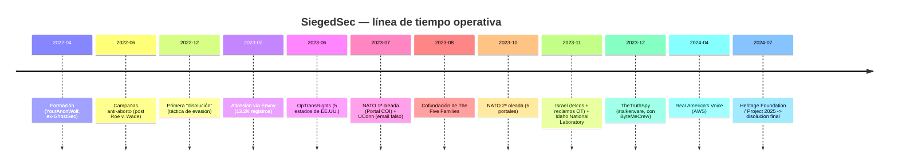
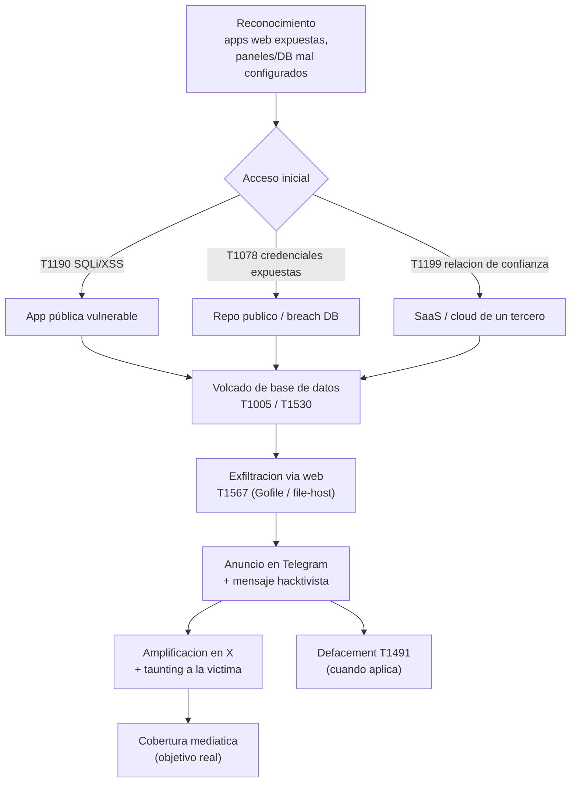

Inteligencia de fuente abierta. Grupo disuelto en julio de 2024. Material defensivo/educativo; mezcla informe técnico, contexto cultural y comentario.



Cuarenta y cinco mil números de seguridad social, y la única condición que el grupo puso para borrarlos fue que el laboratorio nuclear investigara cómo fabricar catgirls reales.

Las dos frases pertenecen al mismo comunicado. Esa convivencia —el dato que arruina la vida de una familia y la broma sacada de un foro a las cuatro de la mañana— es el centro de gravedad de esta historia. SiegedSec, los autodenominados *gay furry hackers*, vivieron de esa tensión durante dos años, y casi todo lo interesante de su caso está en negarse a resolverla en una sola dirección.

Lo que sigue cuenta la historia completa: quiénes eran, de qué cultura salieron, qué hicieron de verdad y qué solo dijeron, cómo entraban, y qué deja todo eso. Mezcla tres registros a propósito —informe técnico, contexto, comentario— porque el fenómeno no se entiende con uno solo. La regla constante es una sola: separar **lo verificado** (confirmado por la víctima o por reportes independientes) de **lo reclamado** (solo afirmado por el grupo en Telegram).

---

## Quiénes eran

SiegedSec —abreviatura de *Sieged Security*— fue un colectivo hacktivista activo entre **abril de 2022 y julio de 2024**. Grupo pequeño, descentralizado y de baja sofisticación técnica, con un perfil deliberadamente teatral: emoticones `:3` y `^-^`, aperturas con *"mew mew mew"*, GIFs de gatos, el meme *BoyKisser*. El linaje es explícito y declarado: **LulzSec**, el grupo que una década antes ya hacía intrusiones de oportunidad como espectáculo, burlándose de las víctimas y de la propia escena de seguridad.

| Campo | Valor |
|---|---|
| Nombre | SiegedSec (*Sieged Security*) |
| Tipo | Colectivo hacktivista |
| Activo | abril 2022 – julio 2024 |
| Personas clave | *YourAnonWolf* (fundador) → *Vio* (líder/portavoz) |
| Membresía | Pequeña y fluctuante; edades reportadas 18–26 (confianza media) |
| Plataformas | Telegram (principal), X/Twitter (amplificación) |
| Alianzas | Cofundador de *The Five Families* (con GhostSec, Stormous, ThreatSec, BlackForums) |
| Motivación | Hacktivismo (pro-LGBTQ+/trans, pro-aborto, anti-derecha) + *"diversión y caos"* |
| Sofisticación | **Baja.** Sin malware propio, sin persistencia, operaciones *smash-and-grab* |

El fundador, *YourAnonWolf*, venía de GhostSec; más adelante la cara pública fue *Vio*, que dio una AMA en Reddit y una entrevista a *Business Insider* donde resumió el objetivo del grupo como *"have fun and cause chaos"*. La selección de blancos, sin embargo, no era azarosa: respondía a la coyuntura política —la reversión de *Roe v. Wade*, las leyes estatales anti-trans, *Project 2025*, el conflicto en Gaza—.


**Sesgo de autorreporte.** SiegedSec exageró sistemáticamente el volumen y la sensibilidad de lo que comprometía. Una captura de pantalla en un canal de Telegram no es una verificación. A lo largo del texto, cada cifra viene etiquetada como *reclamada* o *verificada*.


---

## Furros, queers y hackers: el fenómeno infursec

Antes de los ataques conviene entender el agua en la que nadaban, porque la etiqueta *gay furry hackers* no era una pose vacía ni una rareza aislada. Existe una superposición real y documentada entre el fandom furry y la industria de seguridad informática, lo bastante reconocida como para tener nombre propio: **infursec**, contracción de *infosec* y *furry*.



El fandom furry es una comunidad construida alrededor del arte y los personajes antropomórficos —no una franquicia ni un fetiche, como suele caricaturizarse—. Cada miembro suele tener una *fursona*: un avatar animal personalizado que funciona como identidad. Los estudios revisados por pares del **International Anthropomorphic Research Project** (conocido como FurScience) llevan más de una década midiendo esta comunidad, y los números explican buena parte de la superposición con la seguridad:

- Cerca del **75% se identifica como no heterosexual**, y alrededor del **15% como género-diverso** (trans, no binario, genderqueer).
- Los furros son **al menos 2,25 veces más propensos** a estar en el espectro autista que la población general, con altas tasas reportadas de TDAH. La neurodivergencia se correlaciona con pensamiento sistemático, reconocimiento de patrones y foco intenso —aptitudes que la seguridad informática premia—.
- El fandom creció como subcultura digital en los noventa y dos mil, sobre MUCKs, IRC, BBSs y foros propios. Para participar había que administrar servidores y redes: habilidades directamente transferibles a IT y seguridad.

A eso se suma un motor menos técnico y más humano: una comunidad históricamente estigmatizada, mayoritariamente queer, desarrolló temprano una **conciencia aguda de privacidad y autodefensa digital**. Aprender seguridad operacional no era un hobby; era una forma de existir online sin que el acoso te alcanzara. La fursona y el seudónimo desacoplan la participación de la identidad legal —exactamente la misma lógica con la que un profesional de seguridad separa su persona pública de su nombre real—.



La manifestación más legítima de todo esto es **DEF CON Furs**: lo que empezó en 2016 como un meetup informal en la conferencia de hacking más grande del mundo se volvió, en 2017, un "con-within-a-con" con charlas técnicas, paneles y *badgelife* (el arte de fabricar badges electrónicos custom), hoy bajo el paraguas de una organización sin fines de lucro. No es anécdota: es infraestructura comunitaria. La frase medio en broma *"the furries run the internet"* —que un montón de gente en roles críticos de backend, infra y seguridad tiene fursona— no está cuantificada con rigor, pero se repite con una consistencia que cuesta ignorar.




**Correlación, no causalidad.** Nada de esto dice que ser furro te vuelva hacker, ni al revés. Dice que dos comunidades nacidas en la misma internet temprana, con demografías que se solapan (queer, neurodivergente, digital-first), terminaron compartiendo gente. El estereotipo *gay furry hacker* tiene base empírica; reducir a una comunidad diversa a ese tropo, no.


Y acá viene la parte incómoda para la lectura fácil: **SiegedSec no representaba a esa comunidad.** Encajaban en lo identitario —eran genuinamente queer y furros, los blancos se alineaban con la defensa de derechos LGBTQ+, el registro de internet resonaba con la cultura online—. Pero la comunidad infursec real, la de DEF CON Furs y las fursonas en X, es de **profesionales legales de seguridad** con OPSEC riguroso. SiegedSec cometía delitos federales con seguridad operacional notoriamente pobre. Eran, más que herederos de DEF CON Furs, herederos de LulzSec: un *misfit* cultural deliberado, que tomó prestada una identidad genuina y la usó como marca. La etiqueta era auténtica; la representación, no.

---

## Cronología

Un detalle de comportamiento que vale la pena fijar: la **disolución como táctica de evasión**. El grupo se anunciaba "muerto" para drenar la atención de las fuerzas del orden y reaparecía bajo el mismo nombre. La primera fue en diciembre de 2022; la de julio de 2024 fue la definitiva. El patrón mismo se volvió una firma identificable.

---

## Las operaciones

| Operación | Fecha | Objetivo | Reclamado | Verificado | Severidad |
|---|---|---|---|---|---|
| Atlassian (vía Envoy) | feb 2023 | Atlassian | ~13.200 registros + planos de oficina | Confirmado por Atlassian | ALTO |
| #OpTransRights | jun 2023 | TX, NE, PA, SD, SC | Archivos policiales, intranets, PII | Parcial (SC, NE) | MEDIO |
| NATO (1ª oleada) | jul 2023 | Portal COI | ~845 MB, ~8.000 usuarios | No clasificado; NATO investigó | MEDIO |
| University of Connecticut | jul 2023 | UConn | Email masivo falso ("for the lulz") | Confirmado | BAJO |
| NATO (2ª oleada) | oct 2023 | 5 portales más | ~9 GB, 3.000+ archivos | Sin impacto operacional (NATO) | MEDIO |
| Israel — OT/SCADA | oct–nov 2023 | Modbus/BACnet/Niagara Fox | "Mass attacks" a infra crítica | **Desmentido** (SecurityScorecard) | BAJO |
| Israel — telcos | nov 2023 | Bezeq, Cellcom, Israir | ~230.000 registros de clientes | Reclamado; sin confirmación | MEDIO |
| Idaho National Laboratory | nov 2023 | INL (Oracle HCM) | PII de empleados con SSN | **45.047 personas; confirmado** | CRÍTICO |
| Real America's Voice | abr 2024 | RAV (AWS) | Borrado de buckets S3, ~1.200 usuarios | Reclamado; datos publicados | MEDIO |
| Heritage Foundation | jul 2024 | Heritage / *Project 2025* | 200 GB de sistemas activos | **~2 GB de archivo viejo de terceros** | ALTO |

El patrón general salta a la vista al graficar cuánto de cada reclamo sobrevivió a una verificación independiente:



### Idaho National Laboratory (nov 2023) — el caso más grave

El más serio del historial, y el menos teatral. SiegedSec comprometió un sistema **Oracle Human Capital Management** —recursos humanos en la nube, gestionado por un tercero aprobado a nivel federal— **externo** a la red de investigación nuclear del laboratorio. Exfiltraron PII de **45.047 personas**: empleados actuales y antiguos, cónyuges y dependientes, con nombres, fechas de nacimiento, direcciones, **números de seguridad social**, datos salariales y bancarios. INL confirmó el breach y coordinó con FBI y CISA. La red de investigación nuclear **no** fue tocada.

La cara teatral llegó después: ofrecieron borrar los datos si INL aceptaba investigar la creación de *IRL catgirls*. No era una demanda seria; era una maniobra de prensa, y funcionó —cobertura viral en todos lados—.

### Heritage Foundation / Project 2025 (jul 2024) — el impacto inflado

El caso paradigmático de la brecha entre reclamo y realidad. SiegedSec afirmó haber sacado **200 GB** de los sistemas de la fundación en protesta contra *Project 2025*. Lo verificado:

- Soltaron **~2 GB** comprimidos.
- Los datos venían de un **archivo de dos años de antigüedad de *The Daily Signal*** (registros de 2007 a noviembre de 2022), alojado por un contratista externo en un servidor **mal configurado y públicamente accesible**.
- Heritage negó cualquier breach de sistemas activos o de bases de *Project 2025*; llamó a los atacantes *"criminal trolls"*.
- Investigadores independientes confirmaron que los datos eran de ese archivo legacy, sin material interno ni estratégico activo.


Lo que **sí** se verificó de forma independiente no fue el "hackeo de Project 2025", sino los **chat logs** entre Vio y Mike Howell (director del Oversight Project de Heritage), donde Howell mencionó la cooperación con el FBI. Esa confrontación —no el volumen de datos— precipitó la disolución del grupo días después.


### Israel / OT-SCADA (oct–nov 2023) — el reclamo desmentido

Junto a Anonymous Sudan, SiegedSec publicó una lista de IPs israelíes que decían haber sometido a *"mass attacks"*: dispositivos Modbus, BACnet, receptores GNSS, Niagara Fox. El **STRIKE Team de SecurityScorecard** analizó el tráfico (NetFlow) de esas IPs:

- **No** encontró volúmenes consistentes con un ataque exitoso ni evidencia de compromiso.
- Varios servicios industriales **sí estaban expuestos** a internet —pero estar expuesto no es lo mismo que haber sido comprometido—.
- Evaluó la lista como un **"call to action"**: un llamado a que otros, más capaces, explotaran esas debilidades.


**No confundir actores.** El OT realmente comprometido en EE.UU. e Israel en ese período (PLCs Unitronics en sistemas de agua) fue obra de **CyberAv3ngers**, vinculado al IRGC iraní —no de SiegedSec—. Atribuirles ese OT real sería un error de contabilidad que ellos mismos fomentaban.


---

## Cómo entraban

La mayoría de las operaciones siguió la misma forma: acceso por una debilidad expuesta, exfiltración inmediata, publicación ruidosa. Sin persistencia, sin movimiento lateral profundo, sin malware propio.

### TTPs mapeados a MITRE ATT&CK


SiegedSec **no es un grupo trackeado** en el catálogo oficial de MITRE ATT&CK. Todos los mapeos siguientes son **derivados por analistas** a partir de reportes de Flare, SOCRadar, SpyCloud, DarkOwl, Enzoic y la cobertura de cada incidente. La columna *Confianza* refleja cuánto sostiene la evidencia pública cada atribución.


| Táctica | Técnica | ID | Evidencia / uso | Confianza |
|---|---|---|---|---|
| Reconnaissance | Search Open Websites/Domains | T1593 | Barrido de apps web expuestas y paneles abiertos; targeting de activos ya vulnerables | Media |
| Reconnaissance | Gather Victim Identity: Credentials | T1589.001 | Caso Atlassian: credenciales **commiteadas a un repo público** | Alta |
| Initial Access | Exploit Public-Facing Application | T1190 | **SQLi** como vector primario; **XSS** para defacement y acceso por sesión | Alta |
| Initial Access | Valid Accounts | T1078 | Credenciales robadas/expuestas de empleados (Atlassian → Envoy) | Alta |
| Initial Access | Trusted Relationship | T1199 | Envoy (Atlassian), subcontratista cloud (INL), contratista de *The Daily Signal* (Heritage) | Alta |
| Execution | Command and Scripting Interpreter | T1059 | Consultas SQL contra backends; **sqlmap** probable por el patrón de los volcados | Media (inferida) |
| Persistence | — | — | **Sin evidencia.** Operaciones *smash-and-grab*; ni backdoors ni webshells | Alta (ausencia) |
| Collection | Data from Local System | T1005 | Volcado de PII, credenciales y documentos internos | Alta |
| Collection | Data from Cloud Storage Object | T1530 | INL: exfiltración de PII desde sistema HR cloud de un tercero | Alta |
| Exfiltration | Exfiltration Over Web Service | T1567 | Subida a Gofile/file-hosts anónimos enlazados desde Telegram | Alta |
| Impact | Defacement: External | T1491.002 | Modificación de contenido web con mensajería hacktivista | Alta |
| Impact | Data Manipulation: Stored Data | T1565.001 | Reclamos de "destruir" bases tras exfiltrar (autorreportado) | Baja–Media |

**Herramientas e infraestructura:** sin malware propio (ni RATs, ni implants, ni C2 convencional); **sqlmap** inferido por la forma de los volcados; **Telegram** como hub y canal de leaks; **file-hosts anónimos** (Gofile y similares) para alojar datasets; sin sitios `.onion` —prefirieron clearnet de alta visibilidad—; VPN/VPS genéricos sin atribución concreta.


**OPSEC consistentemente pobre** —rasgo definitorio, no accidente—: taunting público a las víctimas, conversaciones directas con organizaciones objetivo, personas semi-persistentes (*YourAnonWolf*, *Vio*) y marcadores de comportamiento identificables (emoticones, registro vulgar, estética furry junto a cada anuncio). La disolución final la precipitó la presión del FBI comunicada a través de la propia víctima.


---

## La disolución y lo que quedó

El **10–11 de julio de 2024**, Vio anunció la disolución definitiva en Telegram:

> *"yes this is a sudden announcement... for our own mental health, the stress of mass publicity, and to avoid the eye of the FBI."*

> *"we may not be a cybercriminal group anymore, but we will always [be] hackers and always fighting for the rights of others."*

Las razones citadas: salud mental, estrés por la publicidad masiva, evasión del FBI —catalizado por los comentarios de Howell—. Vio mencionó intentos previos fallidos de dejar el cibercrimen.

**Sucesores:** ninguno formal. **NullBulge** comparte la estética *furry hacker* pero es una entidad separada —responsable del leak del Slack de Disney (~1,2 TB), motivado por protesta contra el arte generado por IA, con cargos federales presentados por el DOJ—. La alianza *Five Families* perdió a su miembro más visible; GhostSec sigue operando por separado.


**Allanamiento del FBI a Vio (~marzo 2025): NO verificado oficialmente.** Lo reportó el ex-miembro @mewmrrpmeow en X; periodistas confirmaron su afiliación al grupo pero **no** el allanamiento. La cuenta de Signal de Vio dejó de responder. El FBI no comentó. Trátese como rumor de baja confianza hasta que haya registro judicial o confirmación oficial.


---

## Comentario: la seriedad era opcional

Hasta acá el registro fue de informe. Lo que sigue es distinto: un intento de pensar el fenómeno, no de catalogarlo. Porque la pregunta que casi todos le hicieron a SiegedSec —¿eran un chiste o una amenaza?— tiene trampa, y la trampa es lo que vale la pena mirar.

Hay una manera de leerlos que los archiva como payasos: gatitos, `mew mew mew`, una demanda de catgirls a un laboratorio del Departamento de Energía. Y hay otra que los infla en sentido contrario: hackearon a la OTAN, a un laboratorio nuclear, a la fundación que escribe la política de un país. Las dos lecturas tranquilizan, y las dos fallan por la misma razón: tratan el paquete como un bloque. El trabajo, como siempre, es desagregar. Cuando se separan los componentes, queda algo más incómodo que cualquiera de los extremos. El inflado era constante —200 GB que fueron 2, "mass attacks" que el NetFlow desmiente—, pero en medio de ese ruido hubo un compromiso real: cuarenta y cinco mil personas con su número de seguridad social expuesto. Ahí no hubo exageración. Ahí hubo cuerpos. El chiste y el daño no estaban en cuartos separados de la casa; estaban en la misma oración.

**Una firma que pide ser detectada.** En seguridad, una firma es lo que un detector busca para reconocerte; sobrevivir suele consistir en no tener una fija, en cambiar de forma para que no haya patrón que enganchar. SiegedSec hizo lo contrario, y a propósito: la estética de gato, los emoticones, las personas que reaparecían operación tras operación, el registro identificable hasta en la puntuación. Desde el punto de vista de la seguridad operacional, eso es suicidio. Pero no era torpeza: era el plan. No estaban optimizando para sobrevivir, sino para que los vieran. Y los vieron —la prensa, los seguidores, las víctimas a las que les hablaban de frente—. La misma propiedad que los hizo legibles para su público los hizo legibles para todo lo demás. Cuando Howell les escribió que el FBI ya estaba mirando, no había firma que replegar, porque la firma era el producto. Querer que te vean y no querer que te encuentren son, a cierta resolución, el mismo deseo mal contado.

Lo noto mientras lo escribo, y no me termina de gustar: traducir un `:3` a una técnica con identificador de catálogo, volver el gato un vector, es también una forma de no mirar lo que el gato hacía. El que clasifica, aplana. No tengo una manera limpia de analizar el disfraz sin participar de la seriedad que el disfraz se negaba a tener.

**No hizo falta un genio.** La parte que un defensor no debería poder ignorar es lo barato que fue todo. La entrada a uno de los compromisos más citados fue una credencial que un empleado había dejado escrita en un repositorio público. No un día-cero, no una cadena de exploits: una contraseña a la vista, y desde ahí un salto a una plataforma de terceros que confiaba en esa cuenta. Esto es la asimetría de siempre, vista desde el lado que incomoda. Atacar es un problema de búsqueda: alcanza con que uno funcione. Defender es un problema de cobertura: tienen que fallar todos. Y un grupo de baja capacidad es la prueba más limpia de esa asimetría, justamente porque no aporta genio: si gente que se anuncia con gifs de gatos entra a un laboratorio nuclear por la puerta de un proveedor de recursos humanos, el problema nunca fue la genialidad del atacante. Fue la cantidad de puertas. Hay una tentación de cerrar con una moraleja sobre higiene; la resisto, porque sería falsa por incompleta. La higiene básica habría parado casi todos estos accesos —cierto, y hay que decirlo—, pero "básica" describe la técnica, no la dificultad de sostenerla en cada contratista, durante años, con atención finita. Lo necesario no es lo suficiente, y confundirlos es donde nace casi todo el consejo de seguridad que no le sirve a nadie.

**La máscara y el blanco eran la misma pieza.** Queda lo furry, que casi todo el mundo trató como decoración. Era estructura. Una identidad marginada convertida en marca hace dos cosas a la vez, inseparables. Hacia adentro funciona como armadura: el seudónimo y la estética dan anonimato, señalan pertenencia, y desactivan de antemano la solemnidad con la que el resto del rubro se toma a sí mismo —cuesta construir el mito del hacker temible sobre alguien que abre sus comunicados con `mew`—. Hacia afuera, esa misma marca es lo que los volvió titular y objetivo: lo que los hacía reconocibles para los suyos los hacía reconocibles para todos. La máscara que protege es la cara por la que te identifican. No son dos efectos; es uno solo mirado desde dos lados. Y la elección de blancos no era ajena a eso: un colectivo que se nombra desde una identidad atacada elige, con coherencia, a quienes legislan contra esa identidad. La estética y la política no eran capas pegadas; eran la misma decisión.

**La pregunta no era si hablaban en serio.** Acá la pregunta original se rompe y hay que rescribirla. "¿Chiste o amenaza?" supone que el humor y el daño compiten por el mismo espacio, que en la medida en que algo es lúdico deja de ser real. La operación entera demuestra lo contrario. La pregunta útil es otra: ¿qué hacía la estética dentro de la cadena de ataque? Y la respuesta es que no era el adorno del ataque, era el sistema de entrega. La carga útil real nunca fueron los datos —se inflaban, se exageraban, a veces ni existían—. La carga útil era la atención. El gato, la broma, la provocación, eran el mecanismo por el cual una intrusión técnicamente trivial se convertía en cobertura internacional. Vista así, la demanda de catgirls no contradice la gravedad del breach: es la ojiva. Es lo que hizo que cuarenta y cinco mil números de seguridad social aparecieran en titulares que de otro modo nadie habría escrito. Lo que vuelve esto propio de la época no es la broma, sino que el ataque se diseñó para el ciclo de atención y no para el objetivo nominal. La filtración era el pretexto; la viralidad, el producto. Y eso no es una rareza de un grupo furro: es la forma de la era, expresada con una claridad que la mayoría de los actores disimula mejor.

**El patrón se conserva, el hardware cambia.** Nada de esto es nuevo, y eso también es el punto. Hubo un grupo, hace más de una década, que hacía casi lo mismo: intrusiones de oportunidad, espectáculo por encima del sigilo, burla a las víctimas, una marca reconocible, y un final escrito por la presión policial sobre gente joven que nunca planeó esconderse de verdad. SiegedSec lo sabía; el linaje con LulzSec era explícito. Cambió el envoltorio —la estética furry donde antes había una careta de Anonymous—, cambiaron la coyuntura y los nombres. La firma del fenómeno se conservó entera. Incluso el final rima consigo mismo: el grupo se "disolvió" varias veces como táctica hasta que la última fue de verdad, y en el comunicado el líder admitió que ya había intentado dejar el cibercrimen otras veces sin poder. Es la forma más honesta de cualquier ciclo: no se rompe por decisión; se sale o no se sale, y la mayoría de las veces se vuelve. El bucle no se rompió. Se agotó el hardware que lo corría.

Vuelvo al comunicado del principio, a las dos frases pegadas. Con el tiempo una se borró: los datos de las cuarenta y cinco mil personas quedaron filtrados, el laboratorio mandó cartas y ofreció monitoreo de crédito, y la broma de las catgirls pasó a ser nota de color. Pero el orden de importancia que el grupo le dio en su momento fue el inverso —la broma adelante, el daño como nota al pie—, y ese orden no era un error de gusto. Era la estrategia funcionando exactamente como estaba diseñada.

Me queda una sola cosa firme, y ni siquiera estoy seguro de ella. La próxima vez que algo grave llegue envuelto en algo que parece trivial, el envoltorio no va a ser la prueba de que no es grave. Va a ser el método. Lo lúdico no es garantía de que no hay daño; a veces es el vehículo que lo lleva hasta el titular.

Lo apunto. Sigo.

---

## Fuentes

Inteligencia de fuente abierta. URLs consultadas durante la investigación:

**El grupo, operaciones y disolución**

- Wikipedia — *SiegedSec*: <https://en.wikipedia.org/wiki/SiegedSec>
- Flare.io — perfil de amenaza: <https://flare.io/learn/resources/blog/siegedsec/>
- SOCRadar — *Five Families* / dark web: <https://socradar.io/>
- SpyCloud — credenciales y leaks: <https://spycloud.com/blog/siegedsec-hacking-group/>
- Enzoic — disolución y presión del FBI: <https://www.enzoic.com/blog/siegedsec/>
- DarkOwl — inteligencia de darknet: <https://www.darkowl.com/>
- CyberScoop — Atlassian, Heritage, INL: <https://cyberscoop.com/heritage-foundation-daily-signal-breach-siegedsec/>
- The Record — NATO, INL, OpTransRights: <https://therecord.media/>
- BleepingComputer — Atlassian/Envoy: <https://www.bleepingcomputer.com/>
- SecurityWeek — credenciales Atlassian: <https://www.securityweek.com/>
- Malwarebytes — disputa Heritage: <https://www.malwarebytes.com/blog/news/2024/07/heritage-foundation-hacked-by-gay-furry-hackers-siegedsec>
- Cybernews — Heritage / disolución: <https://cybernews.com/news/heritage-foundation-siegedsec-hacker-leak-disband/>
- SecurityScorecard — OT/SCADA (debunk): <https://securityscorecard.com/>
- Twingate — detalles del breach INL: <https://www.twingate.com/>
- Mashable — INL / "catgirls": <https://mashable.com/>
- The Guardian — OpTransRights: <https://www.theguardian.com/>
- Business Insider — entrevista a Vio: <https://www.businessinsider.com/>
- Daily Dot — Real America's Voice, allanamiento a Vio: <https://www.dailydot.com/>
- Gay Star News — mensaje de disolución: <https://www.gaystarnews.com/>
- The Advocate — allanamiento del FBI (2025): <https://www.advocate.com/>
- CyberDaily.au — Vio vs. Howell: <https://www.cyberdaily.au/>
- CISA — avisos CyberAv3ngers/Unitronics: <https://www.cisa.gov/>
- CloudSEK — portales NATO: <https://cloudsek.com/>
- Trend Micro — ecosistema *Five Families*: <https://www.trendmicro.com/>

**Furros e infursec**

- FurScience (IARP) — orientación, género, neurodivergencia: <https://furscience.com/>
- DEF CON Furs: <https://dcfurs.com/>
- WikiFur — DEFCON Furs / Fursona: <https://en.wikifur.com/wiki/DEFCON_Furs>
- Hackaday — badges electrónicos de DC Furs: <https://hackaday.com/>
- Wikipedia — *Furry fandom*: <https://en.wikipedia.org/wiki/Furry_fandom>
- Business Insider / The Spinoff — furros en tech: <https://thespinoff.co.nz/>


