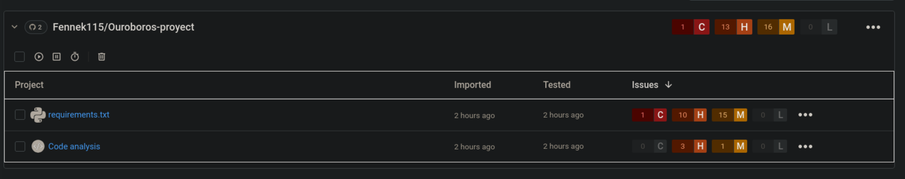
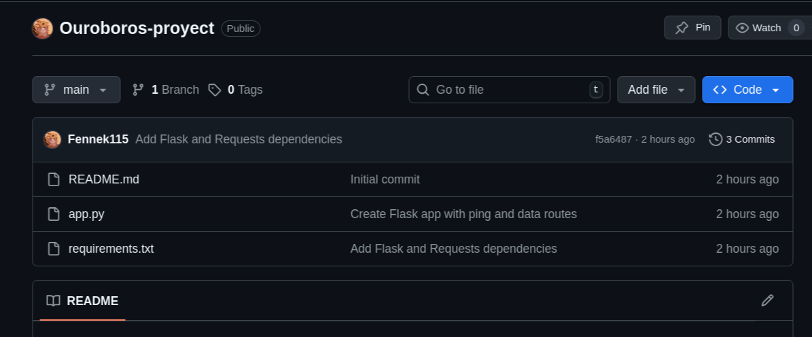
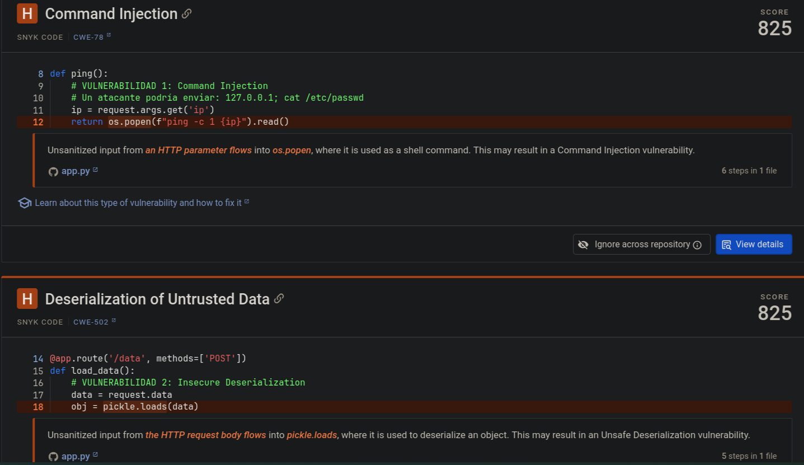
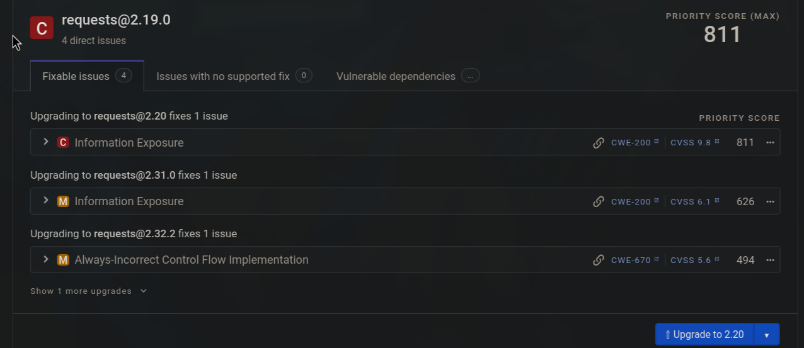
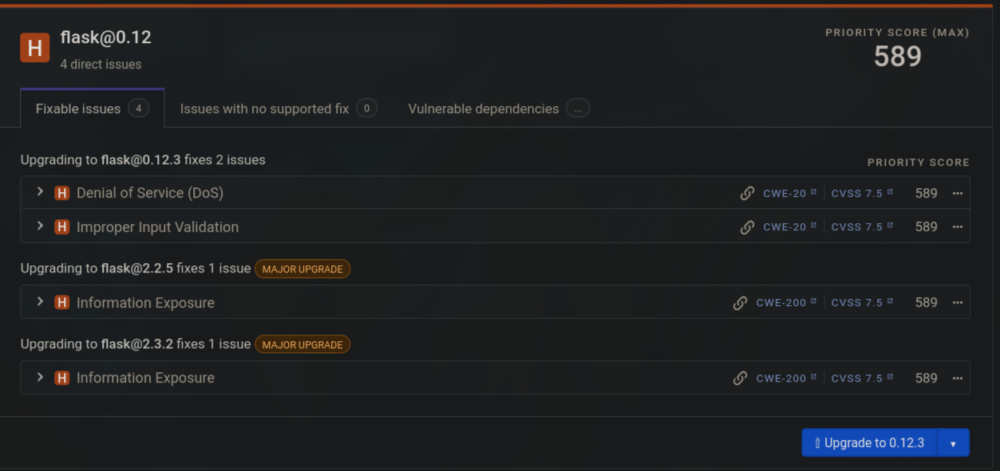
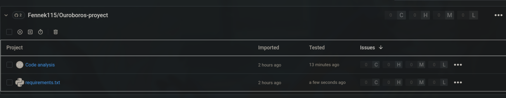

En la alquimia, el **Ouroboros** simboliza el ciclo eterno de renovación. En el desarrollo de software moderno, este ciclo es el CI/CD (Integración y Despliegue Continuo). Pero un ciclo infinito de código roto o inseguro solo acelera el desastre.


> 🔗 **Código Fuente:** Puedes consultar el repositorio completo y su evolución en GitHub:  
> [**github.com/Fennek115/Ouroboros-proyect**](https://github.com/Fennek115/Ouroboros-proyect)

Para mi segundo proyecto de laboratorio, decidí implementar una pipeline **DevSecOps** real. El objetivo: automatizar la detección de "impurezas" ([[pentest-teorico-vs-practico|vulnerabilidades]]) antes de que el código toque producción, aplicando la filosofía *Shift Left*.

## 🧪 La Materia Prima: Un Entorno Vulnerable

Para probar la eficacia del escáner, creé una aplicación en Flask diseñada intencionalmente para ser insegura. Como se ve en mi repositorio, la premisa es simple: el código se crea, se analiza y se despliega, buscando la resiliencia ante errores y ataques.



El repositorio contiene:
* `app.py`: Una API con vulnerabilidades de inyección y deserialización.
* `requirements.txt`: Dependencias desactualizadas y peligrosas.

### `app.py` (Vulnerable)
```python
import os
import pickle
from flask import Flask, request

app = Flask(__name__)

@app.route('/ping')
def ping():
    # VULNERABILIDAD: Command Injection
    ip = request.args.get('ip')
    return os.popen(f"ping -c 1 {ip}").read()

@app.route('/data', methods=['POST'])
def load_data():
    # VULNERABILIDAD: Insecure Deserialization
    data = request.data
    obj = pickle.loads(data)
    return "Data loaded"

if __name__ == '__main__':
    app.run(debug=True)
```

### `requirements.txt` (Desactualizado)
```text
flask==0.12
requests==2.19.0
```



## 🔍 El Proceso de Transmutación (Análisis SAST)

Integré **Snyk** dentro de GitHub Actions para analizar el código estático cada vez que hago un `push`. Los resultados fueron inmediatos y alarmantes. El motor de análisis semántico detectó fallos críticos en mi lógica:

1.  **Command Injection (Severidad Alta - Score 825)**:
    En la línea 12 de `app.py`, el código `os.popen(f"ping -c 1 {ip}").read()` permite que un atacante concatene comandos del sistema operativo si no se sanea la entrada `ip`.
2.  **Deserialization of Untrusted Data (Severidad Alta - Score 825)**:
    En la línea 19, el uso de `pickle.loads(data)` sobre datos recibidos en un POST permite la ejecución remota de código (RCE), ya que `pickle` no es seguro para datos no confiables.

Además, se detectó un riesgo de **XSS (Cross-site Scripting)** y la mala práctica de dejar el **Debug Mode** habilitado en producción.



## 📦 Las Impurezas en los Ingredientes (Análisis SCA)

No solo mi código estaba "sucio", sino también los ingredientes que usé. El análisis de composición de software (SCA) reveló que estaba construyendo sobre cimientos podridos:

* **Requests 2.19.0**: Esta versión tiene vulnerabilidades conocidas de exposición de información. Snyk sugiere actualizar inmediatamente a la versión 2.20 o superior.
* **Flask 0.12**: Una versión muy antigua con riesgo de Denegación de Servicio (DoS) y validación de entrada impropia. La recomendación es un salto mayor a la versión 1.x o 2.x.

Lo interesante es que Snyk no solo marca el error, sino que también analiza las dependencias transitivas (librerías que usan mis librerías), como los problemas encontrados en `urllib3` y `werkzeug`.




## 🛡️ Conclusión: El Ciclo Virtuoso

Este experimento demuestra por qué no podemos confiar solo en la revisión manual. En segundos, el pipeline automático identificó vectores de ataque que podrían haber comprometido el servidor completo (RCE).

El proyecto **Ouroboros** no solo cierra el ciclo de desarrollo, sino que lo purifica. Ahora, ningún código llega a la rama `main` sin haber pasado por este fuego purificador.

## 🛡️ La Transmutación: Purificando el Código

Para remediar las vulnerabilidades críticas detectadas por Snyk, apliqué una estrategia de "Defensa en Profundidad". No bastaba con validar; también había que asegurar la forma en que la aplicación responde.

El análisis persistente de Snyk me alertó de un riesgo residual de **XSS (Cross-Site Scripting)** al devolver la salida del comando directamente. Para solucionarlo, estandaricé todas las respuestas a JSON.

### `app.py` (Versión Final Segura)
```python
import subprocess
import json
import ipaddress
from flask import Flask, request, jsonify

app = Flask(__name__)

@app.route('/ping')
def ping():
    ip = request.args.get('ip')
    
    # 1. VALIDACIÓN (Input Validation)
    # Usamos ipaddress para asegurar que SOLO entra una IP válida.
    try:
        ip_obj = ipaddress.ip_address(ip)
    except ValueError:
        return jsonify({"error": "IP inválida"}), 400

    # 2. EJECUCIÓN SEGURA (No Shell)
    # Reemplazamos os.popen con subprocess.run sin shell.
    # Esto evita la inyección de comandos porque los argumentos no se interpretan.
    try:
        result = subprocess.run(
            ['ping', '-c', '1', str(ip_obj)], 
            capture_output=True, 
            text=True, 
            timeout=5
        )
        
        # 3. MITIGACIÓN XSS (Output Encoding)
        # Snyk alertó que devolver texto plano podría causar XSS.
        # Al envolver la respuesta en jsonify, forzamos el Content-Type 'application/json',
        # neutralizando cualquier intento de inyección de HTML/JS en la respuesta.
        return jsonify({"status": "success", "output": result.stdout})
        
    except subprocess.TimeoutExpired:
        return jsonify({"error": "Ping timeout"}), 504

@app.route('/data', methods=['POST'])
def load_data():
    # 4. DESERIALIZACIÓN SEGURA
    # Reemplazo total de pickle por JSON.
    try:
        data = request.get_json() 
        if not data:
            return jsonify({"error": "No JSON provided"}), 400
        return jsonify({"status": "Data loaded securely", "content": data})
    except Exception as e:
        return jsonify({"error": str(e)}), 500

if __name__ == '__main__':
    # 5. HARDENING
    # Desactivamos debug para no exponer stack traces en producción.
    app.run(debug=False)
```


> *"La seguridad no es algo estatico, es mas bien un ciclo continuo."*
