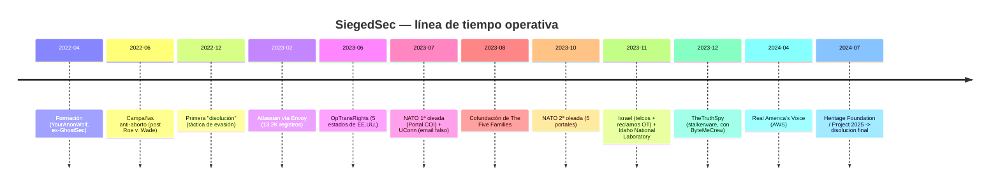

Inteligencia de fuente abierta. Grupo disuelto en julio de 2024. Material defensivo/educativo; redistribución sin restricción.

## Resumen ejecutivo

**SiegedSec** (abreviatura de *Sieged Security*) fue un colectivo hacktivista activo entre **abril de 2022 y julio de 2024**, autodenominado **"gay furry hackers"**. Operó como un grupo pequeño, descentralizado y de baja sofisticación técnica, con un perfil deliberadamente teatral —emoticones `:3` y `^-^`, aperturas con *"mew mew mew"*, GIFs de gatos, el meme *BoyKisser*— heredado directamente del linaje **LulzSec**: espectáculo por encima de sigilo.

Su valor para la inteligencia defensiva no está en la complejidad de sus técnicas, sino en lo contrario: demostró cuánto impacto público puede generar un actor de **capacidad limitada** explotando higiene básica (inyección SQL, credenciales expuestas, relaciones de confianza con terceros). El grupo combinó esa baja sofisticación con una **selección de objetivos cargada políticamente** —legislación anti-LGBTQ+/anti-trans, derecho al aborto, *Project 2025*, el conflicto en Gaza— y un patrón consistente de **inflar el impacto** de sus operaciones.


**Sesgo de autorreporte.** SiegedSec exageró sistemáticamente el volumen y la sensibilidad de los datos comprometidos. Cuando este informe atribuye una cifra o un efecto, distingue siempre **lo verificado** (confirmado por la víctima o por reportes independientes) de **lo reclamado** (solo afirmado por el grupo en Telegram). No confunda una captura de pantalla en un canal con una verificación.


### Identidad del actor

| Campo | Valor |
|---|---|
| Nombre | SiegedSec (*Sieged Security*) |
| Tipo | Colectivo hacktivista |
| Activo | abril 2022 – julio 2024 |
| Personas clave | *YourAnonWolf* (fundador) → *Vio* (líder/portavoz) |
| Membresía | Pequeña y fluctuante; edades reportadas 18–26 (confianza media) |
| Plataformas | Telegram (principal), X/Twitter (amplificación) |
| Alianzas | Cofundador de *The Five Families* (con GhostSec, Stormous, ThreatSec, BlackForums) |
| Motivación | Hacktivismo (pro-LGBTQ+/trans, pro-aborto, anti-derecha) + *"diversión y caos"* |
| Sofisticación | **Baja.** Sin malware propio, sin persistencia, operaciones *smash-and-grab* |

### Tabla de objetivos

| Operación | Fecha | Objetivo | Impacto reclamado | Impacto verificado | Severidad |
|---|---|---|---|---|---|
| Atlassian (vía Envoy) | feb 2023 | Atlassian | ~13.200 registros + planos de oficina | Confirmado por Atlassian | ALTO |
| #OpTransRights | jun 2023 | 5 estados de EE.UU. (TX, NE, PA, SD, SC) | Archivos policiales, intranets, PII | Parcial (SC, NE) | MEDIO |
| NATO (1ª oleada) | jul 2023 | Portal COI | ~845 MB, datos de ~8.000 usuarios | No clasificado; NATO confirmó investigación | MEDIO |
| University of Connecticut | jul 2023 | UConn | Email masivo falso ("por diversión") | Confirmado | BAJO |
| NATO (2ª oleada) | oct 2023 | 5 portales adicionales | ~9 GB, 3.000+ archivos | Sin impacto operacional (NATO) | MEDIO |
| Israel — OT/SCADA | oct–nov 2023 | Modbus/BACnet/Niagara Fox | "Mass attacks" a infra crítica | **Desmentido** (SecurityScorecard) | BAJO |
| Israel — telcos | nov 2023 | Bezeq, Cellcom, Israir | ~230.000 registros de clientes | Reclamado; sin confirmación | MEDIO |
| Idaho National Laboratory | nov 2023 | INL (Oracle HCM) | PII de empleados con SSN | **45.047 personas; confirmado por INL** | CRÍTICO |
| Real America's Voice | abr 2024 | RAV (AWS) | Borrado de buckets S3, ~1.200 usuarios | Reclamado; datos publicados | MEDIO |
| Heritage Foundation | jul 2024 | Heritage / *Project 2025* | 200 GB de sistemas activos | **~2 GB de archivo viejo de terceros** | ALTO |

---

## Cronología

### Patrón de disbandments

SiegedSec usó la **disolución como táctica de evasión**: se anunciaba "muerto" para drenar atención de las fuerzas del orden y regresaba bajo la misma marca. La de **diciembre de 2022** fue la primera; la de **julio de 2024** fue la definitiva. El propio patrón se volvió una firma de comportamiento identificable.

---

## Cadena de ataque (modelo genérico)

La mayoría de las operaciones de SiegedSec siguió la misma estructura: acceso por una debilidad expuesta, exfiltración inmediata, publicación ruidosa. No hubo persistencia ni movimiento lateral profundo.

```mermaid
flowchart TD
    A["Reconocimiento\napps web expuestas,\npaneles/DB mal configurados"] --> B{"Acceso inicial"}
    B -->|"T1190 SQLi/XSS"| C["App pública vulnerable"]
    B -->|"T1078 credenciales expuestas"| D["Repo publico / breach DB"]
    B -->|"T1199 relacion de confianza"| E["SaaS / cloud de un tercero"]
    C --> F["Volcado de base de datos\nT1005 / T1530"]
    D --> F
    E --> F
    F --> G["Exfiltracion via web\nT1567 (Gofile / file-host)"]
    G --> H["Anuncio en Telegram\n+ mensaje hacktivista"]
    H --> I["Amplificacion en X\n+ taunting a la victima"]
    H --> J["Defacement T1491\n(cuando aplica)"]
    I --> K["Cobertura mediatica\n(objetivo real)"]
```


El nodo final —**cobertura mediática**— era el verdadero objetivo. SiegedSec no pedía rescate ni mantenía acceso: monetizaba en atención, no en cripto. Esto los ubica más cerca de LulzSec que de un grupo de extorsión.


---

## TTPs mapeados a MITRE ATT&CK


SiegedSec **no es un grupo trackeado** en el catálogo oficial de MITRE ATT&CK. Todos los mapeos siguientes son **derivados por analistas** a partir de reportes de Flare, SOCRadar, SpyCloud, DarkOwl, Enzoic y la cobertura de cada incidente. La columna *Confianza* refleja cuánto sostiene la evidencia pública cada atribución.


| Táctica | Técnica | ID | Evidencia / uso | Confianza |
|---|---|---|---|---|
| Reconnaissance | Search Open Websites/Domains | T1593 | Barrido de apps web expuestas y paneles abiertos; targeting de activos ya vulnerables, sin recon profunda | Media |
| Reconnaissance | Gather Victim Identity: Credentials | T1589.001 | Cosecha de credenciales filtradas; caso Atlassian: credenciales **commiteadas a un repo público** | Alta |
| Initial Access | Exploit Public-Facing Application | T1190 | **SQLi** como vector primario; **XSS** para defacement y acceso por sesión | Alta |
| Initial Access | Valid Accounts | T1078 | Credenciales robadas/expuestas de empleados (Atlassian → Envoy) | Alta |
| Execution | Command and Scripting Interpreter | T1059 | Consultas SQL contra backends tras SQLi; **sqlmap** probable por el patrón de los volcados | Media (inferida) |
| Persistence | — | — | **Sin evidencia.** Operaciones *smash-and-grab*; ni backdoors ni webshells documentados | Alta (ausencia) |
| Collection | Data from Local System | T1005 | Volcado de PII, credenciales, documentos internos desde backends comprometidos | Alta |
| Collection | Data from Cloud Storage Object | T1530 | INL: exfiltración de PII desde sistema HR cloud de un tercero | Alta |
| Exfiltration | Exfiltration Over Web Service | T1567 | Subida a Gofile/file-hosts anónimos enlazados desde Telegram | Alta |
| Impact | Defacement: External | T1491.002 | Modificación de contenido web con mensajería hacktivista | Alta |
| Impact | Data Manipulation: Stored Data | T1565.001 | Reclamos de "destruir" bases tras exfiltrar (autorreportado) | Baja–Media |
| Initial Access | Trusted Relationship | T1199 | Envoy (Atlassian), subcontratista cloud (INL), contratista de *The Daily Signal* (Heritage) | Alta |

### Herramientas e infraestructura (nivel CTI)

- **Sin malware propio.** No hay reportes de RATs, implants ni frameworks C2. Consistente con un perfil oportunista y de baja sofisticación.
- **sqlmap** (confianza media, inferida): el volumen y la forma de los volcados encaja con la herramienta de SQLi automatizada más común; sin confirmación directa del grupo.
- **Telegram** como C2 organizacional, hub de comunicación y canal de distribución de leaks.
- **File-hosts anónimos** (Gofile y similares; AnonFiles antes de su cierre en 2023) para alojar los datasets.
- **Sin sitios .onion.** Prefirieron clearnet de alta visibilidad (Telegram) sobre hosting en dark web — coherente con un objetivo de impacto político, no de mercado.
- **VPN/VPS genéricos** para anonimización (confianza baja; sin proveedores atribuidos).

### Evaluación de OPSEC


La seguridad operacional de SiegedSec fue **consistentemente pobre** —rasgo definitorio del grupo, no accidente—: taunting público a las víctimas, conversaciones directas con organizaciones objetivo (los chat logs con Mike Howell de Heritage), personas semi-persistentes (*YourAnonWolf*, *Vio*) y marcadores de comportamiento identificables (emoticones, registro vulgar, estética furry junto a cada anuncio de brecha). La disolución final fue precipitada por la presión del FBI comunicada a través de la propia víctima.


---

## Análisis de operaciones seleccionadas

### Idaho National Laboratory (nov 2023) — el caso más grave

El más serio del historial, y el menos teatral. SiegedSec comprometió un sistema **Oracle Human Capital Management** (RR.HH. en la nube, gestionado por un tercero aprobado a nivel federal) **externo** a la red de investigación nuclear del laboratorio. Exfiltraron PII de **45.047 personas** —empleados actuales y antiguos, cónyuges, dependientes— incluyendo nombres, fechas de nacimiento, direcciones, **números de Seguridad Social**, datos salariales y bancarios. INL confirmó la validez del breach y coordinó con FBI y CISA. La red de investigación nuclear **no** fue afectada.

La cara teatral apareció después: el grupo ofreció borrar los datos si INL aceptaba investigar la creación de *"IRL catgirls"*. La demanda no era seria; era una maniobra de relaciones públicas que funcionó —generó cobertura viral.

### Heritage Foundation / Project 2025 (jul 2024) — el impacto inflado

El caso paradigmático de la brecha entre reclamo y realidad. SiegedSec afirmó haber exfiltrado **200 GB** de los sistemas de la fundación en protesta contra *Project 2025*. La realidad verificada:

- Soltaron **~2 GB** comprimidos.
- Los datos provenían de un **archivo de dos años de antigüedad de *The Daily Signal*** (registros 2007–nov 2022), alojado por un contratista externo en un servidor **mal configurado y públicamente accesible**.
- Heritage negó cualquier breach de sistemas activos o de bases de *Project 2025*; calificó a los atacantes de *"criminal trolls"*.
- Investigadores independientes confirmaron que los datos eran de ese archivo legacy, **sin** archivos internos o estratégicos activos.


Lo que **sí** se verificó de forma independiente no fue el "hackeo de Project 2025" sino los **chat logs** entre Vio y Mike Howell (director del Oversight Project de Heritage), donde Howell mencionó la cooperación con el FBI. Esa confrontación, no el volumen de datos, fue lo que precipitó la disolución del grupo días después.


### Israel / OT-SCADA (oct–nov 2023) — el reclamo desmentido

SiegedSec, junto a Anonymous Sudan, publicó una lista de IPs israelíes que decía haber sometido a *"mass attacks"* —dispositivos Modbus, BACnet, receptores GNSS, Niagara Fox, Crestron—. El **STRIKE Team de SecurityScorecard** analizó el NetFlow de esas IPs:

- **No** encontró volúmenes consistentes con un DoS exitoso ni evidencia de compromiso real.
- Varios servicios industriales **sí estaban expuestos** a internet — pero *estar expuesto ≠ haber sido atacado*.
- Evaluó la lista como un **"call to action"** para que otros actores más capaces explotaran esas debilidades.


**No confundir actores.** El OT realmente comprometido en EE.UU. e Israel en ese período (PLCs Unitronics en sistemas de agua) fue obra de **CyberAv3ngers**, vinculado al IRGC iraní — no de SiegedSec. Atribuir el OT real a SiegedSec sería un error de contabilidad que ellos mismos fomentaron.


---

## Disolución y legado

El **10–11 de julio de 2024**, Vio anunció la disolución definitiva en Telegram:

> *"yes this is a sudden announcement... for our own mental health, the stress of mass publicity, and to avoid the eye of the FBI."*

> *"we may not be a cybercriminal group anymore, but we will always [be] hackers and always fighting for the rights of others."*

**Razones citadas:** salud mental, estrés por la publicidad masiva, evasión del FBI (catalizado por los comentarios de Howell). Vio mencionó intentos previos fallidos de dejar el cibercrimen.

**Sucesores:** ninguno formal. **NullBulge** comparte estética *furry hacker* pero es una entidad separada (leak del Slack de Disney). La alianza *Five Families* perdió a su miembro más visible. GhostSec sigue operando por separado.


**Allanamiento del FBI a Vio (~marzo 2025): NO verificado oficialmente.** Lo reportó el ex-miembro @mewmrrpmeow en X; periodistas confirmaron su afiliación al grupo pero **no** el allanamiento. La cuenta de Signal de Vio dejó de responder. El FBI no comentó. Trátese como rumor de baja confianza hasta que haya registro judicial o confirmación oficial.


---

## Conclusiones para defensores

- **La sofisticación no es el predictor del impacto.** SiegedSec no necesitó *0-days*; necesitó un repo mal cuidado, un contratista olvidado y un panel expuesto. La higiene básica (gestión de credenciales en repos, configuración de servicios de terceros, inventario de activos expuestos) habría neutralizado la mayoría de sus accesos.
- **La superficie de terceros es la superficie propia.** Atlassian→Envoy, INL→subcontratista cloud, Heritage→contratista de *The Daily Signal*: las tres brechas más relevantes entraron por una **relación de confianza** (T1199), no por la red principal de la víctima.
- **Separe el ruido del daño.** El modelo de negocio del grupo era la atención. Tratar cada reclamo como un compromiso confirmado le habría regalado el efecto que buscaba. La métrica defensiva correcta es *qué confirmó la víctima*, no *qué publicó el atacante*.

---

## Fuentes

Inteligencia de fuente abierta. URLs consultadas durante la investigación:

- Wikipedia — *SiegedSec*: <https://en.wikipedia.org/wiki/SiegedSec>
- Flare.io — perfil de amenaza: <https://flare.io/learn/resources/blog/siegedsec/>
- SOCRadar — *Five Families* / monitoreo dark web: <https://socradar.io/>
- SpyCloud — análisis de credenciales y leaks: <https://spycloud.com/blog/siegedsec-hacking-group/>
- Enzoic — disolución y presión del FBI: <https://www.enzoic.com/blog/siegedsec/>
- DarkOwl — inteligencia de darknet: <https://www.darkowl.com/>
- CyberScoop — Atlassian, Heritage, INL: <https://cyberscoop.com/heritage-foundation-daily-signal-breach-siegedsec/>
- The Record (Recorded Future) — NATO, INL, OpTransRights: <https://therecord.media/>
- BleepingComputer — breach Atlassian/Envoy: <https://www.bleepingcomputer.com/>
- SecurityWeek — exposición de credenciales Atlassian: <https://www.securityweek.com/>
- Malwarebytes — disputa Heritage Foundation: <https://www.malwarebytes.com/blog/news/2024/07/heritage-foundation-hacked-by-gay-furry-hackers-siegedsec>
- Cybernews — Heritage / disolución: <https://cybernews.com/news/heritage-foundation-siegedsec-hacker-leak-disband/>
- SecurityScorecard — análisis OT/SCADA (debunk): <https://securityscorecard.com/>
- Dark Reading — cobertura del análisis SecurityScorecard: <https://www.darkreading.com/>
- Twingate — detalles técnicos del breach INL: <https://www.twingate.com/>
- Mashable — INL / demanda de "catgirls": <https://mashable.com/>
- The Guardian — OpTransRights / contexto legislativo: <https://www.theguardian.com/>
- Business Insider — OpTransRights / entrevista a Vio: <https://www.businessinsider.com/>
- Daily Dot — Real America's Voice, allanamiento a Vio: <https://www.dailydot.com/>
- Gay Star News — transcripción del mensaje de disolución: <https://www.gaystarnews.com/>
- The Advocate — allanamiento del FBI a Vio (2025): <https://www.advocate.com/>
- CyberDaily.au — confrontación Vio vs. Howell: <https://www.cyberdaily.au/>
- CISA — avisos CyberAv3ngers/Unitronics (contexto OT): <https://www.cisa.gov/>
- Fraunhofer — perfilado demográfico de hacktivistas: <https://www.fraunhofer.de/>
- CloudSEK — breach de portales NATO: <https://cloudsek.com/>
- CyberInt / Check Point — *Five Families*, tracking: <https://cyberint.com/>
- Trend Micro — disolución, ecosistema *Five Families*: <https://www.trendmicro.com/>


